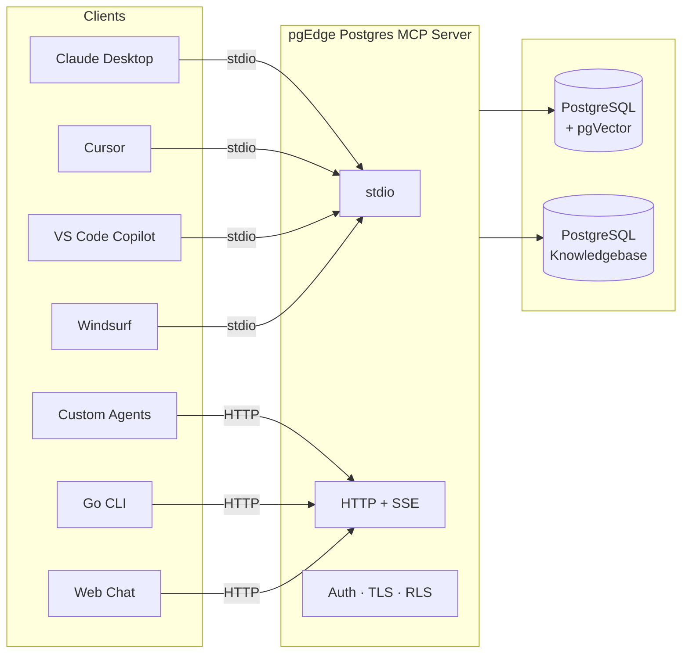
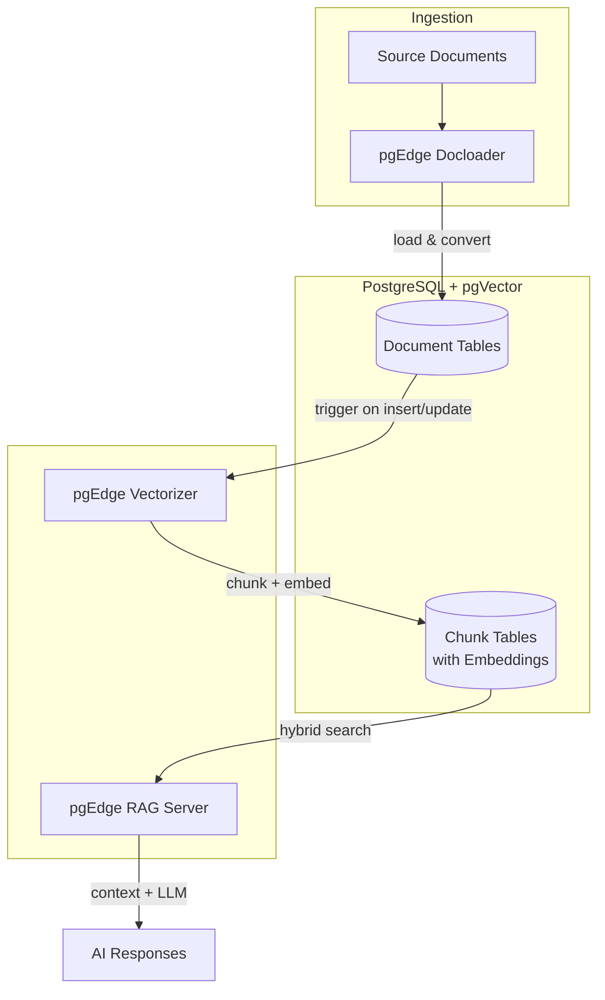

# AI Toolkit

The pgEdge AI Toolkit connects AI agents and LLMs to PostgreSQL through two
independent capabilities: **secure database access** and
**retrieval-augmented generation (RAG)**.

The **pgEdge Postgres MCP Server** gives AI agents autonomous, structured
access to your database through the Model Context Protocol — with built-in
security, PostgreSQL-specific knowledge, and support for multiple LLM
providers. It works standalone and requires no additional toolkit
components.

For applications that need to answer questions over a document corpus, the
remaining components form a **complete RAG pipeline**: Docloader ingests
documents, the Vectorizer chunks and embeds them, and the RAG Server answers
questions over the resulting knowledge base.

Both capabilities share **[pgVector](../pgvector/)** as a foundation — it
provides the vector similarity search that powers the MCP Server's semantic
search tools and the RAG pipeline's hybrid retrieval.

## Components

The pgEdge AI Toolkit consists of the following components.

### pgEdge Components

**[pgEdge Postgres MCP Server](../pgedge-postgres-mcp-server/)** — Gives AI
agents secure, structured access to PostgreSQL through the Model Context
Protocol. Exposes tools for schema inspection, SQL execution, similarity
search, embedding generation, query plan analysis, and knowledgebase search.
Supports Claude, OpenAI, and Ollama, with read-only defaults,
authentication, TLS, and row-level security.

**[pgEdge RAG Server](../pgedge-rag-server/)** — HTTP API for
retrieval-augmented generation. Runs hybrid search combining pgVector cosine
similarity with BM25 keyword ranking, fuses results using Reciprocal Rank
Fusion, and sends assembled context to an LLM for completion. Supports
multiple independent pipelines, streaming responses, and conversation
history.

**[pgEdge Docloader](../pgedge-docloader/)** — CLI tool for loading
documents into PostgreSQL from local files, glob patterns, or Git
repositories. Accepts HTML, Markdown, reStructuredText, and SGML/DocBook,
converting all content to Markdown with extracted metadata. Supports
transactional loading and UPSERT mode for incremental updates.

**[pgEdge Vectorizer](../pgedge-vectorizer/)** — PostgreSQL extension that
automatically chunks text and generates vector embeddings via background
workers. Triggers detect inserts and updates on configured tables, with
configurable chunking strategies and support for OpenAI, Voyage AI, and
Ollama embedding providers.

### Community Components

**[pgVector](../pgvector/)** — Open-source PostgreSQL extension for vector
similarity search. Adds a `vector` column type with IVFFlat and HNSW
indexing. pgVector is a shared dependency across the toolkit: the MCP Server
uses it for semantic search, the Vectorizer stores embeddings in pgVector
columns, and the RAG Server queries them for retrieval.

## Connecting AI Agents With the MCP Server

Rather than giving an LLM raw database credentials — uncontrolled access to
every table, no guardrails on query complexity, no visibility into what the
model is doing — the [MCP Server](../pgedge-postgres-mcp-server/) acts as a
controlled gateway with read-only defaults, authentication, TLS, and
PostgreSQL row-level security.

The MCP Server is purpose-built for PostgreSQL and ships with a **built-in
PostgreSQL knowledgebase**. When an agent needs to understand a PostgreSQL
feature, diagnose a configuration issue, or write correct syntax for an
extension, it queries the knowledgebase directly rather than relying on the
LLM's training data (which may be outdated or imprecise).

The server offers two connection modes:

- **stdio** — For desktop clients (Claude Desktop, Cursor, VS Code Copilot,
  Windsurf) where the server runs as a local subprocess.
- **HTTP + SSE** — For multi-user and remote deployments where the server
  runs as a long-lived service. The built-in **Go CLI client** and **React
  web chat interface** both connect via this mode.

### Security Model

AI agents never interact with your database unguarded:

- **Read-only by default** — All queries run inside read-only transactions
  unless explicitly configured otherwise.
- **Authentication** — Token-based and user-based authentication control
  which agents can connect.
- **TLS** — All HTTP connections can be encrypted in transit.
- **Row-level security** — PostgreSQL's native RLS policies are respected,
  so different agents or users see only the data they're authorized to
  access.
- **Defined tool surface** — Agents can only perform operations the MCP
  Server exposes. There is no open-ended SQL access unless the administrator
  enables it.

## Building a RAG Pipeline

### Ingestion: Docloader → PostgreSQL

**[Docloader](../pgedge-docloader/)** reads source content and loads it into
a PostgreSQL table, converting documents to Markdown with extracted metadata.
Loading is transactional, and UPSERT mode allows re-running the same load to
pick up changes without duplicating rows. At this stage, the data is plain
text — no vectors or chunking are involved yet.

### Processing: Vectorizer + pgVector

**[Vectorizer](../pgedge-vectorizer/)** watches configured tables for changes
via triggers. When rows are inserted or updated, background workers chunk the
text and generate embeddings, storing the results in dedicated chunk tables
using **[pgVector](../pgvector/)** column types. The chunk tables are indexed
for fast similarity search.

### Serving: RAG Server

Pointing an LLM directly at chunk tables is both a security risk and a
retrieval quality problem — unguarded data access, no keyword matching,
duplicate passages wasting the context window, and embedding/token/LLM
orchestration left to the application.

**[RAG Server](../pgedge-rag-server/)** solves this by constraining access to
pre-configured pipelines against specific tables (the LLM never generates
SQL) and handling hybrid retrieval (vector + BM25), deduplication, and
context assembly in a single layer.
