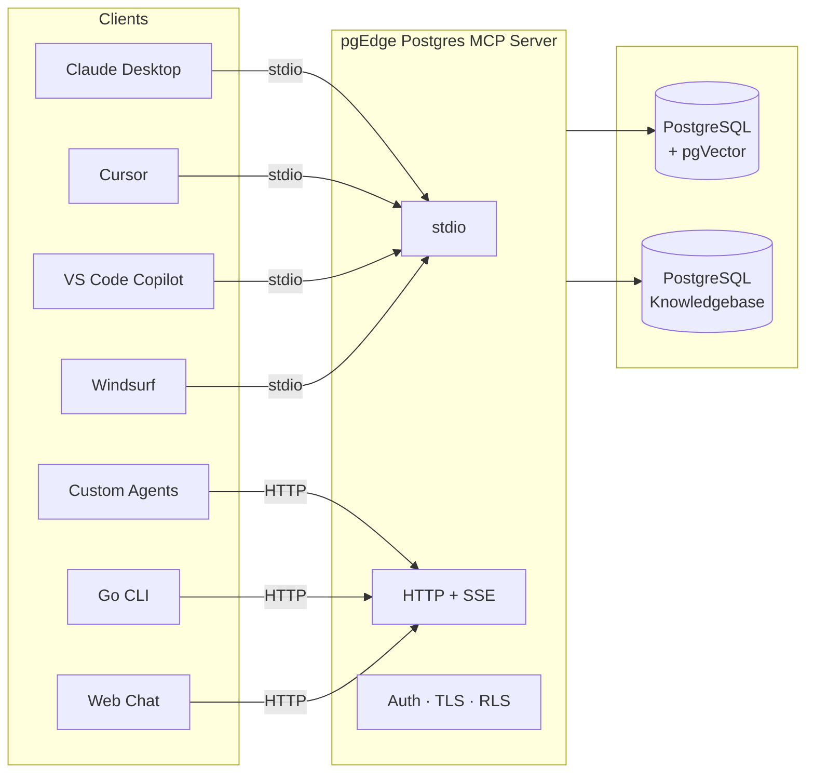
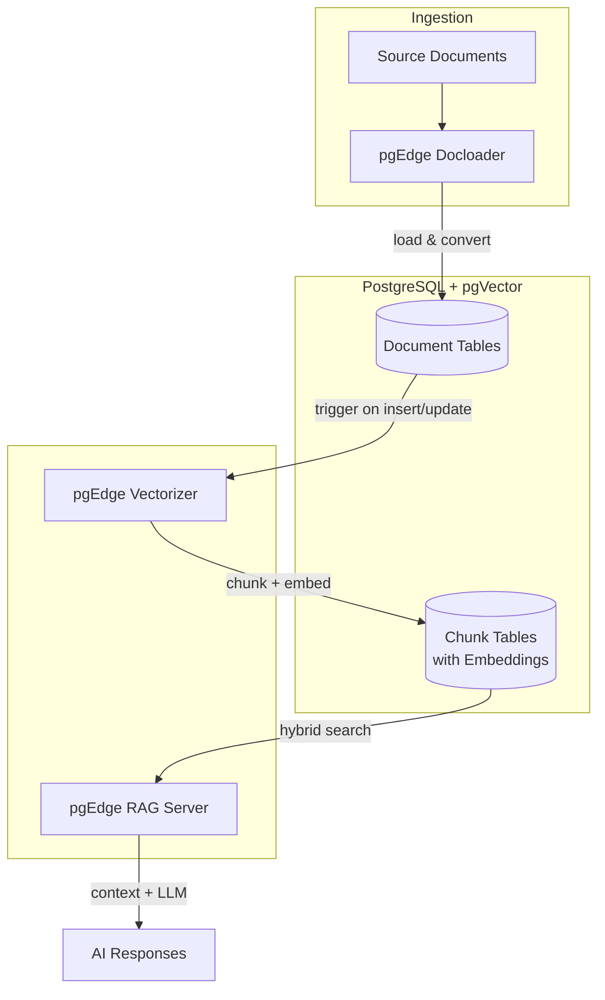

# AI Toolkit

The pgEdge AI Toolkit connects AI agents and LLMs to PostgreSQL through two independent capabilities: **secure database access** and **retrieval-augmented generation (RAG)**.

The **pgEdge Postgres MCP Server** gives AI agents autonomous, structured access to your database through the Model Context Protocol — with built-in security, PostgreSQL-specific knowledge, and support for multiple LLM providers. It works standalone and requires no additional toolkit components.

For applications that need to answer questions over a document corpus, the remaining components form a **complete RAG pipeline**: Docloader ingests documents, the Vectorizer chunks and embeds them, and the RAG Server answers questions over the resulting knowledge base.

Both capabilities share **[pgVector](../pgvector/)** as a foundation — it provides the vector similarity search that powers the MCP Server's semantic search tools and the RAG pipeline's hybrid retrieval.

## Components

| Component | Description |
|-----------|-------------|
| **[pgEdge Postgres MCP Server](../pgedge-postgres-mcp-server/)** | Secure, structured PostgreSQL access for AI agents via the Model Context Protocol |
| **[pgEdge RAG Server](../pgedge-rag-server/)** | HTTP API for retrieval-augmented generation with hybrid vector and keyword search |
| **[pgEdge Docloader](../pgedge-docloader/)** | CLI tool for loading documents into PostgreSQL from files, directories, and Git repos |
| **[pgEdge Vectorizer](../pgedge-vectorizer/)** | PostgreSQL extension for automatic text chunking and vector embedding generation |
| **[pgVector](../pgvector/)** | Open-source vector similarity search for PostgreSQL (shared dependency) |

## Connecting AI agents with the MCP Server

Rather than giving an LLM raw database credentials — uncontrolled access to every table, no guardrails on query complexity, no visibility into what the model is doing — the [MCP Server](../pgedge-postgres-mcp-server/) acts as a controlled gateway. It exposes a defined set of tools that an agent can invoke (schema inspection, SQL execution, similarity search, embedding generation, query plan analysis, and knowledgebase search), while enforcing read-only transactions by default with token authentication, TLS, and PostgreSQL row-level security.

This is not a generic database access tool. The MCP Server is purpose-built for PostgreSQL and ships with a **built-in PostgreSQL knowledgebase**. When an agent needs to understand a PostgreSQL feature, diagnose a configuration issue, or write correct syntax for an extension, it queries the knowledgebase directly rather than relying on the LLM's training data (which may be outdated or imprecise). This is the difference between a thin SQL proxy and an enterprise-grade database assistant that understands PostgreSQL deeply.

The server supports **Anthropic Claude**, **OpenAI**, and **Ollama** as LLM providers, and offers two connection modes:

- **stdio** — For desktop clients (Claude Desktop, Cursor, VS Code Copilot, Windsurf) where the server runs as a local subprocess.
- **HTTP + SSE** — For multi-user and remote deployments where the server runs as a long-lived service. The built-in **Go CLI client** and **React web chat interface** both connect via this mode.

### Security model

AI agents never interact with your database unguarded:

- **Read-only by default** — All queries run inside read-only transactions unless explicitly configured otherwise.
- **Authentication** — Token-based and user-based authentication control which agents can connect.
- **TLS** — All HTTP connections can be encrypted in transit.
- **Row-level security** — PostgreSQL's native RLS policies are respected, so different agents or users see only the data they're authorized to access.
- **Defined tool surface** — Agents can only perform operations the MCP Server exposes. There is no open-ended SQL access unless the administrator enables it.

## Building a RAG pipeline

### Ingestion: Docloader → PostgreSQL

**[pgEdge Docloader](../pgedge-docloader/)** reads source content — local files, directories, glob patterns, or Git repositories — and loads it into a PostgreSQL table. Each document is converted to Markdown and stored with metadata (title, filename, timestamps). Loading is transactional (a batch fully commits or rolls back), and UPSERT mode allows re-running the same load to pick up changes without duplicating rows.

At this stage, the data is plain text in standard PostgreSQL tables. No vectors or chunking are involved yet.

### Processing: Vectorizer + pgVector

**[pgEdge Vectorizer](../pgedge-vectorizer/)** watches configured tables for `INSERT` and `UPDATE` operations via triggers. Changed rows are queued, and background workers handle the rest:

1. **Chunking** — Text is split into segments sized for embedding models. Strategies include fixed token windows, Markdown-aware splitting that respects document structure, and a hybrid two-pass approach.

2. **Embedding** — Each chunk is sent to a configured provider (OpenAI, Voyage AI, or Ollama) and the resulting vector is stored in a chunk table using **[pgVector](../pgvector/)** column types.

3. **Queue management** — Workers process batches with retry logic and exponential backoff. Completed items are cleaned up automatically.

The result is a set of chunk tables where each row contains a text fragment, its vector embedding, and a foreign key back to the source document, indexed by pgVector for fast similarity search.

### Serving: RAG Server

Pointing an LLM directly at your chunk tables is both a security risk and a retrieval quality problem. The LLM has unguarded access to whatever data is in the tables, pure vector similarity misses keyword-exact matches, and near-duplicate passages waste the context window. The application is left to handle embedding generation, token budgeting, and LLM orchestration itself.

**[pgEdge RAG Server](../pgedge-rag-server/)** solves both problems. It constrains access to pre-configured pipelines against specific tables — the LLM never generates SQL. When a query arrives, the server runs a hybrid search: pgVector cosine similarity for semantic matching and BM25 for keyword matching. Results are fused using Reciprocal Rank Fusion, deduplicated, and assembled into a context window that respects a configurable token budget, then sent to an LLM (OpenAI, Anthropic, or Ollama) for a generated answer. Multiple pipelines can run independently, each with its own database, tables, and provider configuration.
