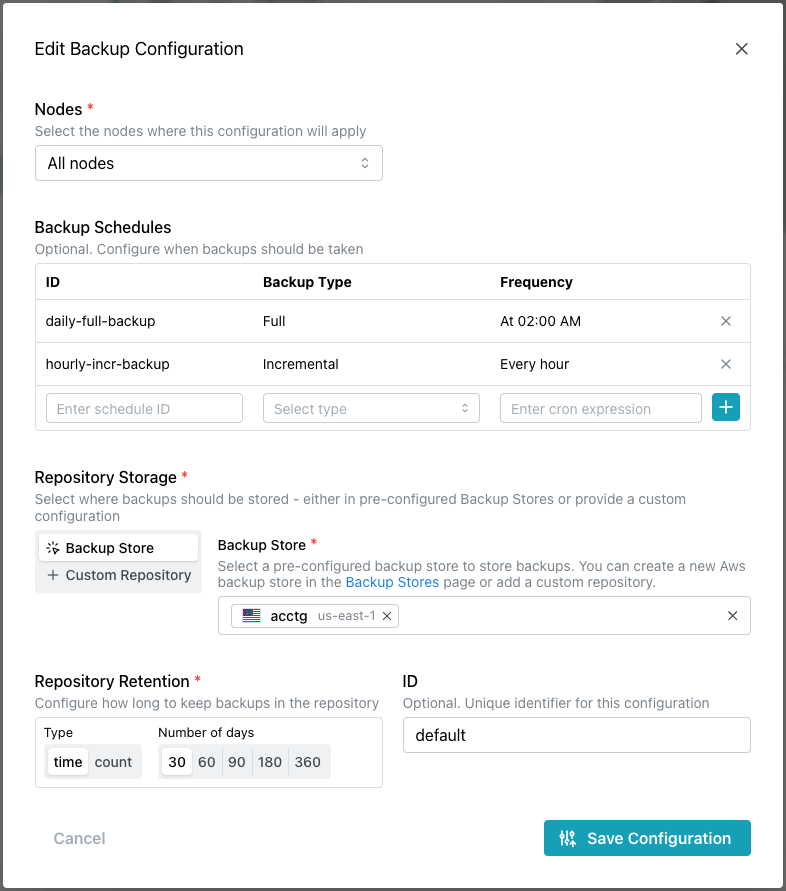
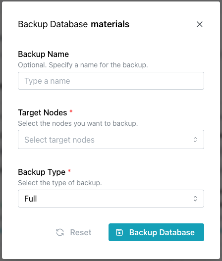

# Backing up your Database

Backup configuration is specific to each database; you can define a different strategy for each database depending on your selected backup provider.  By default:

* pg_dump is the backup tool used for Developer Edition Cloud accounts.
* pgBackRest is the backup tool used for Enterprise Edition Cloud accounts.

## Using pg_dump for Backups

[pg_dump](https://www.postgresql.org/docs/16/app-pgdump.html) uses native Postgres tooling to take database backups that are stored in Cloud's central storage. You can access the pg_dump archive via the `Backups` page or with the Cloud API. pg_dump backups are not recommended for large databases or enterprise-level applications.

pg_dump backups are only taken of node `n1`, and the configuration cannot be customized. While the backup schedule cannot be modified, you can take a database backup at any time by highlighting a database name and selecting `Backup Database` from the `Actions` drop-down menu. 

pg_dump archives offer flexibility and portability, allowing you to download the archive and recreate the database on another host with [pg_restore](https://www.postgresql.org/docs/16/app-pgrestore.html).

## Using pgBackRest for Backups

pgBackRest is a reliable backup provider for large databases and enterprise-level applications. pgBackRest can perform ad hoc backups, archive WAL, and perform custom backups that support a wide variety of scenarios.

pgBackRest backups cannot be downloaded, and can currently only be used to restore data to the same database from which the backup was taken. 

When you create a database using pgBackRest as your backup provider, a backup repository is initialized using the provided Backup Store on each configured node; that repository is then utilized by pgBackRest to store data for each node. Backup repositories enable the re-use of Backup Stores across multiple databases, with paths being used to keep data separate. These paths are configured to ensure no collision of data occurs:

`/databases/<database_id>/<backup_repository_id>/<node_name>`

When you perform a restore with the pgBackRest repository, a new backup repository is established for the database across all nodes. The newly restored database does not overwrite any existing backup data, ensuring you can attempt a fresh restore from your original backup if needed.

### Customizing Backup Details for pgBackRest

If you use pgBackRest as the backup provider for your database, you can edit the backup configuration details or define additional backup configurations for use by your databases. Any changes to the backup configuration must be performed before the database is deployed. 

* To open the `Edit Backup Configuration` dialog and edit the backup configuration, select the pencil icon in the upper-right corner of the backup details dialog.
* To open the `Add Backup Configuration` dialog and define a new backup configuration, select the `+ New Configuration` button. 

Select options on the `Add` or `Edit` dialog to customize your backup and retention policy:

* Specify a node where this configuration will apply, or choose `All nodes` to apply this configuration to any nodes in the database where a node-specific configuration is not provided.

A default backup configuration is provided that includes schedules that describe a once-daily full backup and an hourly incremental backup; you can use options in the `Backup Schedules` section to add new schedules and delete from existing schedules to refine a backup strategy that suits your workload:

* To remove a schedule from the configuration, select the `X` to the right of a schedule.
* To define a new schedule, provide a user-friendly identifier for a new schedule in the `ID` field.
* Select a `Backup Type` for the new schedule; choose: 
    * `Full` to schedule a complete backup of the specified nodes.
    * `Incremental` to backup modifications to the database since the last backup of any type (whether full, differential, or incremental).
    *  `Differential` to backup changes to the database since the last full backup.

* Provide a [Cron expression](https://docs.gitlab.com/ee/topics/cron/) that details the times and days that backups will be taken in the `Frequency` field.

When you've defined the schedule, click the `+` icon to the right of the schedule definition. This will open another set of fields where you can add another schedule if desired.

Use the `Repository Storage` field to identify where backups will be stored:

* Choose `Backup Store` to select a pre-configured backup store from the drop-down in the `Backup Store` field.
* Choose `Custom Repository` to specify details of a custom storage location for backups on your Cloud Provider. If you choose to use a custom repository definition, you will be required to add provider-specific information for your Cloud storage, and ensure that your cluster has the correct IAM permissions to read and write to the storage.

Use the `Repository Retention` selectors to specify how many backups you would like to retain in storage:

* Use the `Type` selector to indicate if you would like to measure how long a backup is stored by length of `time` or backup `count`. 
* Use the `Number of days`/`Number of full backups` indicators to specify the storage retention.
* Optionally, provide a user-friendly identifier for the configuration in the `ID` field.

Select the `Save Configuration` button when you've finished providing backup configuration details.

import { Callout } from 'nextra/components'
 
<Callout type="info">
  Incremental and differential backups will be retained only as long as the full backup that provides their baseline.
</Callout>

## Taking a Backup

To take a database backup, select `Backup` from the drop-down `Actions` menu in the upper-right corner of the `Backups` dialog. 

When the `Backup Database` popup opens:

* Optionally, specify a `Backup Name` to identify the backup.
* Use the `Target Nodes` drop-down to select one or more nodes to be included in the backup.
* Specify the type of backup in the `Backup Type` field. Choose
    
    * `Full` to do a complete backup of the selected database and nodes.
    * `Incremental` to backup only those items that have changed since the last backup.
    * `Differential` to backup any items that have changed since the last *Full* backup.

Use the `Reset` icon to clear the fields, or select the `Backup Database` button to start the backup.
