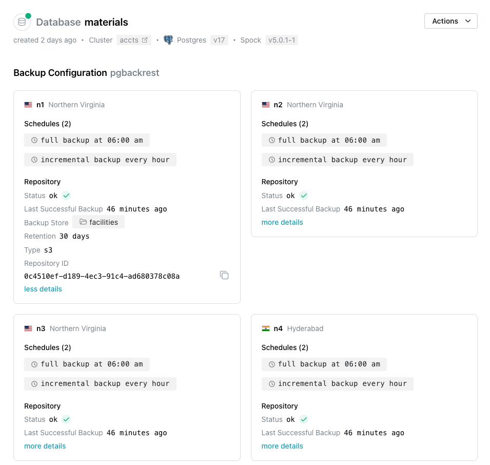
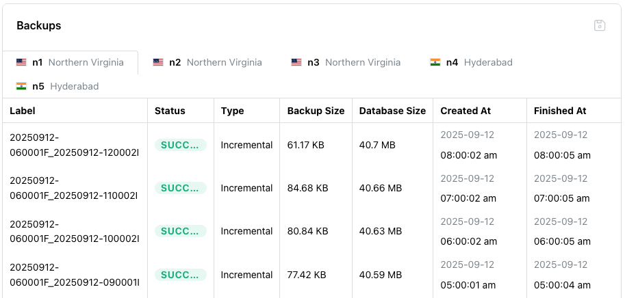

# Reviewing Backup Details

You can use the Cloud `Backups` dialog to take, restore, and manage backups of your Cloud database.  To open the `Backups` dialog, highlight a database name, and then select the `Backups` node from the navigation tree in the left-side panel.

By default, Cloud databases are automatically backed up once every 24 hours. 

The top section of the `Backups` dialog displays a `Backup Configuration` pane for each node in your cluster.  Within a pane, click `more details` to expand the information displaying backup details for the node.

Scroll down to review the `Backups` table; the table displays detailed information about each backup taken.

