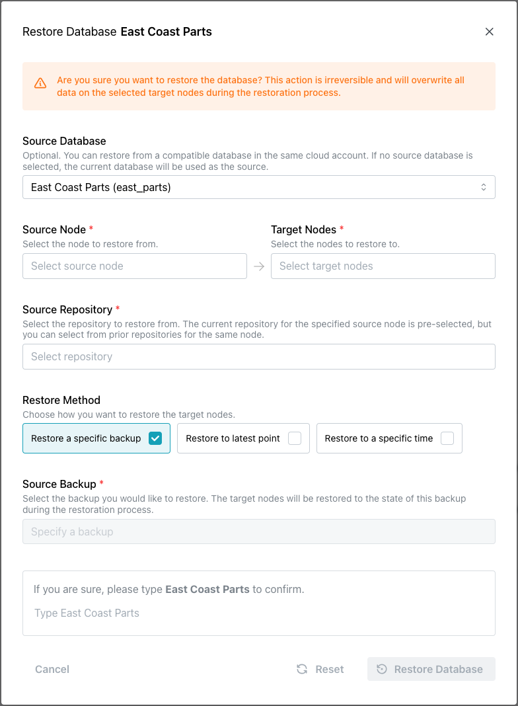

# Restoring a Database from Backup

The pgEdge Distributed Postgres (Cloud Edition) options offered when you restore from backup will vary based on the backups available. The source can be from the same database, or from another database.  If you are restoring from a backup taken from another database, note that:

* the source database must use the same **major** version of Postgres as the target version.
* the source and target databases must be part of the same Cloud account.

Restoring to all of the nodes in your Cloud database is generally the safest way to ensure that all nodes are in sync after a restore. If you are not actively performing writes to your database, or if you have data you maintain only in specific regions, you might opt to restore only a single node in your database.

To restore a database, select `Restore` from the drop-down `Actions` menu in the upper-right corner of the `Backups` dialog.

Use fields on the `Restore Database` dialog to describe how you would like to restore into database nodes:

* Use the `Source Database` field to select the database that will provide the backup source; by default, the current database is selected. Note that the source database must be in the same cloud account as the target database.
* Use the `Source Node` field to specify the source node from which you wish to restore a database backup; available backups are filtered by the selected source node.
* Use the `Target Nodes` field to specify one or more nodes that you wish to restore the database backup into.  
* Use the `Source Repository` field to select the repository that you'd like to restore a backup from.
* Select a Restore Method; choose:
    * `Restore a specific backup` to restore the database to the state it was in when a specific backup was taken.
    * `Restore to latest point` to restore a database to the latest archived state in the repository.
    * `Restore to a specific time` to restore a database to the state it was in at a specific time. When the date/time selection fields open, use the calendar and time selector or `Relative Time` selector to choose the point to which you wish to restore. Note that the point in time you specify must be after the first transaction stored in your repository, but before the latest transaction archived to the repository.
* Select the `Source Backup` that you would like to restore into the current database.

When you've made your selections, type the database name in the confirmation field and click `Restore Database` to start the restoration process.  When the restore completes, replication sets will be created, and replication will be restarted if automatic DDL replication is enabled.  If automatic DDL replication is disabled, you will be required to [use the `Start Replication` button](https://docs.pgedge.com/cloud/database/manage_db#the-start-replication-pane) to initiate replication of restored tables.

import { Callout } from 'nextra/components'
 
<Callout type="info" emoji="ℹ️">
You can also use the Cloud API to restore from backup; for details, visit [here](https://docs.pgedge.com/cloud/settings#the-api-clients-tab).
</Callout>
