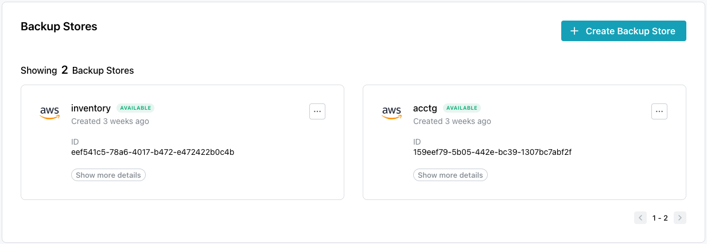
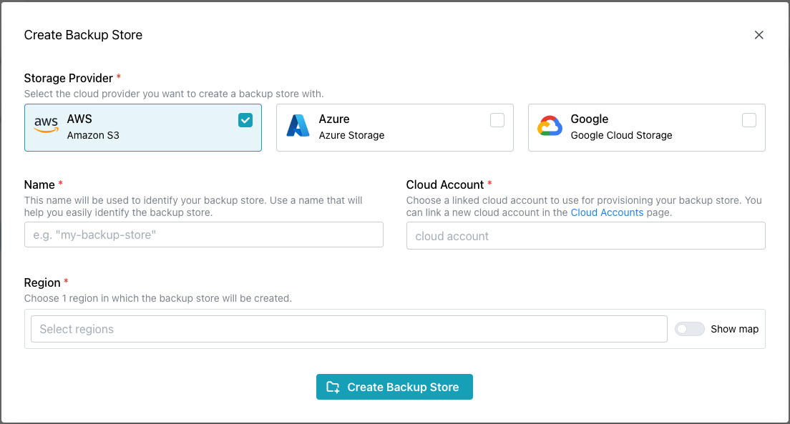
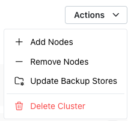
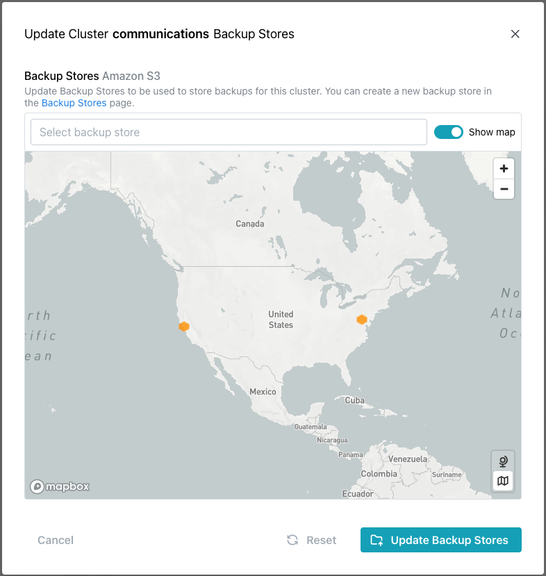
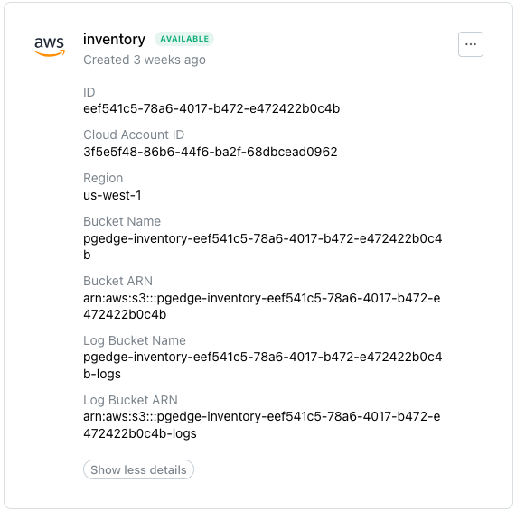
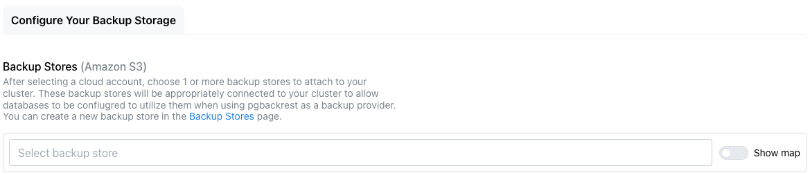
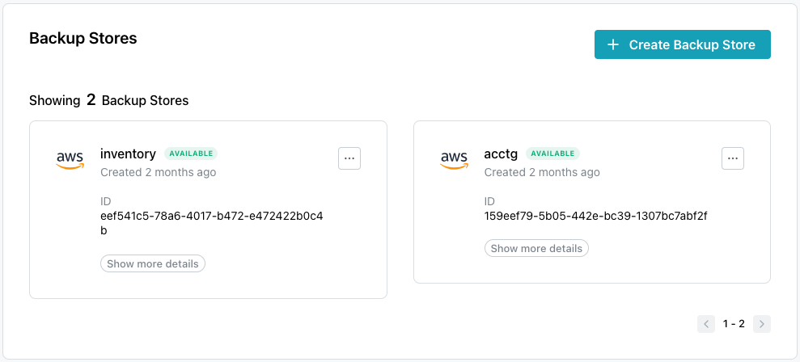
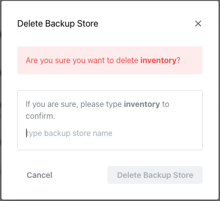

# Defining a Backup Store

import { Callout } from 'nextra/components'
 
<Callout type="info">
  Backup stores are available only on Enterprise Edition and are used only for pgBackRest backups.
</Callout>

Use options accessed via the `Backup Stores` link in the navigation pane to define storage on your cloud provider. Then, when you deploy a cluster, you can select a backup store to attach to the Cloud cluster for use when backing up cluster nodes or log files.

A Cloud provider backup store acts as a connection between your Cloud cluster and your provider's object store. The provider account that is used for your backup store must be the same account used when deploying the cluster. You can attach more than one backup store to a single cluster, and each backup store can be used for multiple Cloud nodes and/or databases. 

When you create the backup store, two storage buckets are deployed in the store; one bucket is used for backups, and one is used to store provider access logs for the primary bucket.

To reduce network latency, you should backup each node to a backup store located geographically close to the node's region (ideally within the same region). You can optionally create a backup store in another region, but archiving will take longer if the store is geographically distanced.

## Creating a Backup Store

The `Backup Stores` dialog displays the backup storage defined on your Cloud provider; select the `Create Backup Store` icon (located in the upper-right corner of the dialog) to provide details and define a backup store. 

To define a backup store, start by selecting the `Storage Provider` on which you wish to create a backup store. Then, when the dialog expands:

1. Provide a user-friendly `Name` to identify the backup store.
2. Select the `Cloud Account` that will be used to provision the store.
3. Select a `Region` in which the backup store will be created.

When you've specified your preferences, click the `Create Backup Store` icon to create the store.

## Attaching a Backup Store to a Cluster

You can attach multiple backup stores to each cluster when [defining the cluster](../cluster/create_cluster.md#creating-a-cluster); if you would like to add a backup stores after cluster creation, you can use the `Update Cluster Backup Stores` dialog.  Before attaching a store, you must [define the backup store](#defining-a-backup-store).

Then, to attach the store to a cluster, highlight the cluster name in the navigation panel and select `Update Backup Stores` from the `Actions` menu.  

The `Update Cluster Backup Stores` dialog opens as shown below:

When the dialog opens, click in the `Backup Stores` field or select from the icons on the map to choose the backup stores you wish to make available to your cluster.  When you've identified the clusters backup stores, select the `Update Backup Stores` button to update the cluster. 

## The Backup Stores dialog

After you define a backup store, the new store will be added to the Backup Stores dialog; select the `Show more details` icon to expand the information dialog to view details about the store:

Backup store details include:

* the provider identity, backup store name, and creation date.
* the volume identifier (the `ID`).
* the `Cloud Account ID`. 
* the `Region` in which the backup store resides.
* the `Bucket Name`.
* the `Bucket ARN`. 
* the `Log Bucket Name`; the log bucket stores the access logs to the bucket.
* the `Log Bucket ARN`.

Note that the security policy associated with the ARN uses the least permissions required to create and use backup stores.  You can use your provider's console to modify the security policy if needed.

When defining a cluster, you can select the backup store you wish to use for cluster backups in the `Backup Stores` field. Select a defined store from the drop-down list or toggle the `Show map` option to `enabled` to select from defined stores on the map image.

## Deleting a Backup Store

Before you can delete a Backup Store, you must remove all data from the store in your Cloud provider account.  Then, to remove a store, highlight the `Backup Stores` node in the navigation panel.  When the `Backup Stores` dialog opens, you'll see details about the currently defined backup stores:

To delete a backup store, open the context menu in the upper-right corner of a backup store information pane and select `Delete Store`.  The `Delete Backup Store` popup opens:

To delete the store, type the name of the store in the confirmation field, and click the `Delete Backup Store` button.