# Creating a Cluster

!!! info

    To create a cluster with pgEdge Distributed Postgres Cloud Edition,
    you must have a
    [linked Cloud provider account](../prerequisites/cloud_accounts/index.md).

To create a cluster, navigate to the `Clusters` page and select the
`+ New Cluster` button. When the `Create New Cluster` page opens,
provide a unique name for the cluster in the `Cluster Name` field.

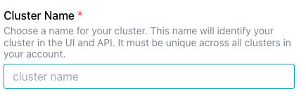

Use the drop-down listbox in the `Cloud Account` field to select the
[cloud provider account](../prerequisites/cloud_accounts/index.md)
used to provision the cluster.

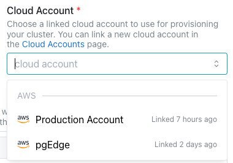

Select up to 5 availability zones in any regions accessible from the
cloud provider account. Use the `Show map` toggle to enable the map
for location selection.

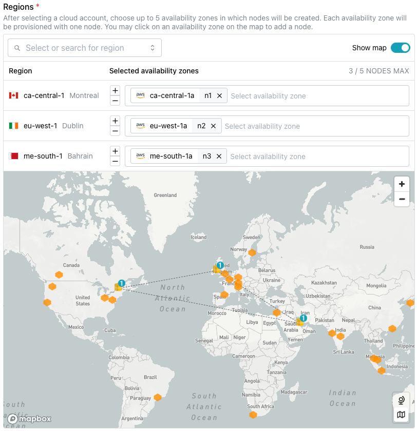

To define the cluster deployment using the drop-down fields, first select
the region for node deployment. The region name is displayed in the list
of selected `Regions` after selection.

Use the `+/-` control or the drop-down list to the right of the `Region`
name to select from the supported Availability Zones for node deployment.
One node is deployed in each listed zone; use the `X` in the zone icon
to remove a zone from the deployment list.

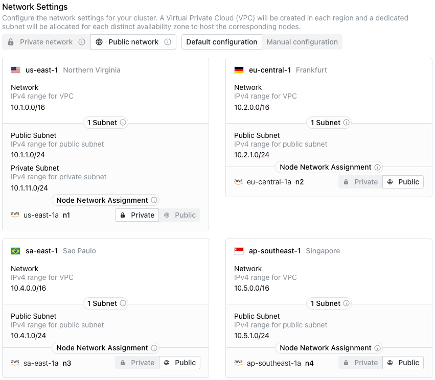

Each region in which the cluster is deployed is represented by a pane in
the `Network Settings` section; within each region, subnet details for
each availability zone are displayed. Toggles at the top of the
`Network Settings` section control the network assignments for the
cluster:

- Use the `Configuration` toggle to accept the `Default configuration`
  for address assignments, or move the toggle to `Manual configuration`
  to specify custom address assignments.

- Use the `Network Type` toggle to specify whether the connection values
  for the cluster use `Public` or `Private` addresses:

  - `Public` network clusters have IP addresses assigned to each node
    that are accessible from the public internet.
  - `Private` network clusters are not accessible from the public
    internet.

Within each pane, the `Node Network Assignment` label lists the
provider-assigned region, the node name (`n` followed by a number),
and a toggle that specifies the network assignment for that node.

Specify the vendor-specific deployment details for the cluster.

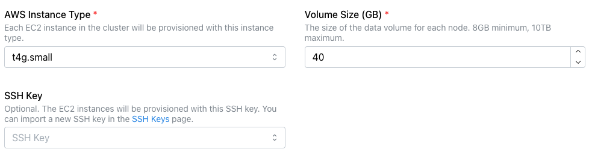

- Use the `Instance Type` drop-down to select the size and configuration
  of the cluster instance type. Each node in the cluster resides on the
  selected instance type; the instance type is one factor in determining
  the operating cost of the cluster.

- Use the `Volume Size (GB)` field to specify the size of the data volume
  for each node of the cluster. Volume size must be between 8 GB and
  10 TB.

- Use the `SSH Key` drop-down to select a key pair from the list of
  [imported key pairs](../prerequisites/ssh_key.md). A key pair is
  required to SSH to a cluster; without a key, connections to databases
  provisioned on the cluster are available, but SSH connections to the
  host are not.

Optionally, select the
[`Backup Stores`](https://docs.pgedge.com/cloud/backup/backup_store)
available for database backups and log file backups for the new cluster.

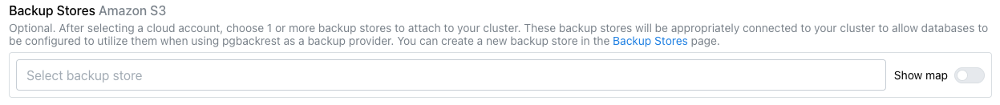

As you define backup stores, remember that selecting backup stores near your
cluster nodes will reduce network latency during the backup process. Use the
drop-down field or select locations on the map to include a specific store.

A [`Resource Tag`](resource_tag.md) is a user-defined key/value pair
attached to a cluster definition. The tag is displayed under the cluster
name on the `Clusters` page. Use tags to categorize cloud resources or
search for resources used by specific teams or applications. For example,
a tag that specifies `team/db-ops` makes it easy to identify resources
used by the `db-ops` team.

To add a resource tag, select `Add Resource Tag` and specify the `Key`
and `Value`; the terms are displayed with a `/` delimiter.

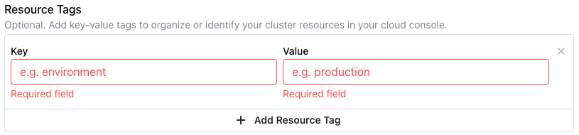

Define a [VPC association](vpc_assoc.md) to configure VPC peering and,
if needed, private zone routing between any defined VPCs and the pgEdge
cluster network. Peering allows an application to connect seamlessly to
any node across regions, enabling latency routing and DNS failover. VPC
associations are currently only available for AWS.

Use the `VPC Associations` fields to add any defined VPCs that require
access to the cluster.

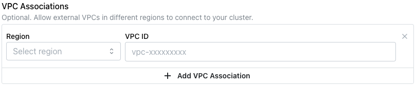

Use the [`Firewall Rules`](firewall.md) field to open ports on each node
of the cluster for connections. Select the `+ Add Firewall Rule` icon to
add a rule.

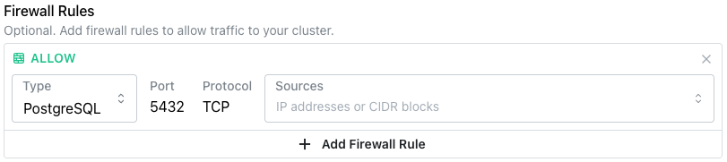

- Use the `Type` drop-down to select the connection type for the rule:

    - Select `PostgreSQL` to create a connection to port `5432`; this is
      the default port used by clients that query the database.
    - Select `HTTPS` to open port `443` for secure communication between
      PostgreSQL and a web server.
    - Select `SSH` to open port `22` for SSH connections.

- Use the `Source Type` selector in the right column to specify the type
  of connection source allowed to connect with this rule. The following
  options are available:

    - An IP address, specifying a single host or CIDR block.
    - A prefix list, specifying a managed set of CIDR blocks.
    - A security group, specifying a set of AWS instances.

- Use the `Sources` field in the left column to specify the connection
  source allowed access to the cluster with the rule:

    - To remove a source, select the `X` in the rule's `Sources` field.
    - To add a source, select the `Sources` field and choose from the
      predefined options, or type directly in the field.

- Use the `Applies To` selector to choose the node or nodes to which
  the rule applies.

After providing rule details, select the `+ Add Firewall Rule` button
to add another rule to the list. To remove a rule from the list, select
the `X` in the upper-right corner of the rule box.

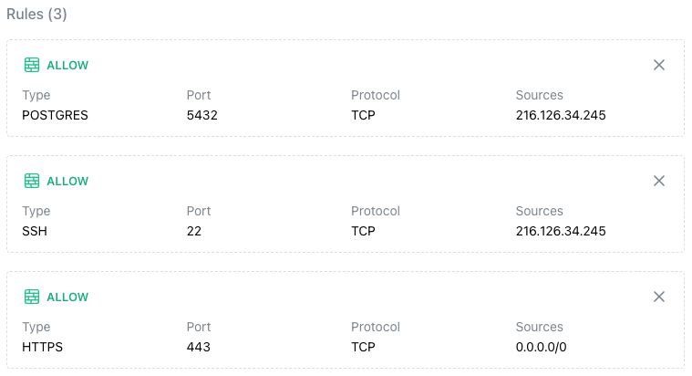

!!! note

    Client software cannot connect to the OS or databases on the cluster
    if ports are not opened for connection.

The `Options` section provides the option to create the cluster as a
`single-database cluster`.

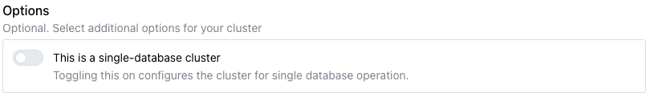

Single database clusters provide the following benefits:

- A single-database cluster allows connections to the database with an IP
  address rather than a domain name.
- A single-database cluster allows connections via DNS names and records
  created outside of the pgEdge console.
- A single-purpose, dedicated cluster guarantees that all cluster
  resources are available for the single database.

After completing the dialog, select the `Deploy Cluster` button to
deploy a provisioned cluster.

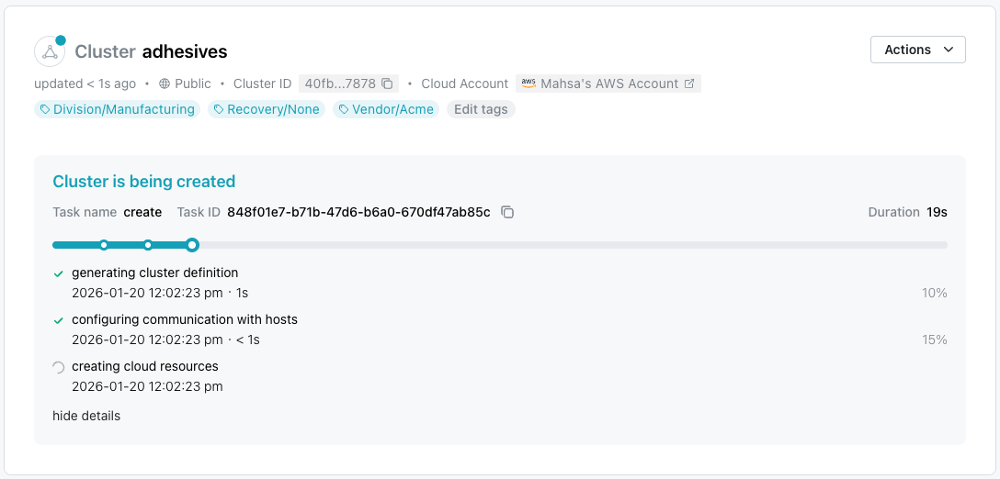

A progress bar tracks the deployment through each step; when the cluster
is ready to use, it is added to the list of clusters in the navigation
tree.

If errors occur during cluster creation, see the
[Troubleshooting section](../troubleshooting.md).
