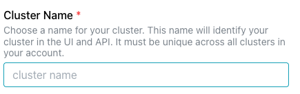

# Creating a Cluster

!!! info

    To create a cluster with pgEdge Distributed Postgres (Cloud Edition), you must have a [pgEdge Enterprise Edition account](https://www.pgedge.com/products/pgedge-cloud) and a [linked Cloud provider account](../prerequisites/cloud_accounts/index.md).

To create a cluster, select the `+ New Cluster` button in the left navigation pane. Then:

* Provide a unique name for your cluster in the `Cluster Name` field.

* Use the drop-down listbox in the `Cloud Account` field to select the [cloud provider account](../prerequisites/cloud_accounts/index.md) that will be used to provision your cluster.

* Select up to 5 availability zones in any regions to which you have access. To use the map for location selection, use the `Show map` toggle to enable the map.

Once selected, the region name is added to the list of selected `Regions`. Use the `+/-` control or the drop-down list to the right of the `Region` name to select from the supported Availability Zones for node deployment. One node will be deployed in each zone listed; you can use the `X` in the zone icon to remove a zone from the deployment list.

Each region in which your cluster is deployed is represented by a pane in the `Network Settings` section; within each region, subnet details for each availability zone are displayed. Toggles at the top of the section control network details:

* Use the `Configuration` toggle to accept the `Default configuration` for address assignments, or move the toggle to `Manual configuration` to specify custom address assignments.

* Use the `Network Type` toggle to specify if the connection values displayed or edited should be `Public` or `Private` addresses: 

  * `Public` network clusters will have IP addresses assigned to the nodes that can be accessed from the public internet.
  * `Private` network cluster are not accessible from the public internet.

Next, specify the vendor-specific deployment details for your cluster.

* Use the `Instance Type` drop-down to select the size and configuration of your cluster instance type. Each node in the cluster will reside on the instance type selected. The instance type is one factor in determining the operating cost of your cluster. 

* Use the `Volume Size (GB)` field to specify the size of the data volume for each node of your cluster. Volume size must be between 8 GB and 10 TB.

* Use the `SSH Key` drop-down to select a key pair from the list of your [imported key pairs](../prerequisites/ssh_key.md). A key pair is required to SSH to a cluster; without a key, you can connect to databases you provision on the cluster, but will not be able to connect with the host via SSH.

Select the [backup stores](https://docs.pgedge.com/cloud/backup/backup_store) that will be available to use for database backups and log file backups for the new cluster.

As you select backup stores, remember that selecting backup stores near your cluster nodes will reduce network latency during the backup process. Use the drop-down field or select locations on the map to include a specific store.

You can define a VPC association to configure VPC peering and (if needed) private zone routing between any defined VPCs and the pgEdge cluster network. Peering allows an application to connect seamlessly to any of the nodes across regions, allowing you to fully leverage latency routing and dns failover. This is currently only available for AWS.

Use the `VPC Associations` fields to add any defined VPCs that should have access to your cluster.

Use the `Firewall Rules` field to open ports on each node of your cluster for connections. Click the `+ Add Firewall Rule` icon to add a rule.

* Use the `Type` drop-down to select the connection type you are defining:

    * Select `PostgreSQL` to create a connection to port `5432` ; this is the port that connecting clients that wish to query the database should use.

    * Select `HTTPS` to open port `443` for secure communication between PostgreSQL and a web server.

    * Select `SSH` to open port `22` for SSH connections.

* Use the `Sources` drop-down to select the IP address(es) that will be allowed to connect to the port.

    * Choose `My IP:x.x.x.x` to open a port for the detected IP address from which you are connected.
    * Choose `All IPV4` to allow connections to the selected port from any source. This setting is not recommended for connections to the database server.

After selecting a protocol type and an address, choose the `+ Add Rule` button to add the list of firewall rules. To remove a rule from the list, select the `X` in the upper-right corner of the rule box.

To create the cluster without firewall rules, check the box to the left of `Deploy cluster without firewall rules`. Note that if you do not open ports for connection, client software will be unable to connect to the OS or databases that reside on the cluster.

In the `Options` section you'll find the option to create the cluster as a `single-database cluster`.

Single database clusters are beneficial because:

* they allow connections to the database with an IP address (rather than by domain name).
* they allow connections to the database via DNS names and records that you create outside of the pgEdge console.
* a single-purpose, dedicated cluster guarantees that all cluster resources are available for the single database.

When you've completed the dialog, select the `Deploy Cluster` button to deploy a provisioned cluster.

A progress bar tracks the progress as the deployment goes through each step; when the cluster is ready to use, it is added to the list of clusters in the navigation tree.

If you encounter any errors during cluster creation, please see the [Troubleshooting section](../troubleshooting.md).
