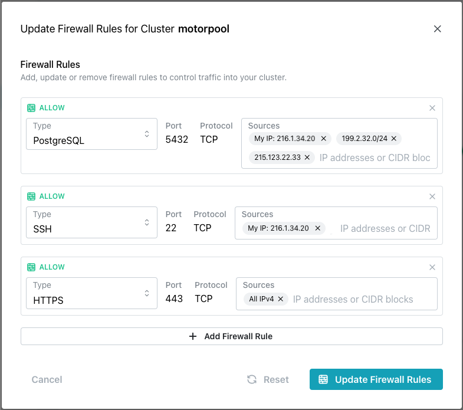
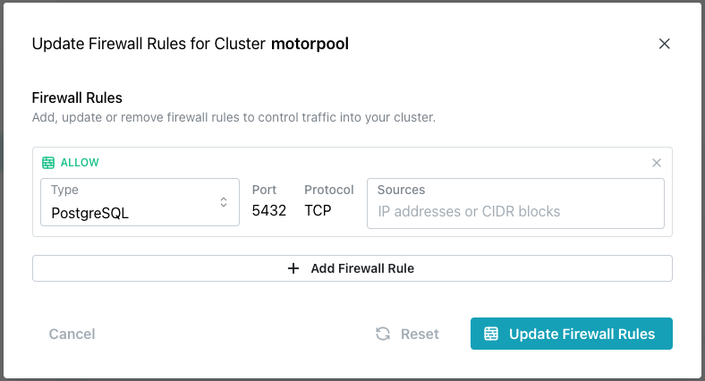

# Adding or Modifying Firewall Rules

When you create a Cloud cluster, you can provide firewall rules that define the IP addresses or CIDR blocks that are allowed to connect to your cluster. To add or modify a cluster's firewall rules, highlight the name of a cluster in the navigation tree and select `Update Firewall Rules` from the [`Actions`](https://pgedge-docs-sandbox.pages.dev/cloud/mod_cluster/actions) drop-down menu.

The Firewall Rules popup displays the currently defined rules for your cluster. You can click the `+ Add Firewall Rule` bar to open a new line (as shown below) and add a new firewall rule, or modify the current rules:

To add or modify a firewall rule:

* Use the `Type` selector in the left column to specify the incoming connection type. You can create a rule that connects with:

  * A Postgres client like pgAdmin or psql on port `5432`.
  * An SSH client on port `22`.
  * An HTTPS client on port `443`.

* Use the `Sources` field in the right column to add or remove the IP address(es) or [CIDR block(s)](https://www.postgresql.org/docs/17/datatype-net-types.html#DATATYPE-CIDR) that will be allowed to connect via the connection `Type` specified in the left column. 

  * To remove an address, click the `X` to the right of the address in the `Sources` field. 
  * To add an address, click in the Sources field and select from the predefined options, or type directly in the field. After entering each address, hit `Enter` to confirm the addition; you can then add another address to the `Sources` field, or select `+ Add Firewall Rule` to open another line for entries.  

When you're finished, select `Update Firewall Rules` to modify your cluster's firewall. While the firewall is being modified, a blue dot to the left of the cluster name indicates that the changes are being applied. During this time, your cluster remains available for connections, but you must wait to make further modifications to the cluster definition.

!!! info

    When specifying a CIDR block, append the number of bits in the netmask after the address block; for example, the address `10.1.2.0/24` specifies that anyone connecting from an IP address that starts with the prefix `10.1.2` can connect.