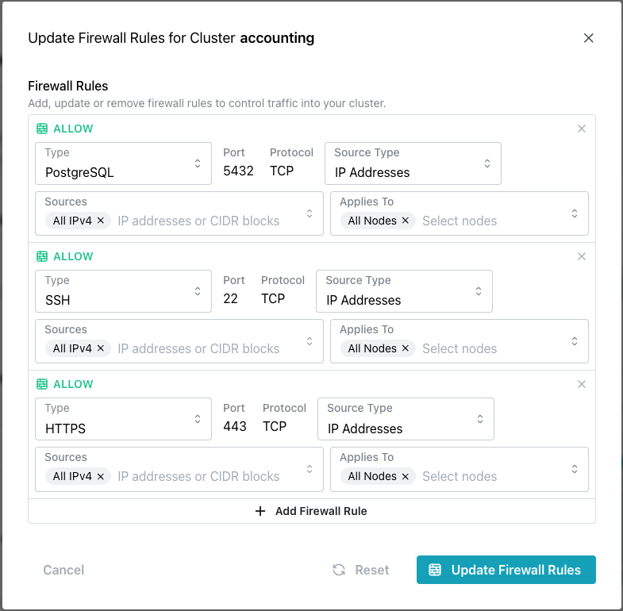
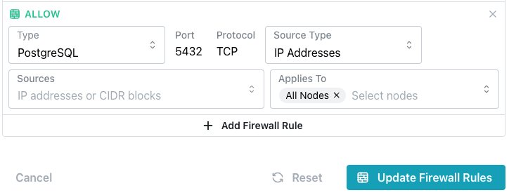

# Adding or Modifying Firewall Rules

When you create a Cloud cluster, you can provide firewall rules that define
the IP addresses or CIDR blocks that are allowed to connect to your cluster.
To add or modify a cluster's firewall rules, highlight the name of a cluster
in the navigation tree and select `Update Firewall Rules` from the
[`Actions`](https://pgedge-docs-sandbox.pages.dev/cloud/mod_cluster/actions)
drop-down menu.

The Firewall Rules popup displays the currently defined rules for your
cluster. You can click the `+ Add Firewall Rule` bar to open a new line (as
shown below) and add a new firewall rule, or modify the current rules:

To add or modify a firewall rule:

* Use the `Type` selector in the left column to specify the incoming
  connection type. You can create a rule that connects with:

  * A Postgres client like pgAdmin or psql on port `5432`.
  * An SSH client on port `22`.
  * An HTTPS client on port `443`.

* Use the `Source Type` selector in the right column to specify the type of
  connection source that is allowed to connect with this rule. You can choose
  from the following options:

  * An IP address, specifying a single host or CIDR block.
  * A prefix list, specifying a managed set of CIDR blocks.
  * A security group, specifying a set of AWS instances.

* Use the `Sources` field in the left column to specify details about the
  connection source that will be allowed access to your cluster with the rule.

  * To remove a source, click the `X` in the rule's `Sources` field. 
  * To add a source, click in the `Sources` field and select from the
    predefined options, or type directly in the field.

* Use the `Applies To` selector to choose the node or nodes to which the
  rule applies.

When you're finished, select `Update Firewall Rules` to modify your cluster's
firewall. While the firewall is being modified, a blue dot to the left of the
cluster name indicates that the changes are being applied. During this time,
your cluster remains available for connections, but you must wait to make
further modifications to the cluster definition.

!!! note

    Duplicate firewall rules are not allowed; you will receive a message if
    any of your rules duplicate previously defined rules.