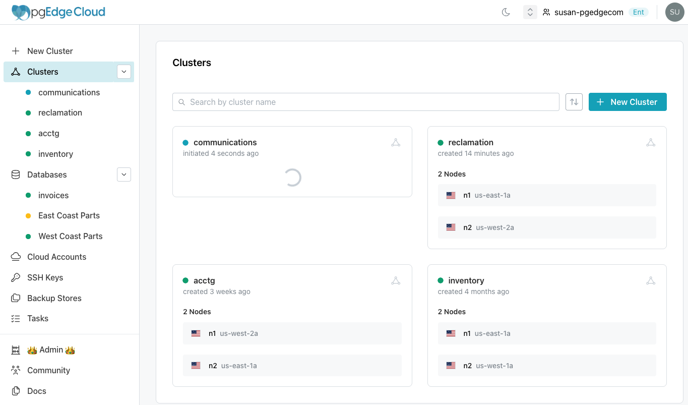

# Reviewing your Cloud Clusters

!!! info

    Clusters are available only on pgEdge Distributed Edition (Cloud Edition) Enterprise Edition accounts.

To review a list of the currently defined Postgres clusters, expand the `Clusters` node of the tree control in the console navigation pane.

The dot to the left of a cluster name in the tree control indicates the cluster status:

* A green dot indicates that the cluster deployment has completed.
* A blue dot indicates that the cluster is in the process of deploying.
* A grey dot indicates that cluster deletion is pending.
* A red dot indicates that cluster creation failed.

The `Clusters` page displays a pane for each cluster that lists the nodes in the cluster and the regions in which each node is deployed. Select a cluster name in the tree control or select the navigation icon in a pane to navigate to a page with cluster information.