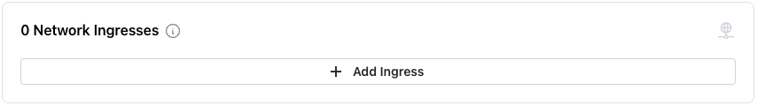
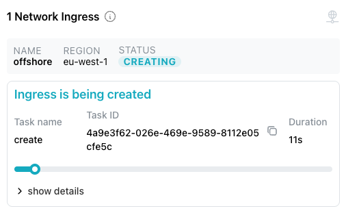

# Adding an Ingress to a Private Cluster

When you create a private Cloud cluster, you restrict access to only those
users on your local network.  You can define an ingress for users not on your
network that exposes the services for use.  To add a network ingress to your
cluster, select `Add Ingress` from the
[`Actions`](https://pgedge-docs-sandbox.pages.dev/cloud/mod_cluster/actions)
drop-down menu.

Complete the `Create Ingress` dialog; use the:

* `Name` field to enter a name for the ingress. This name is used
  to identify the ingress in the UI and API.

* `Region` field to select the region where the ingress will be
  created.

After completing the dialog, select the `+ Create Ingress` icon to create the
defined ingress.

