# Managing a Cluster

Use the pgEdge Cloud console to review cluster information. Select the
name of a cluster in the `Clusters` menu to access the console for that
cluster.

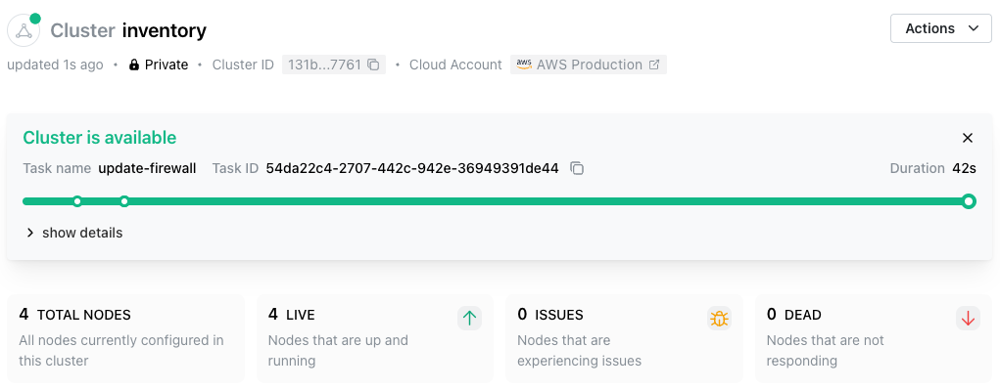

If you recently created or modified the cluster, the header displays a
banner showing the cluster state. The console header also displays
information about the selected cluster:

- The cluster name.
- The length of time since the last cluster update.
- The cluster connection type (`Public` or `Private`), which indicates
  whether the cluster nodes are in a public subnet.
- The `Cluster ID` associated with the cluster.
- The name of the cloud provider account on which the cluster resides;
  select the account name to navigate to the details page for the account.
- User-defined [resource tags](resource_tag.md) associated with the cluster.

The cluster header also displays a set of informational panes that show
the state of the cluster at a glance:

- The total node count.
- The number of healthy nodes.
- The number of unhealthy nodes.
- The number of unresponsive nodes.

## The Cluster Information Tabs

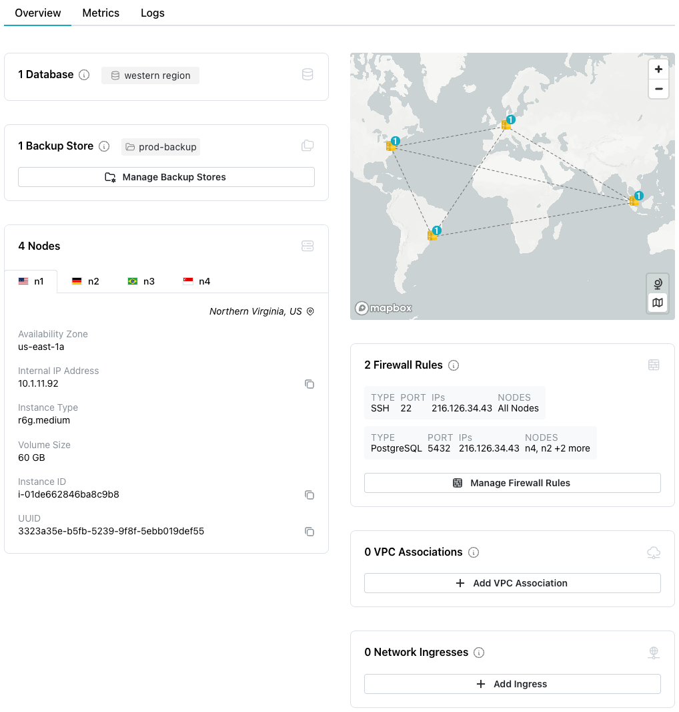

The tabbed browser on the `Cluster` tab provides quick access to
information about the state of the cluster:

- Select the [`Overview`](#the-overview-tab) tab to view information
  about the cluster and the databases currently deployed on the cluster.
  Detailed information about the cluster nodes displays below. Select an
  icon in the `Database` pane to navigate to detailed information about
  the selected database.
- Select the [`Metrics`](#reviewing-cluster-metrics) tab to view details
  about cluster resource use.
- Select the [`Logs`](#reviewing-cluster-log-files) tab to review cluster
  log files.

### The Overview Tab

Select the `Overview` tab to review information about the cluster.
Panes on the `Overview` tab contain links to cluster artifacts:

- Select a database name in the `Databases` pane to navigate to the
  information page for that database.
- Select a backup store name in the `Backup Store` pane to navigate to
  the information page for the store.

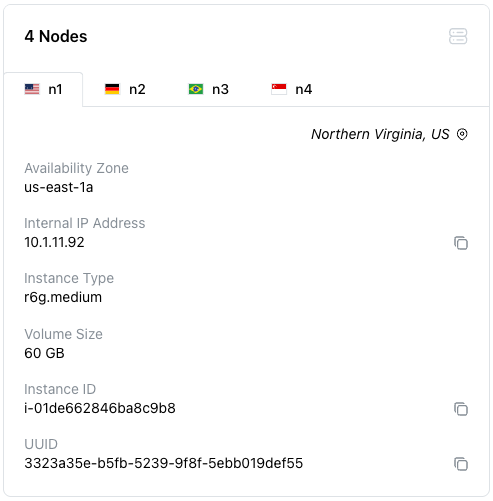

The `Nodes` pane contains general node information. Use the tabbed
browser to select a node and review information about that node:

- The `Availability Zone` lists the provider region in which the node
  is deployed.
- Use the `External IP Address` when making connections to the node from a
  public address.
- Use the `Internal IP Address` when configuring VPN connections to the
  node.
- The `Instance Type` and `Volume Size` details provide node size information.
- The `Instance ID` identifies the node and associated resources in the
  cloud provider console.
- The `UUID` is a unique identifier for cluster resources outside of
  the cloud provider console; use the UUID when making API calls.

When the `Overview` tab is selected, a map displays the locations of
the cluster nodes. Hover over a mapped node to display the name and
city in which the node resides.

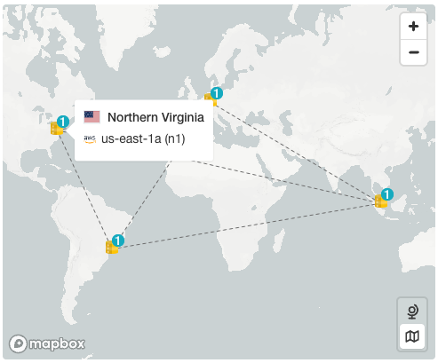

The `Overview` tab also displays the currently defined
[Firewall Rules](firewall.md).

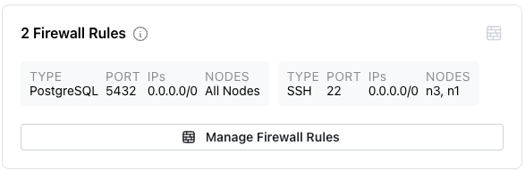

Select the `Manage Firewall Rules` button to open a dialog to
[modify or create rules](firewall.md) for the cluster.

The `Overview` tab also displays the current [VPC Associations](vpc_assoc.md).

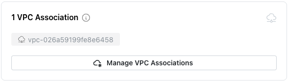

Select the `+ Add VPC Association` button to add a new association.

### Reviewing Cluster Metrics

Select the `Metrics` tab to review detailed system resource usage for
the cluster.

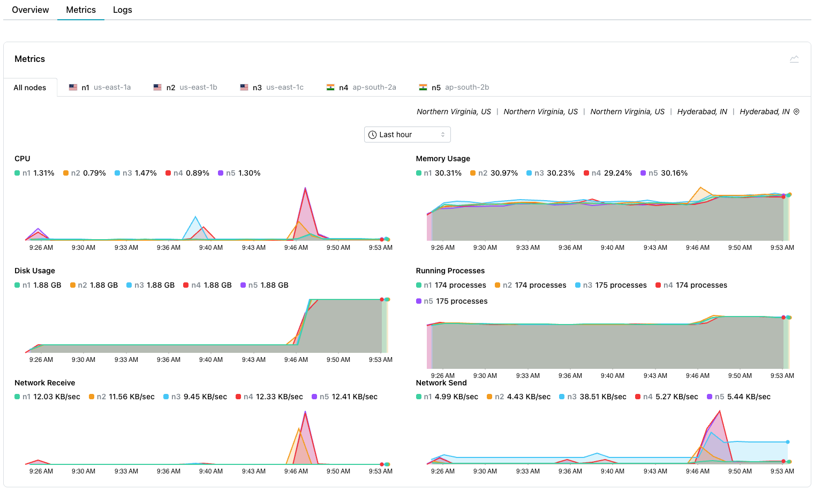

Select from the tabs across the top to review graphs containing:

- Metrics for all nodes in the cluster.
- Metrics for a specific node in the cluster.

The drop-down at the top of the `Metrics` pane specifies the length of
time displayed by each graph.

Select a point on a graph to display information about the graphed event:

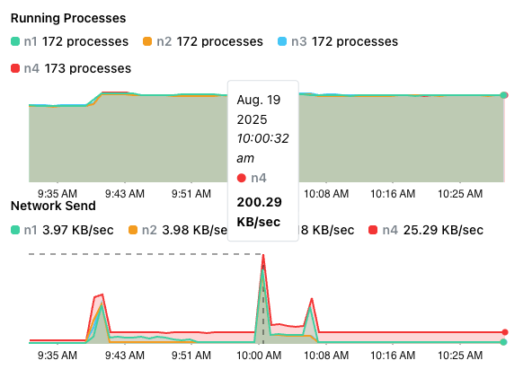

The following table describes the available graphs:

| Graph Name | Description |
|------------|-------------|
| CPU | The percentage of CPU used by the database |
| Memory Usage | Memory used (in MB) |
| Disk Usage | The amount of disk space used (in GB) |
| Running Processes | The number of running processes |
| Network Receive | The amount of data received by the instance |
| Network Send | The amount of data transmitted from the instance |

### Reviewing Cluster Log Files

Select the `Logs` tab to review log files for the cluster.

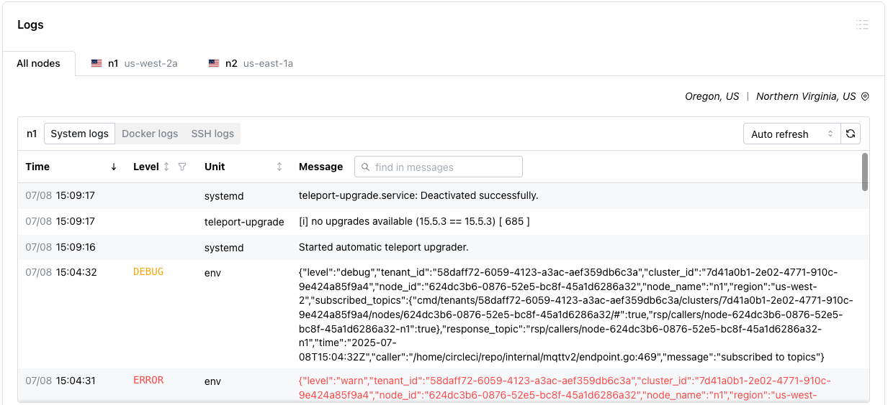

Use the tabs across the top to select the nodes for which to review log
files, then select one of the following log types:

- `System logs` reviews the system commands performed to manage the
  cluster.
- `Docker logs` reviews the Docker-specific commands executed to manage
  the container in which the cluster is running.
- `SSH logs` reviews details about SSH connections made to the cluster.

Use the `Auto refresh`/`Manual refresh` drop-down to specify whether
log entries update automatically (`Auto refresh`) or pause updating
(`Manual refresh`) for easier viewing. To manually refresh the log
table's content, select the refresh button to the right of the drop-down.

Use the controls in the table header to sort or search the selected log file:

- Select a column heading to sort alphabetically by the column value;
  select a second time to reverse the sort order.
- Select the filter icon to the right of the `Level` heading to choose
  a status from the drop-down; all rows assigned the selected status
  are filtered to the top of the result set.

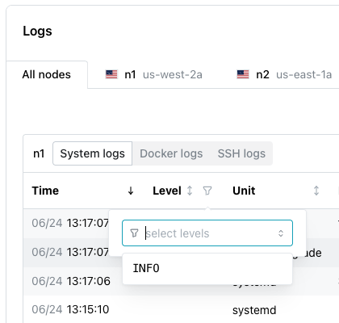

- Use the search box to the right of the `Message` label to enter a
  search string; the search term is highlighted in the log file entries.
  Use the navigation arrows to move to the next or previous occurrence
  of the search term.

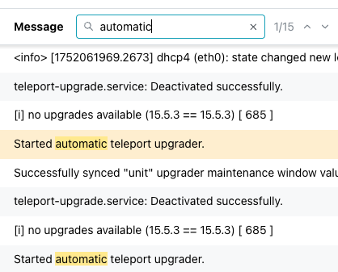

## Cluster Administration Links

Use the links at the end of the navigation pane to access pgEdge Cloud
resources:

- To manage account details, select the [`Settings`](../settings.md) link.
- Select the [`Team Management`](../teams.md) link to manage account membership.
- For an invitation to the pgEdge Discord server, select the `Community` link.
- To review the documentation, select the
  [`Docs`](https://docs.pgedge.com/) link.
