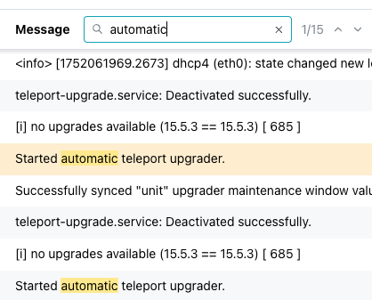

# Managing a Cluster

You can use the pgEdge Distributed Postgres (Cloud Edition) console to review cluster information; highlight the name of a cluster in the `Clusters` menu to access the console for that cluster.

If you've recently created or modified the cluster, the header displays a banner showing the cluster state.  The console header also displays information about the selected cluster:

* The cluster name.
* The length of time since the last cluster update.
* The preferred connection type (`Public` or `Private`); this indicates if the cluster nodes are in a public subnet or not.
* The `Cluster ID` associated with the cluster.
* The name of the cloud provider account on which the cluster resides; click the name of the account to navigate to the details page for the account.

Also in the cluster header, a set of informational panes tell you the state of the cluster at a glance:

* the total node count 
* the number of healthy nodes
* the number of unhealthy nodes
* the number of unresponsive nodes

## The Cluster Information Tabs

The tabbed browser on the `Cluster` tab provides quick access to information about the state of your cluster:

* Select the [`Overview`](#accessing-cluster-details) tab to view information about the cluster, and the databases currently deployed on the cluster. Detailed information about the cluster's nodes is displayed below. Click on an icon in the `Database` pane to navigate to detailed information about the selected database. 
* Select the [`Metrics`](#reviewing-cluster-metrics) tab to view details about cluster resource use.
* Select the [`Logs`](#reviewing-cluster-log-files) tab to review cluster log files.

### The Overview Tab

Select the `Overview` tab to review information about the cluster. Panes on the `Overview` tab contain links to cluster artifacts:

  * Select a database name in the `Databases` pane to navigate to the information page for that database. 
  * Select a backup store name in the `Backup Store` pane to navigate to the information page for the store.

The `Nodes` pane contains general node information. Use the tabbed browser to select a node to review information that node:

* The `Availability Zone` lists the provider region in which the node is deployed.
* Use the `External IP Address` when making ssh connections to the node.
* Use the `Internal IP Address` when configuring VPN connections to the node.
* The `Instance Type` and `Volume Size` fields provide node size information.
* The `Instance ID` identifies the node and associated resources in the cloud provider console.
* The `UUID` is a unique identifier for cluster resources outside of the cloud provider console; use the UUID when making API calls.

**Cluster Nodes Map**

When the `Overview` tab is selected, a map displays the locations of the cluster's nodes. Hover over a mapped node to display the name and city in which the node resides.

**Review Firewall Configuration**

The `Overview` tab also displays the currently defined [Firewall Rules](./firewall.mdx).

**VPC Associations**

The Overview tab also displays the current [VPC Associations](./vpc_assoc.mdx):

### Reviewing Cluster Metrics

Select the `Metrics` tab to review detailed system resource usage for the cluster.

Select from tabs across the top to review a graph containing:

* Metrics for `All nodes` in your cluster.
* Metrics for a specific node in your cluster.

Use the drop-down at the top of the `Metrics` pane allows you to specify the length of time displayed by each graph. 

Select a point on a graph to display information about the graphed event that occurred on your cluster: 

The graphs display metrics about:

| Graph Name | Description |
|------------|-------------|
| CPU | The percentage of CPU used by the database |
| Memory Usage | Memory used (in MB) |
| Disk Usage | The amount of disk space used (in GB) |
| Running Processes | The number of running processes |
| Network Receive | The amount of data received by the instance | 
| Network Send | The amount of data transmitted from the instance |

### Reviewing Cluster Log Files

Select the `Logs` tab to review log files for the cluster.

Use the tabs across the top to select the node(s) for which you'd like to review the log files. Then:

* select `System logs` to review the system commands performed to manage your cluster.
* select `Docker logs` to review the Docker-specific commands executed to manage the container in which your cluster is running.
* select `SSH logs` to review details about ssh connections made to your cluster.

Use the `Auto refresh`/`Manual refresh` drop-down to specify if the log entries should update automatically (`Auto refresh`), or to pause updating (`Manual refresh`) for easier viewing.  To manually refresh the log table's content, select the refresh button to the right of the drop-down.

Use controls in the table header to sort or search the selected log file:

* Select a column heading to sort alphabetically by the column value; click a second time to reverse the sort order.
* Click the filter icon to the right of the `Level` heading to select a status from the drop-down; all rows assigned the selected status will be filtered to the top of the result set.

* Use the search box to the right of the `Message` label to enter a search string; the search term will be highlighted in the log file entries.  Use the navigation arrows to move to the next/previous occurrence of the search term.

## pgEdge Distributed PostgreSQL: Cloud Edition Resources

Use the links at the end of the navigation pane to access pgEdge Distributed PostgreSQL: Cloud Edition resources:

* For an invitation to the pgEdge Discord server, select the `Community` link.
* To review the documentation, select the `Docs` link.
* To manage account details, select the `Settings` link.
* Select the `Team Management` link to manage account membership.
