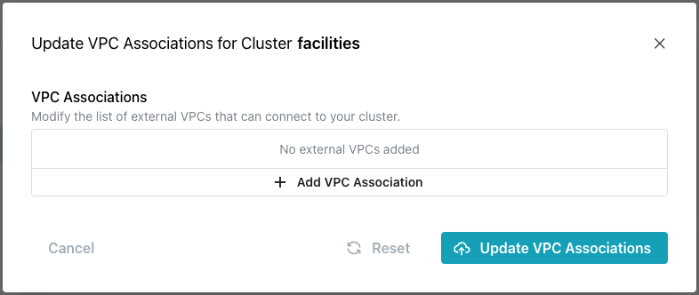
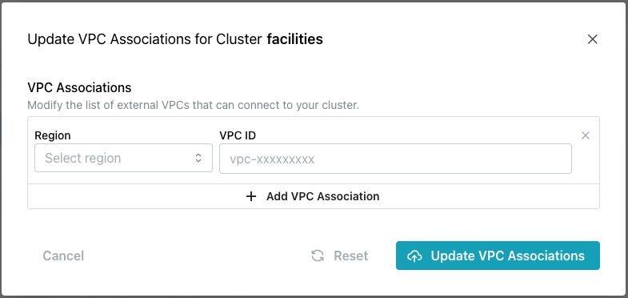

# Adding or Modifying VPC Associations

import { Callout } from 'nextra/components'
 
<Callout type="info">
VPC Associations are currently supported only for AWS clusters.
</Callout>

When you create a Cloud cluster, you can provide the identity of a VPC association to configure VPC peering and (if needed) private zone routing between any defined VPCs and the pgEdge cluster network. Peering allows an application to connect seamlessly to any of the nodes across regions, allowing you to fully leverage latency routing and dns failover. 

To add or modify a VPC association, highlight the name of a cluster in the navigation tree and select `Manage VPC Associations` from the [`Actions`](https://pgedge-docs-sandbox.pages.dev/cloud/mod_cluster/actions) drop-down menu in the upper-right corner of the console.

The `VPC Associations` popup displays the currently defined rules for your cluster. You can click the `+ Add VPC Association` bar to open a new line (as shown below) and add a VPC association, or modify the existing entries:

To add or modify a VPC association:

* Use the `Region` drop-down in the left column to specify the region in which the AWS VPC is defined.

* Use the `VPC ID` field in the right column to add or remove VPC IDs from the list. 

When you're finished, select `Update VPC Associations` to modify the VPCs available.

