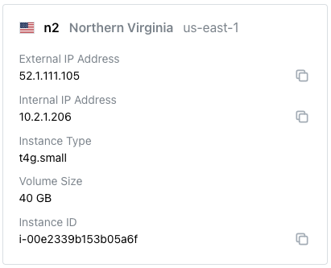

# Connecting to pgEdge Distributed PostgreSQL (Cloud Edition)

Your pgEdge account type determines the type of connections you can establish with pgEdge Distributed PostgreSQL (Cloud Edition):

* Enterprise Edition accounts can connect to Cloud clusters with SSH (port `22`), a PostgreSQL client (port `5432`), or via https (port `443`).
* Developer Edition accounts can use a PostgreSQL client to connect to their database on port `5432`.

Any client that can negotiate a connection using libpq can connect to the PostgreSQL server (port `5432`) on a Cloud database; this applies to custom clients as well. All authenticating clients must:

* require an SSL connection.
* disable GSS encoding ([gssencmode](https://www.postgresql.org/docs/current/libpq-connect.html#LIBPQ-CONNECT-GSSENCMODE)).
* use an SSH key when connecting.

Additionally, you must open ports for connection when [creating your cluster](../cluster/create_cluster.md).

## Connecting to a Cluster

You can connect to a Cloud cluster with SSH. IP addresses for each node in your cluster are displayed on the `Nodes` pane of the Cluster information dialog.

For detailed information about using SSH to connect to a node, see [Connecting with ssh](./ssh.md).

## Connecting to a Database

You can use any PostgreSQL client that meets the connection criteria detailed above to connect to a PostgreSQL database. In this guide, we'll walk you through connecting with some commonly used clients.

