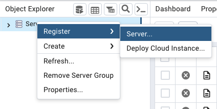
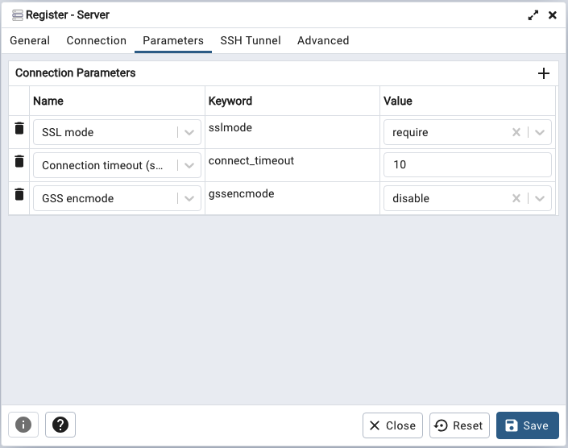
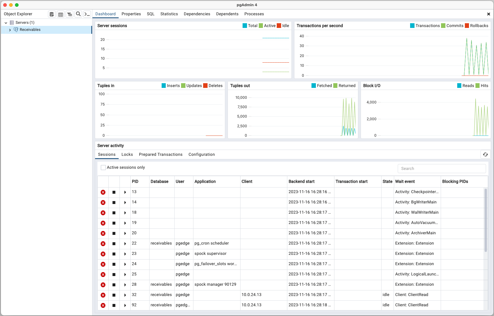

# Connecting with pgAdmin

To use the pgAdmin client to manage your pgEdge Distributed Postgres (Cloud Edition) database and the objects that reside on it, right-click on the `Servers` node in the pgAdmin client, and select `Register`, then `Server` from the context menu.

The `Register - Server` dialog opens: 

When prompted, provide authentication details on the pgAdmin `Connection` tab. To find connection information for your database, highlight the database name in the navigation panel, and review the `Connect to your database` pane shown on the `Database` dialog:

* Provide the name shown in the `Domain` field that ends with `.pgedge.io` in the `Host name/address` field.

* Provide the name of your database in the `Maintenance database` field.

* Replace the default `Username` with `admin` when connecting for the first time.

* Enter the password associated with the user in the `Password` field. 

Provide the following information on the `Parameters` tab:

* Use the drop-down to the right of `SSL mode` to select `require`. All client connections to pgEdge Developer Edition are required to use SSL.

* Use the `+` at the top of the parameter table to open a new row, and use the drop-down list in the `Name` field to select `GSS encmode`. Set the `Value` to `disable`

Complete the other tabs in the `Register - Server` dialog specifying your connection preferences, and select `Save`. The connection to your database is added to the `Servers` node in the `Object Explorer` pane, and the pgAdmin `Dashboard` displays current database activities.

For detailed information about using pgAdmin, you can review the pgAdmin documentation at: [https://www.pgadmin.org/docs/](https://www.pgadmin.org/docs/)