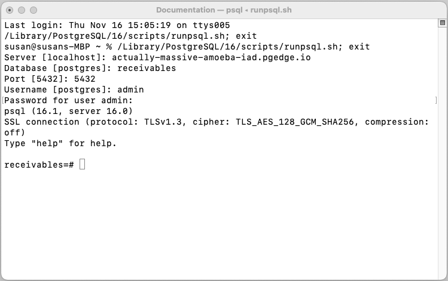

# Connecting with psql

To locate database-specific PSQL connection properties for your pgEdge Distributed PostgreSQL (Cloud Edition) database, double-click a database name in the Cloud console navigation panel. When invoked on the command line, the `PSQL` connection string displayed opens the first version of psql it locates in your `$PATH`, and connects to the database identified in the string.

## Accessing the psql Client

If you created your database without the Northwind sample tables, you'll find connection properties for your database in the `Get Started` pane of the pgEdge console. When entered in a Terminal window, the connection string starts the first copy of psql it locates in your `$PATH` and authenticates with the permissions of the `admin` user.

If your database has sample tables, the `Connect to your database` pane displays the connection strings for each node in your cluster, and the unique connection properties for each pgEdge-created user.

Select a node (`n1`, `n2`, or `n3`) and a `User` to display the connection properties you can use to authenticate with your database on the selected node:

* The `Database Name` field displays the name of the database specified at database creation; if you are using a `Display Name` to make database identification easier, the `Database Name` may not be the name displayed in the navigation pane.
* The `Password` field obscures the password assigned to each pgEdge-created user; use the `show` button to display the password. Use [icons](https://docs.pgedge.com/cloud/database/manage_db#password-management) to the right of the password to regenerate and copy the password.
* The `Domain` field displays the URL of the database; use the URL (rather than an IP address) when connecting to your database.
* The `Connection String` field displays a libpq formatted connection string for client applications.
* The `PSQL` field displays a formatted connection string that opens psql at the command line and connects to your database.

If you prefer to start psql with a graphical prompt or icon (rather than the command line) you can use individual clauses found in the connection string to authenticate:

`PGSSLMODE=require PGPASSWORD=********** psql -h actually-massive-amoeba-iad.pgedge.io -p 5432 -U admin -d receivables`

When you open psql, the client prompts you for authentication information:

* When prompted for a `Server [localhost]`, provide the server DNS (the clause that ends with `.pgedge.io`) and press `Return`. In our example above, the server name is: `actually-massive-amoeba-iad.pgedge.io`.

**Note:** If you are using Developer Edition, you should always use the DNS name when connecting; IP addresses are not supported for Developer Edition connections. This limitation may cause issues with name resolution.

* When prompted for a `Database [postgres]` provide the name of the database and press `Return`. In our example, the database name is `receivables`.
* When prompted for a `Port [5432]`, enter `5432` and press `Return`.
* When prompted for a `Username [postgres]`, provide the name of the user in your connection string or connection properties, and press `Return`. If you're using Developer Edition, you should use the database superuser (`admin`) for your first connection.
* When prompted for the `Password`, provide the password associated with the user.  If you are using Developer Edition, and have not created tables, enter the decrypted value from the `PGPASSWORD` clause in your `PSQL` connection string. If the value is obscured by asterisks, you can use the copy button to copy the connection to another temporary window and then select the password portion for use authenticating.

Press return to connect to your database:

## Installing psql and Connecting

 To install psql on your local system, follow the platform-specific installation and connection details for your server.

### On a Mac

On a Mac, you can use `brew` to install psql at the command line. To install psql, open a `Terminal` window and enter:

`brew install libpq`

When `brew` completes, use the following command to ensure that the version of psql that you've just installed is the first version in your PATH:

`echo 'export PATH="/usr/local/opt/libpq/bin:$PATH"' >> ~/.zshrc`

Then, to connect to a new pgEdge PostgreSQL database, use the copy button to the right of the connection string in the `Get Started` section to copy the connection string of your database; then paste the string in the `Terminal`.

Press `Return` to connect to the server with the psql client.

### On Linux

On a Linux system, install the `postgresql` package with your platform-specific package manager; for example, on a Rocky Linux host, use `yum`:

`yum install postgresql`

This command installs psql in `/usr/bin/psql`. After installing, you can connect to the database with the connection string provided by the pgEdge console.

For detailed information about installing PostgreSQL packages on Linux, visit the [PostgreSQL Downloads page](https://www.postgresql.org/download/).

### On Windows

For detailed information about installing PostgreSQL on Windows, visit the [PostgreSQL downloads page](https://www.postgresql.org/download/windows/). After installing PostgreSQL, you can navigate through the Windows menu to open the psql client.