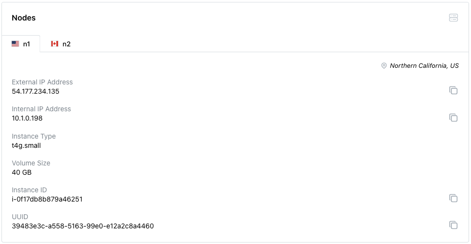

# Connecting with SSH

To connect to a pgEdge Distributed PostgreSQL (Cloud Edition) node with ssh, specify the complete path and name of your SSH private key in the connection string. You should always use the identity of the `pgedge` user when connecting to the `External IP Address` noted in the Cloud console. Use the following signature when connecting:

`ssh -i path_to_key_file/key_file_name.pem pgedge@external_IP_address` 

To locate the `External IP Address`, select the name of the cluster in the Cloud console navigation pane. Scroll down to the `Nodes` tab, and select the name/location of the node to which you wish to connect. The first IP address in the `Node Information` section is the address you should use for SSH connections.

