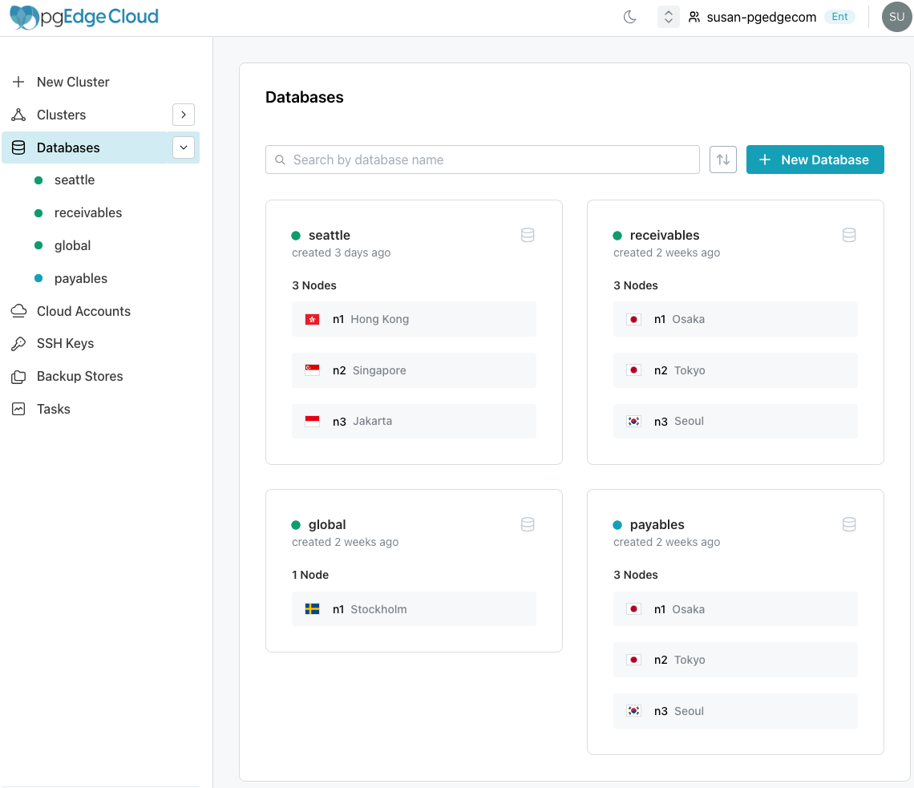

# Managing a Cloud Database

To review a list of databases, select the `Databases` node of the tree control in the left-pane of the Cloud console.

The dot to the left of a database name in the tree control indicates the database status:

* A green dot indicates that the database deployment has completed.
* A blue dot indicates that the database is in the process of deploying.
* A grey dot indicates that database deletion is pending.

The `Databases` page displays a pane for each database and each region in which a replicated copy of the database is deployed. Options on this page allow you to:

* Use the `Search` bar to locate a specific database
* Use the `Sort/Filter` controls to sort the displayed panes by database `status`, `age`, or `name`.
* Use the `+ New Database` button to open a dialog that allows you to [define a new database](/cloud/database/create_db.md).
* Double-click a database name in the navigation pane or select a database pane to navigate to a details page for the database.
