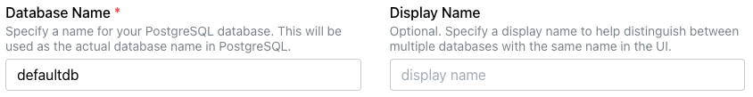
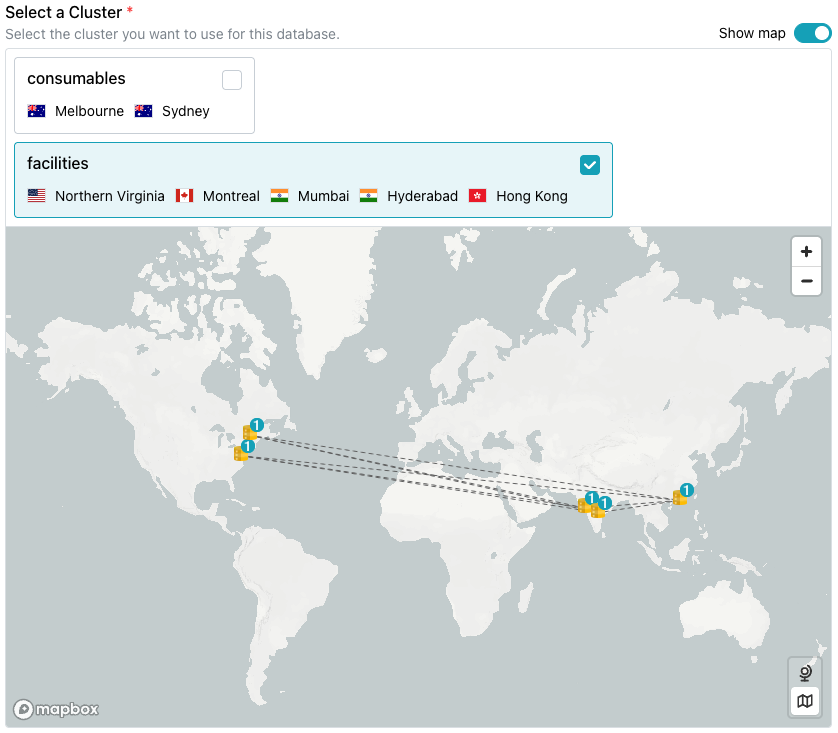
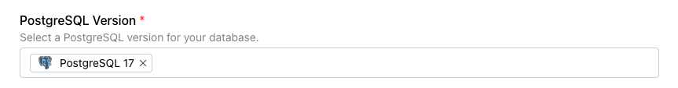
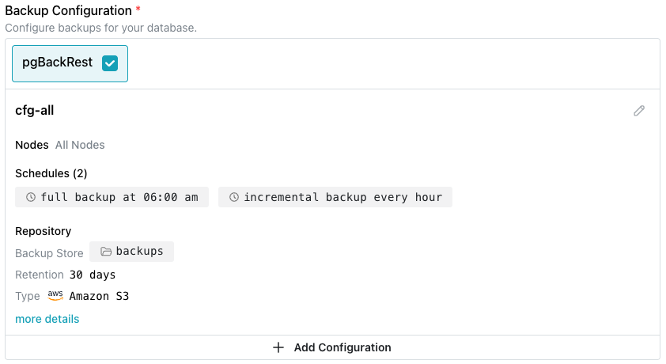
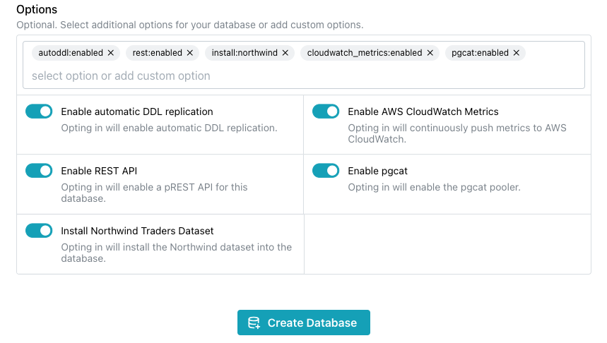
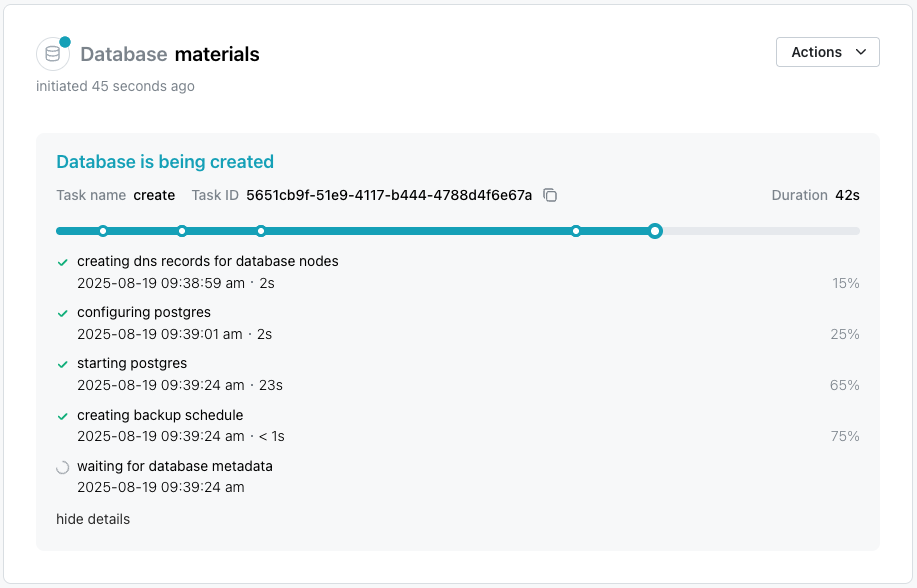

# Creating a New Database

To create a new database, select the `Databases` node in the navigation tree control; then, select the `+ New Database` icon located in the upper-right corner of the page. When the `Create New Database` dialog opens, use the fields on the dialog to define your database.

* Provide a name for the database in the `Database Name` field.

* Optionally, provide a `Display Name` to identify the database in the navigation tree control.  If you have more than one database with the same name, a `Display Name` can help you easily identify each database in the navigation tree control.

Select the cluster you would like to host your new database from the options shown under `Select a Cluster`.  Use the `Show Map` toggle to display a map of the node locations for the selected cluster.

  * If you are an Enterprise Edition user, the dialog displays your clusters and their deployment regions. Check the box in a cluster pane to deploy on that cluster.
  * If you are a Developer Edition user, you can choose from three cluster configurations for testing and experimentation:

    * `US - Europe` offers an East Coast/West Coast US configuration with one server in Frankfurt.
    * `US` offers an East Coast/Midwest/West Coast configuration.
    * `Global` offers servers on the West Coast, in Frankfurt, and Singapore.

Specify the version of Postgres that you would like to install in the `PostgreSQL Version` field:

**Implementing a Backup Strategy**

!!! note

    Developer Edition databases use pg_dump as their backup provider.

The `Backup Configuration` pane allows you to customize the configuration you wish to use for your Enterprise Edition database backups.

If applicable, use fields in this section to customize the backup strategy:

* If your database resides on an Enterprise Edition cluster, [pgBackRest](../backup/backup_providers.md#using-pgbackrest-for-backups) is the tool used for backups. You can [customize the backup schedule and storage](../backup/backup_providers.md#customizing-backup-details-for-pgbackrest), but backups cannot be downloaded. The default configuration defines a schedule that includes a daily full backup, with hourly incremental backups, but you use the `Add Configuration` button to [modify the schedule](../backup/backup_providers.md#customizing-backup-details-for-pgbackrest).

* If your database resides on a Developer Edition cluster, [pg_dump](../backup/backup_providers.md#using-pg_dump-for-backups) is the backup tool used. Note that if your backup strategy uses pg_dump, you cannot customize the backup schedule and storage details, but backups can be downloaded for use on other systems.

!!! note

    You cannot modify a backup configuration or your selected database backup provider after database deployment.

**Additional Database Installation Options**

The `Options` section displays optional features you can enable when your database is provisioned:

* Use the toggle switch next to `Enable automatic DDL replication` to turn on [automatic DDL updates](https://docs.pgedge.com/platform/advanced/autoddl).
* Use the toggle switch next to `Enable REST API` to enable the pREST API; you can use the API to [enable HTTPS connections](https://docs.pgedge.com/cloud/connecting/https) to your database.  For more information about using pRESTd, visit the [project site](https://docs.prestd.com/).
* Use the toggle switch next to `Install Northwind Database` to install the Northwind sample database and schema objects. 
* Use the toggle switch next to `Enable AWS CloudWatch Metrics` to share metrics with [AWS CloudWatch](https://aws.amazon.com/cloudwatch/).
* Use the toggle switch next to `Enable pgcat` to enable the pgcat connection pooler on your database.

When you've made your selections, click `Create Database` to initialize a PostgreSQL database and start replicating data between the nodes in the cluster. Your new database is added to the list of databases in the left pane of the console; a green dot to the left of the name indicates that the database is available for connections.

