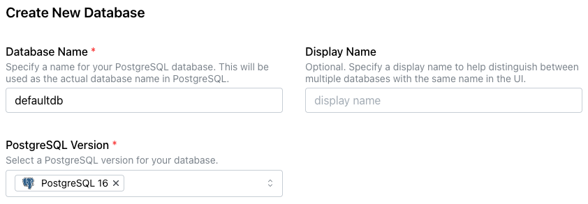
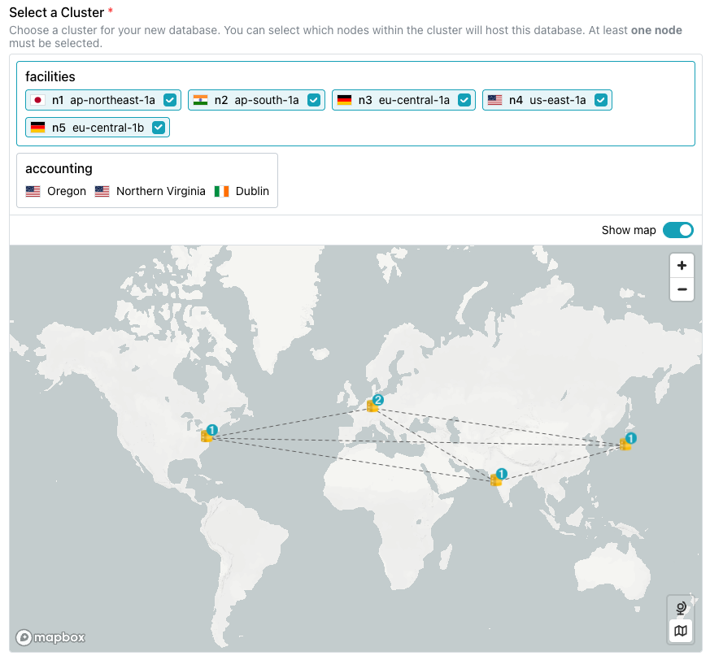
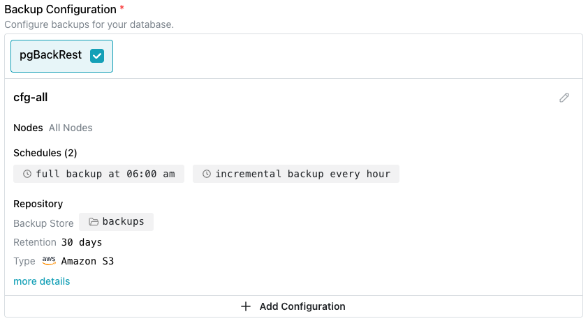
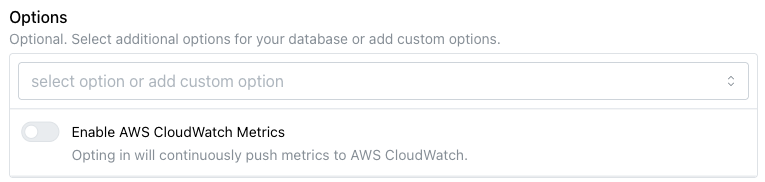
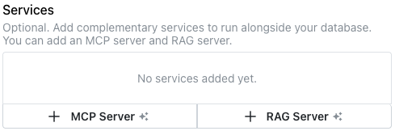
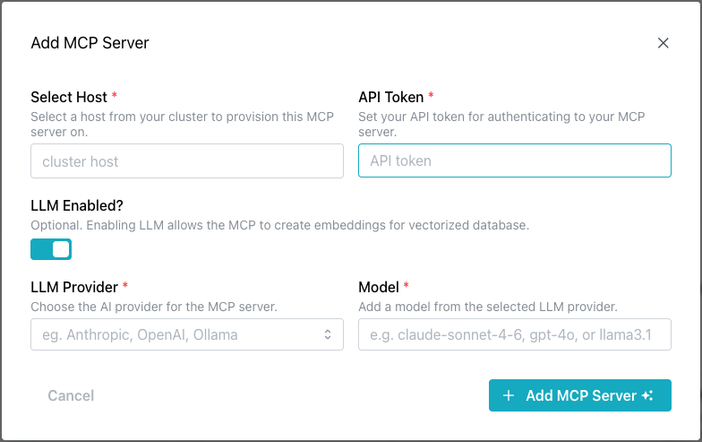
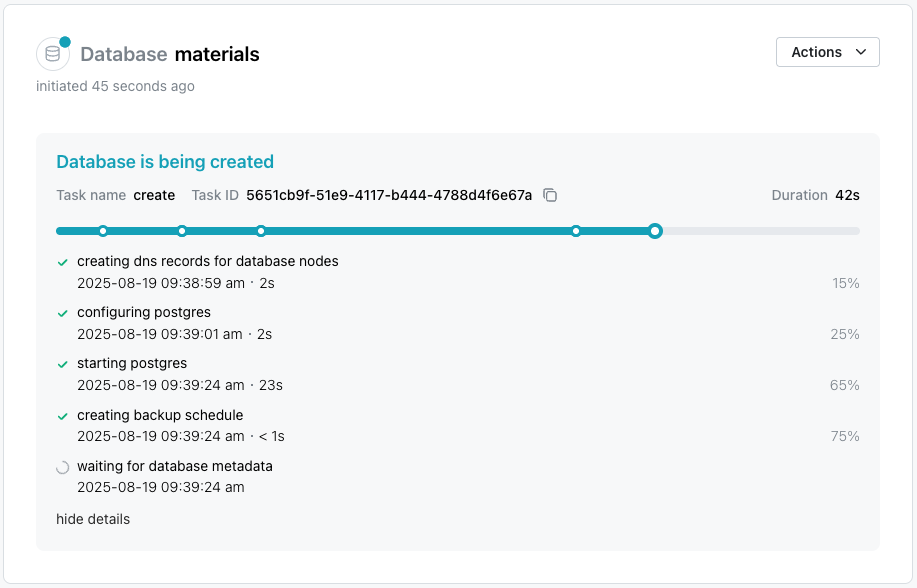

# Creating a New Database

To create a new database, select the `Databases` node in the navigation tree
control; then, select the `+ New Database` icon located in the upper-right
corner of the page. When the `Create New Database` dialog opens, use the
fields to define your database.

* Provide a name for the database in the `Database Name` field.

* Optionally, provide a `Display Name` to identify the database in the
  navigation tree control.  If you have more than one database with the same
  name, a `Display Name` can help you easily identify each database in the
  navigation tree control.

* Use the `PostgreSQL Version` drop-down to select the version of Postgres
  that you would like to install.

Next, the dialog displays your clusters and their deployment regions. Use the
`Show Map` toggle to display or hide a map of node locations.

Highlight the cluster you would like to host your new database from the panes
displayed under `Select a Cluster`.  Then, use the checkboxes in each host's
selector to indicate if the database should be deployed on that host; remove
the check if the database should *not* deploy in a specific location.

The `Backup Configuration` pane allows you to customize the configuration you
wish to use for your Enterprise Edition database backups.

Use fields in this section to customize the backup strategy; select the `edit`
icon (a pencil) in the upper-right corner to modify backup settings. The 
default configuration defines a schedule that includes a daily full backup,
with hourly incremental backups. Use the `Add Configuration` button to
[create a custom schedule](../backup/backup_providers.md) for your database.

!!! note

    You cannot modify a backup configuration or your selected database
    backup provider after database deployment.

The `Options` section displays optional features you can enable when your
database is provisioned:

* Use the toggle switch next to `Enable AWS CloudWatch Metrics` to share
  metrics with [AWS CloudWatch](https://aws.amazon.com/cloudwatch/).

Use the `Services` section to add an [MCP server](https://docs.pgedge.com/pgedge-postgres-mcp-server/v1-0-0/) to your installation. Currently, MCP server functionality is supported only on private clusters with a defined ingress.  

Select the button labeled `+ MCP Server` to add MCP server details for your database; for more information about adding or managing a service in the cloud, see [Adding pgEdge AI Tookit Functionality(../services.md)].

Select the Add MCP Server button to access the Add MCP Server popup and define an MCP server, and optionally enable an associated LLM.

Use fields on the `Add MCP Server` popup to describe the server and optionally, the LLM:

* Click the `Select Host` field to select the node that the MCP server will be provisioned on; you can deploy the MCP server on each node of your cluster, but each MCP server deployment must be individually defined.

* Use the `API Token` field to provide the string used to authenticate with your MCP server; this is a user-created value.

* Slide the `LLM Enabled?` toggle switch to enable the LLM detail fields.

* Use the LLM Provider drop-down to select your AI provider; currently, Cloud supports the following AI providers:

    * Anthropic AI (Claude)
    * OpenAI (ChatGPT)
    * Ollama

* Enter the model name of the LLM provider; this field is not validated, but must match the name of an available model.  For example, the following models are supported:

    * claude-sonnet-4-6
    * gpt-4o
    * llama3.1
  
After making your selections, click `Create Database` to initialize a
Postgres database and start replicating data between the nodes in the
cluster. Your new database is added to the list of databases in the left pane
of the console; a green dot to the left of the name indicates that the
database is available for connections.

