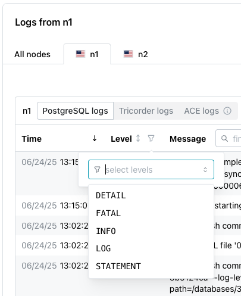

# Managing a Database

Highlight a database name in the navigation tree to display detailed database information in the Cloud console. 

Console content is displayed in a series of panes that simplify database management; select a pane to review information or perform management tasks.

## The Database Header

The database header tells you:

* The name of the database; next to the name, a dot indicates the status of the database:
    * A green dot indicates that the database is available for connections.
    * A blue dot indicates that the database is being created.
    * A red dot indicates that the database is not available.

* How long the database has been running.
* The cluster on which the database is deployed.
* The Postgres database version.
* The version of the [Spock extension](../../spock_ext.mdx) in use by the database.

## The Get Started Pane

If you did not install the sample database (creating tables), the console displays the `Get Started` pane at the top. The pane displays a `PSQL` connection string that you can use to connect to the database as the `admin` user (a database superuser).

For detailed information about:

* installing the psql client and connecting to the database, see [Connecting](../connecting.mdx).
* moving a database object into your database, see [Migrating to pgEdge Distributed Cloud](../migration.mdx).
* Postgres SQL commands, see the [Postgres documentation](https://www.postgresql.org/docs/16/sql-commands.html).

## The Start Replication Pane

If you enabled AutoDDL when configuring your new database with the Northwind sample data, the `Start Replication` bar is not displayed. If you installed the sample Northwind tables with AutoDDL disabled, the database console opens with the `Start Replication` pane displaying the sample tables that are ready to replicate.

Press the `Start Replication` bar to start replication for the sample objects listed above the bar. 

## The Tables Pane

The `Tables` pane displays the schema name (`public`), table names, and an icon that indicates the state of the table. The pane displays the names of [tables added with a Postgres client](../database_admin/table_mgmt.md) as well. 

An icon to the left of the table name indicates the state of each table:

* A grey icon indicates that the table is ready for replication.
* A blue icon indicates that the table is currently replicating.
* A red icon indicates that the table cannot be replicated. To be replicated, a table must have a primary key.

Double-click a table name to open the table viewer, displaying the contents of the table.

## The Users Pane

In its initial state, a new database has three `Users`:

* The `admin` user is a database superuser. Use this identity for your first login; the password is included in the `PSQL` connection string on the console.
* The `app` user is a login user without superuser privileges. 
* The `app_read_only` user is a login user without privileges to make changes to the database.

You can use [psql](../connecting/psql.md) or [pgAdmin](../connecting/pgadmin.md) to [create additional database users](https://www.postgresql.org/docs/16/sql-createrole.html); remember the [principal of least privileges](https://en.wikipedia.org/wiki/Principle_of_least_privilege) as you share database login access.

## Connect to your database

The `Connect to your database` pane displays connection information for the nodes in your cluster. Select a node (`Nearest node`, `n1`, `n2`, or `n3`) and user name to access connection details for a specific node/user pair.

For detailed information about using the connection information to connect to your database, see [Connecting](../connecting.mdx).

## Password Management

A random password is generated for each pre-defined user when you create a database; the same user name/password pair can be used to access the database on each node of the cluster.  The associated password and password management options are located in the `Connect to your database` pane. To access the password associated with one of the users (`app`, `app_read_only`, or `admin`), select the user name from the `User` field.

Then, use options in the `Password` field to manage the password assigned to the `app` user:

* Select `show` to display the password in unobscured form; select `hide` to conceal the password.
* Select the `Copy` icon (at the right side of the pane) to copy the password in an unobscured (usable) form.
* Select the `Rotate Password` icon (next to the `Copy` icon) to generate a new password and assign that password to the currently selected user:

To confirm that you wish to generate a new password and invalidate the old password, click the `Rotate Password` button; to exit the dialog without changing the password, click `Cancel`.

## The Code Snippet Pane

The `Code Snippet` pane displays three code snippets (TypeScript, Python, and Go) that set the environment variables for your cluster and create a cursor that lists the nodes in your cluster. Select a tab to review and copy the code.

Consider the snippets a starting point for the application developers on your team.

## The Cluster Map

A map in the pgEdge console displays the nodes in your distributed replication cluster; hover over a node to display the region name and location.

## The Usage Pane

If you are using Developer Edition, the `Usage` pane displays a bar graph showing how much space you have used and available in your cluster. If you are using Enterprise Edition, database resources are limited only by the size of your underlying nodes (virtual machines).

## Reviewing Node Metrics

The `Node Metrics` section of the console displays an overview of the resources used by the cluster in the last hour. Tabs across the top of the section allow you to display the metrics for the entire cluster or select the metrics for an individual node.

The `All nodes` tab shows bar graphs that compare resource usage for all three nodes of your cluster. 

Select the tab for a named node to see activity and resource use for each individual node of your cluster.

Detailed usage is color coded; select a tab to display details about resource usage on a specific node. For detailed metrics for a specific point in time, hover over a graph.

| Command  | Description
|----------|-------------
| `CPU` | The `CPU` graph displays information about the CPU usage for the server.
| `Memory` | The `Memory` graph displays information about memory usage (in MB) for the cluster or by the node.
| `Replication Output` | The `Replication Output` graph displays the replication traffic for the database in tuples.

## Reviewing the Database Logs

A tabbed panel in the `Logs` pane allows you to access database logs for each cluster node:

Use the `Auto refresh`/`Manual refresh` drop-down to specify if the log entries should update automatically (`Auto refresh`), or to pause updating (`Manual refresh`) for easier viewing.  To manually refresh the log table's content, select the refresh button to the right of the drop-down.

Use tabs across the top of the panel to select the node for which you wish to view log files; after selecting the node, choose the log file type:

* Select `PostgreSQL logs` to view the logs from the Postgres database on the selected node.
* Select `Tricorder logs` to view Tricorder logs. Tricorder is a companion service from pgEdge that enables metrics collection, performs health checks, and supports scheduled backups for the database. It also performs operational actions on the database as part of workflows.
* Select `ACE logs` to view the [ACE](../../platform/ace.mdx) logs. ACE logs are only available for customers that enable ACE monitoring.

You can sort or search the log files using options in the top bar of the log table:

* Select a column heading to sort alphabetically by the column value; click a second time to reverse the sort order.
* Click the filter icon to the right of the `Level` heading to select a status from the drop-down; all rows assigned the selected status will be filtered to the top of the result set.

* Use the search box to the right of the `Message` label to enter a search string; the search term will be highlighted in the log file entries.