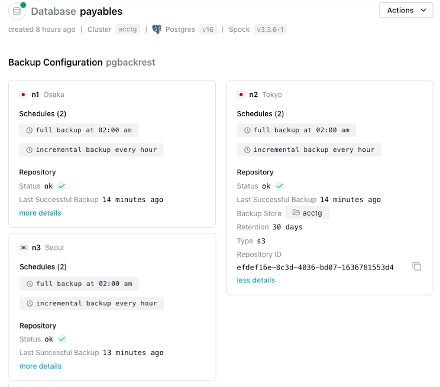
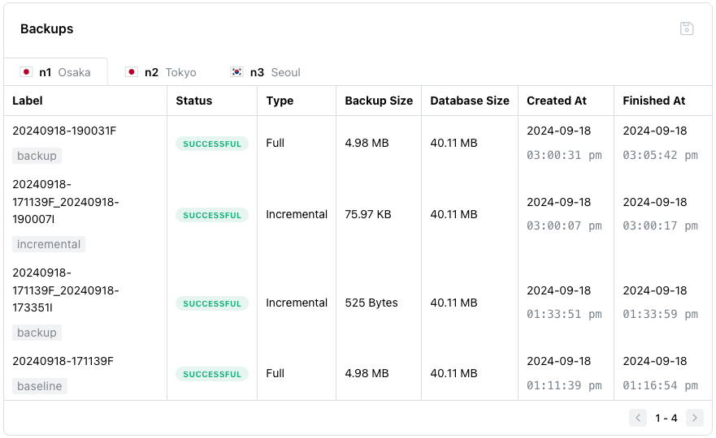

# Reviewing Backup Details

Details displayed on dialogs related to backup and restore will vary based on your account type:

* Enterprise Edition backups are managed with pgBackRest.
* Developer Edition backups ar managed with pg_dump and pg_restore.

You can use the Cloud `Backups` page to review and manage database backups; the `Backups` page also provides access to links that allow you to perform an ad hoc backup or restore.  To open the `Backups` page, select a database name in the navigation panel and select the `Backups` node from the navigation tree.

At the top of the `Backups` dialog, the header provides information about the selected database:

* The Database name.
* The length of time since the database was created.
* The name of the cluster in which the database resides.
* The PostgreSQL version used by the database.
* The version of Spock used by the database.

In the `Backup Configuration` panel, a pane for each database in your cluster displays configuration details for the database; select the `more details` link to view extended backup detail including:

* The node number, node name, and region identifier.
* The backup schedules for the database.
* The repository status.
* The length of time since the last backup.
* The name of the Backup Store used by the database.
* How long backups are retained for.
* The storage type of the Backup Store.
* The repository ID in which the backups are stored.

The `Backups` table displays the backups currently stored for the database:

The columns displayed in the `Backups` table will vary depending on your [backup provider](https://docs.pgedge.com/cloud/backup/backups):

* Use the tabs across the top of the table to select the node you wish to see the backups for.
* The `Label` column (if you're using pgBackRest) or `Name` column (if you're using pg_dump) contains the backup identifier.
* The `Status` column displays `SUCCESSFUL` if the backup completed successfully.
* The `Type` column identifies the backup method; `Full` if the backup was a complete backup, `Incremental` if the backup only contains those changes that occurred since the last incremental backup, and `Differential` if it was a backup of only those changes that occurred since the last full backup.
* The `Backup Size` column displays the storage size of the database at the time of the backup.
* The `Database Size` column displays the storage size of the database.
* The `Created At` column displays the date and time the backup started.
* The `Finished At` column displays the date and time the backup completed.
* If you use pg_dump for your backups, you can use the context menu to the left of a backup name to access backup management options:
  * Select `Download` to download the backup archive.
  * Select `Delete` to delete the backup archive.

**Note:** If a pgBackRest backup fails, details are written to the [tricorder log files](../database_admin/logs.md).  pg_dump backups that fail to complete are not displayed in the `Backups` table or written to log files.

