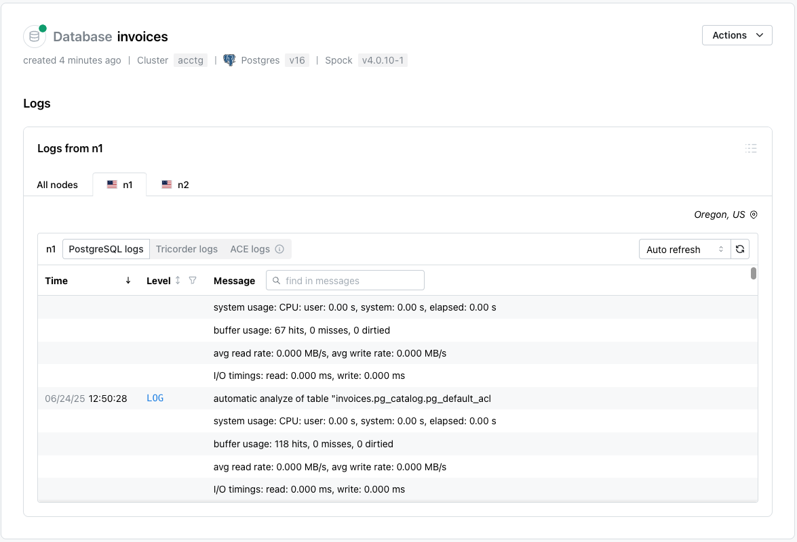
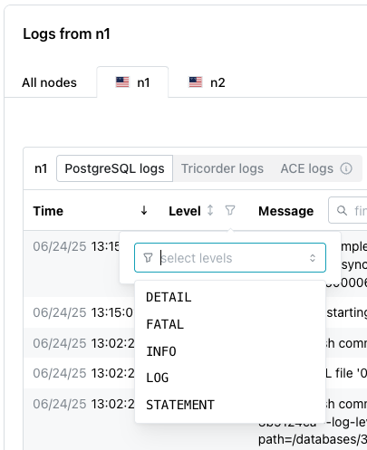

# Reviewing Log Entries

Use options on the `Logs` dialog to access the log entries for your nodes:

Use tabs across the top of the `Logs` pane to select the node for which you wish to view log files; after selecting the node (or `All nodes`), choose the log file type:

* Select `PostgreSQL logs` to view the logs from the PostgreSQL database on the selected node.
* Select `Tricorder logs` to view Tricorder logs. Tricorder is a companion service that collects metrics and provides HTTP connectivity via the pREST API.
* Select `ACE logs` to view the ACE logs. [ACE](../../platform/ace.mdx) is the pgEdge Active Consistency Engine.  ACE logs are only available for customers that enable ACE monitoring.

Use the `Auto refresh`/`Manual refresh` drop-down to specify if the log entries should update automatically (`Auto refresh`), or to pause updating (`Manual refresh`) for easier viewing.  To manually refresh the log table's content, select the refresh button to the right of the drop-down.

You can sort or search the log files using options in the top bar of the log table:

* Select a column heading to sort alphabetically by the column value; click a second time to reverse the sort order.
* Click the filter icon to the right of the `Level` heading to select a status from the drop-down; all rows assigned the selected status will be filtered to the top of the result set.

* Use the search box to the right of the `Message` label to enter a search string; the search term will be highlighted in the log file entries.