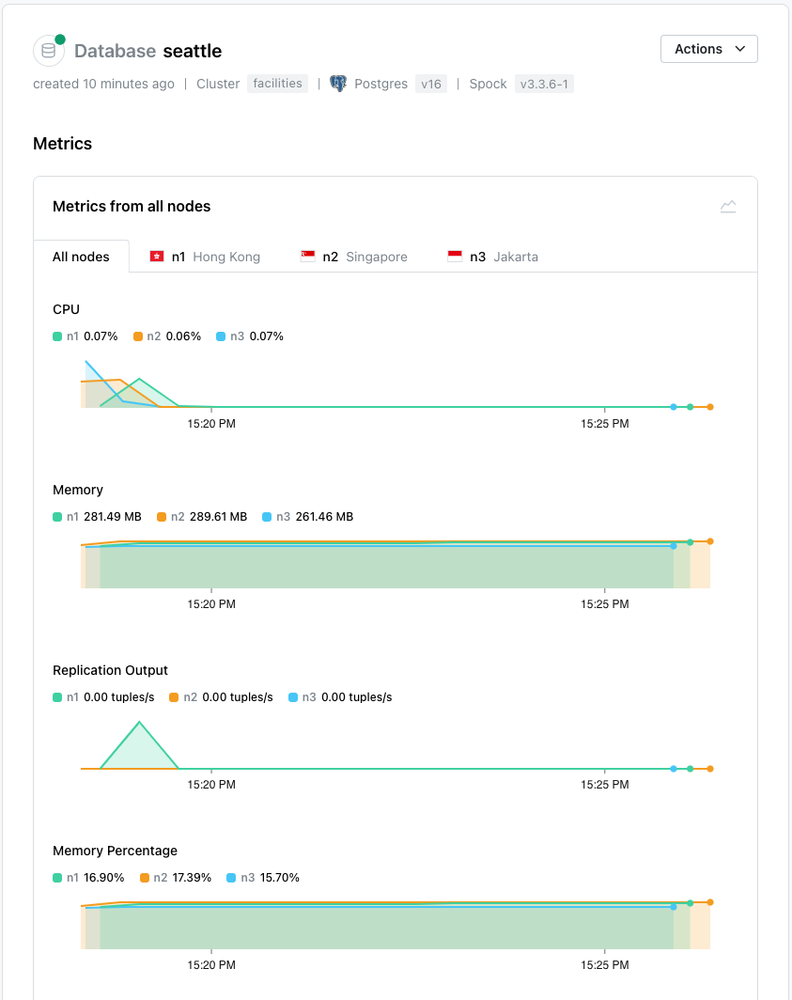
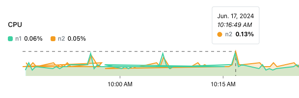

# Reviewing Database Metrics 

Highlight a database name in the tree control to access the link to the `Metrics` dialog; the dialog allows you to review statistical information gathered from that specific database.  

Select a graphed point to see detailed information about the selected event.

Select a tab to display information for `All nodes`, or a specific individual node. The graphs display metrics about:

| Graph Name | Description |
|------------|-------------|
| CPU | The percentage of CPU used by the database |
| Memory | Memory used (in MB) |
| Replication Output | The tuples used by outgoing replication processes |
| Memory Percentage | The percent of memory resources used by the database|
| Network Transmit | The number of tuples transmitted from the database |
| Network Receive | The number of tuples received by the database | 
| Database Size | The size of the database (in MB) at a given point in time |
| Database Table Count | The number of tables that are defined in the database |
| Replication Slots Count | The number of replication slots in use by the database |
| Replication Slots Count Active | The number of replication slots that are currently active |
| Spock Resolutions Count | The number of data inconsistencies resolved |
| WAL Segments | The number of WAL segments in the server's WAL directory |
| Wal Size | The size of each ordinary file in the server's write-ahead log (WAL) directory |
| Stat Database Tup Inserted | Number of rows inserted by queries |
| Stat Database Tup Updated | Number of rows updated by queries |
| Stat Database Tup Deleted | Number of rows deleted by queries |
| Stat Database Tup Returned | Number of live rows fetched by sequential scans and index entries returned by index scans |
| Stat Database Tup Fetched | Number of live rows fetched by index scans |
