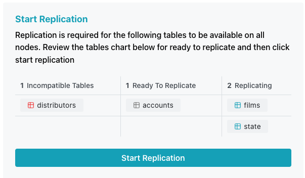
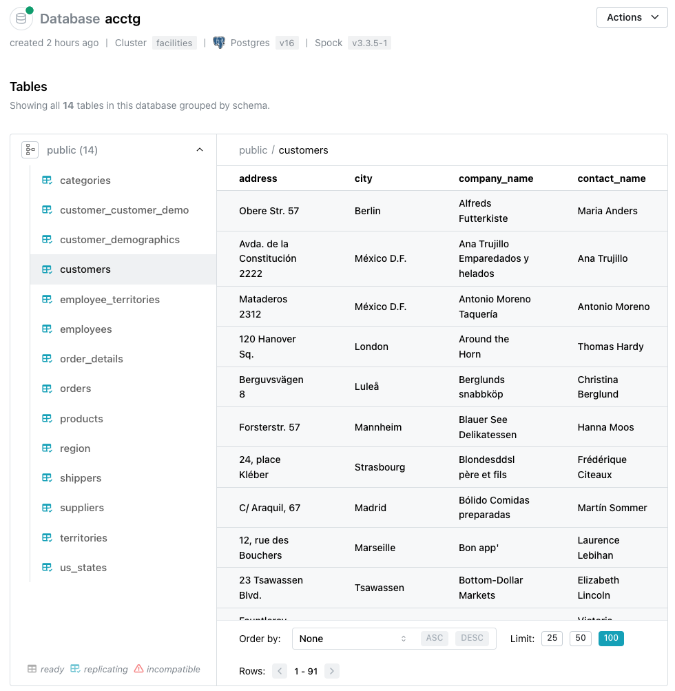
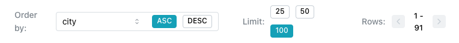

# Creating and Managing Tables

To create a table, connect to the database with [psql](/cloud/connecting/psql.md) or [pgAdmin](/cloud/connecting/pgadmin.md), and use [SQL commands](https://www.postgresql.org/docs/16/sql-commands.html) or pgAdmin's graphical interface to define tables, add data, and create and manage users.

Note that to replicate, a table must have a primary key; `UNLOGGED` and `TEMPORARY` tables are not replicated.

## Starting Replication

The `Start Replication` pane displays the tables that reside on your database. An icon to the left of each table identifies the state of the table.

Table status can be:

* `ready` for replication - when a table is eligible for replication and ready, a table opens displaying the current state of all of the tables in the database.
* `replicating` - a blue table grid indicates a healthy replicating table.
* `incompatible` - The configuration of your table makes it ineligible for replication.
    
To start replication for the tables in the `Ready to Replicate` column, select the `Start Replication` button. When the replicated table is available, connection information for each node in the cluster is displayed in a tabbed pane below the `Users` information; select the tab for the node to which you wish to connect to copy information.
    

## Using the Tables Viewer

When you add a table to your database, the table is added to the list of tables in the console window and the table state is noted. To display a list of tables sorted by schema and the table contents (where applicable), select the `Tables` node under the database name in the navigation pane.

When the table viewer opens:

* To collapse the list of tables that reside in a specific schema, use the control to the right of the schema name.
* Icons to the left of a table name indicate the status of a table; tables that are eligible for replication have a grey icon, a blue icon indicates that the table is replicating, and a red icon indicates that the table cannot be replicated. Use the key at the bottom of the table list for reference.
* Highlight a table name to display table data in the pane to the right.

Use the table controls at the bottom of the pane to specify your viewing preferences:

* Use the controls in the `Order by` field to select the row that will be used to sort the data displayed; select the `ASC` icon to sort the rows in ascending order, or the `DESC` icon to sort in descending order.
* Highlight a value in the `Limit` field to specify how many rows should be displayed at a time; choose from `25`, `50`, or `100`.
* Use the arrows next to the `Rows` field to page through the sorted results.