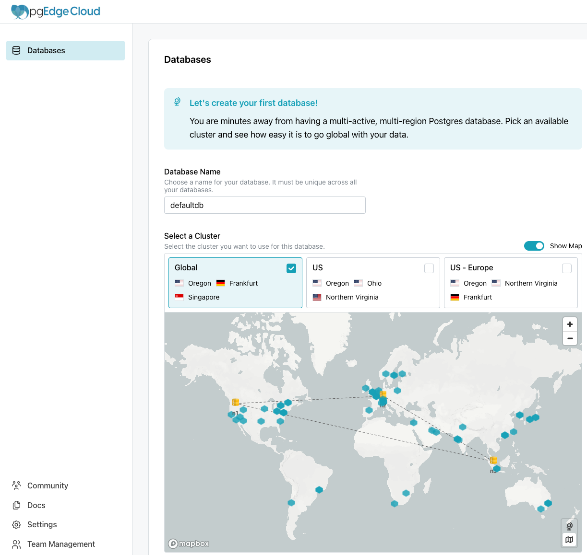
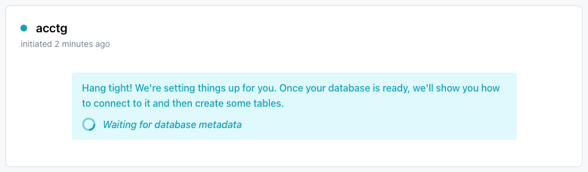

# Getting Started with pgEdge Distributed Postgres (Cloud Edition) Developer Edition

Signing up for Developer Edition is easy; simply navigate to [the pgEdge sign-in page](https://app.pgedge.com/login?plan=developer&screen_hint=signup) and provide a name and password, or log in with your Google or Github account. 

To convert a Developer Edition account to an Enterprise Edition account, reach out to the [pgEdge customer success team](https://www.pgedge.com/contact).

After signing up, you can create use the Cloud console to create a database:

* Provide a unique name for the database in the `Database Name` field. 
* Check the box next to a cluster configuration in the `Select a Cluster` field. You can use the `show map` toggle to review a map displaying each configuration.
* Use the `Options` field to manage custom options for the database. 
* To install sample data, toggle the `Install Northwind Database` switch.
* To enable a [pREST API](https://docs.prestd.com/) for your new database, toggle the `Enable REST API` switch.

Then, select the `Create Database` button to initialize the database.

When the database is ready, the Cloud Console displays the database name in the navigation tree. Select the database name to start [using your database](../database/manage_db.md).

## Resources

Use the links in the lower-left corner of the console to access Cloud resources:

* For an invitation to the pgEdge Discord server, select the `Community` link.
* To review the documentation, select the `Docs` link.
* To review or modify account settings (including API Clients), select the `Settings` link.
* To review and manage team settings, select the `Team Management` link.
