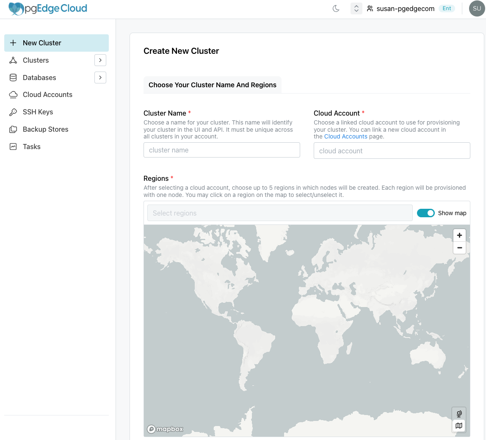

# Getting Started with pgEdge Distributed Postgres (Cloud Edition) Enterprise Edition

Signing up for Enterprise Edition is easy; simply navigate to [the pgEdge sign-in page](https://app.pgedge.com/login?plan=developer&screen_hint=signup) and provide a name and password, or log in with your Google or Github account. 

Before creating your first cluster, you need to link your Cloud provider account with pgEdge. When you create a cluster, pgEdge will provision the cluster using resources available to your cloud account. pgEdge Cloud can create and manage clusters created on:

* AWS
* Azure
* Google

To [link a cloud account](../prerequisites/cloud_accounts.mdx), select the `Cloud Accounts` menu option in the left navigation pane. 

## pgEdge Resources

Use the links in the lower-left corner of the console to access pgEdge resources:

* For an invitation to the pgEdge Discord server, select the `Community` link.
* To review the documentation, select the `Docs` link.
* To review or modify account settings (including API Clients), select the `Settings` link.
* To review and manage team settings, select the `Team Management` link.
