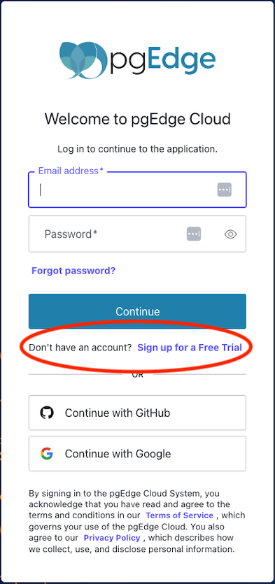
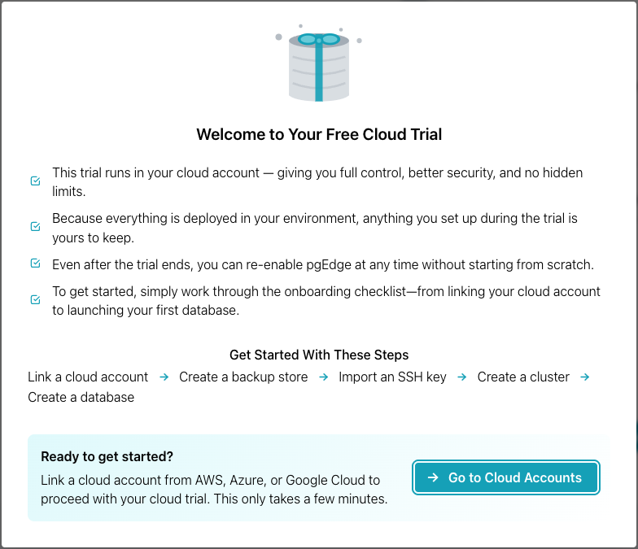
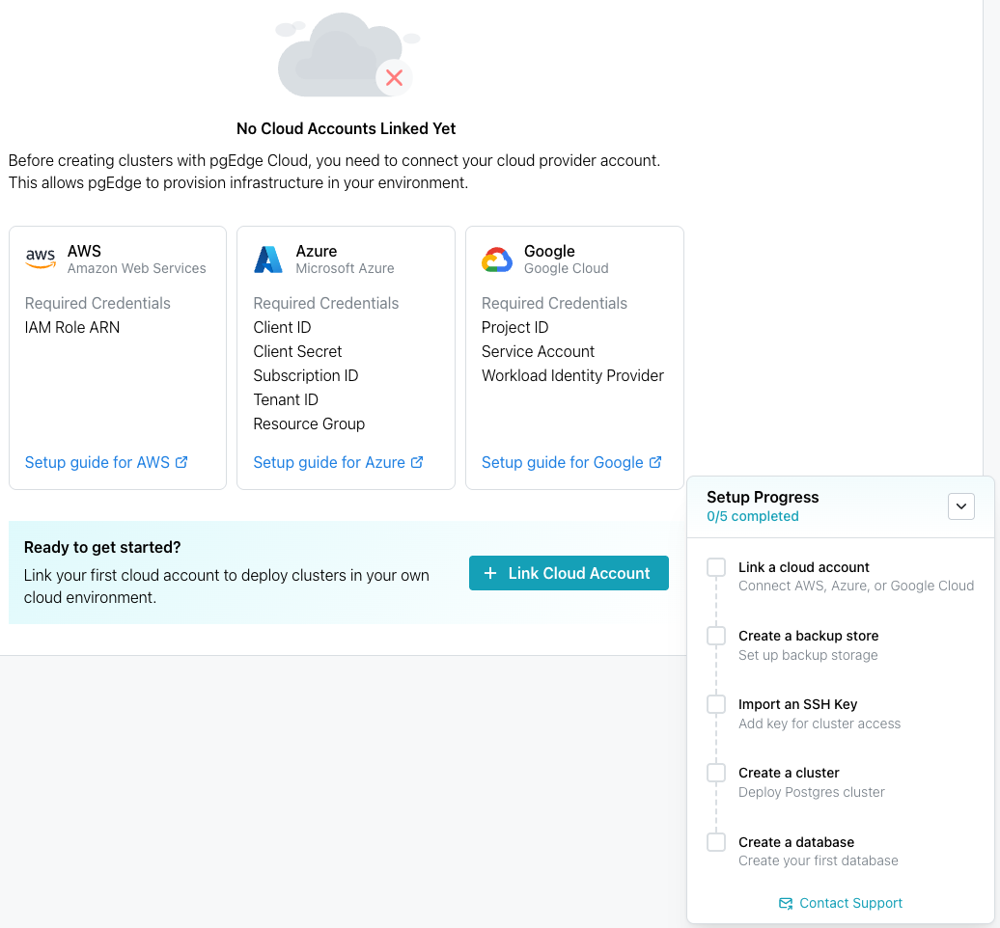
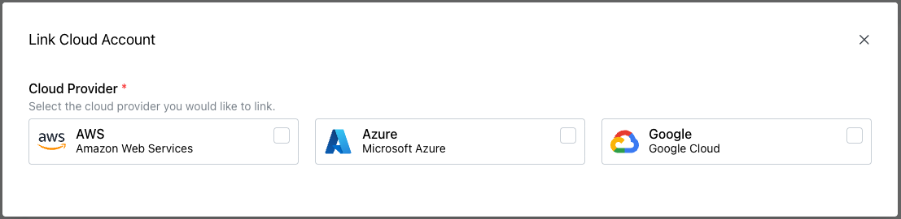
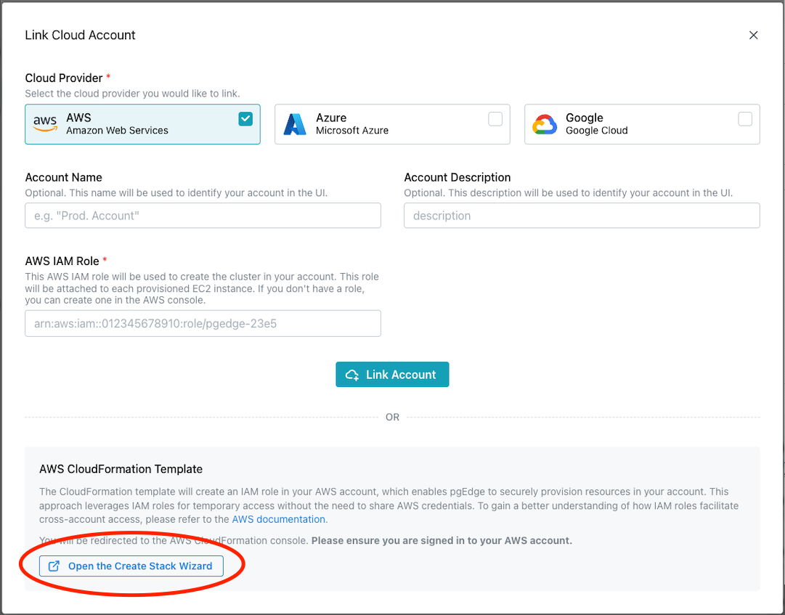
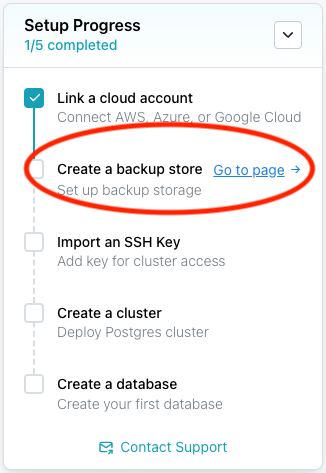

# Getting Started with pgEdge Postgres Cloud Edition

Getting started with pgEdge Postgres Cloud edition is easy; simply navigate to
[the pgEdge sign-in page](https://app.pgedge.com/login?plan=developer&screen_hint=signup)
and follow the provided link to create an account, or log in with your Google
or Github account.

If this is your first time logging in, you are welcomed to the free trial
of pgEdge Cloud.

pgEdge Cloud uses resources provisioned on your choice of cloud provider;
Cloud can create and manage clusters created on:

* AWS
* Azure
* Google

When you create a cluster, pgEdge provisions your cluster's supporting
resources on that provider as well - those resources include:

* Backup stores
* SSH keys

Before creating your first cluster, you need to link your Cloud provider
account with pgEdge. To get started, select the `Go to Cloud Accounts` button
on the Welcome dialog.

The progress tracker in the lower-right corner helps walk you through the
deployment steps as you prepare your account. 

Panes in the center of the page list the credentials and artifacts you will
need to create an account with each provider, as well as a link to the
provider-specific `Setup guide` for detailed information about linking your
account. 

When you're ready to get started, select the `Link Cloud Account` button to
choose your cloud provider.

Choose your provider to open the account details dialog and provide the
information required by each provider to deploy on Cloud.

If you're [deploying on AWS](../prerequisites/cloud_accounts/link_to_AWS.md),
you can use the `Create Stack Wizard` to use a completed AWS CloudFormation
template to create an AWS role with the required permissions; use the link
circled in red above to navigate to the wizard and retreive your ARN.

When you've finished adding a provider account, the new account is displayed
on the `Cloud Accounts` page, and your setup progress is updated:

Next, you'll create a backup store.  You can use the link on the progress
tracker to navigate to a page where you'll define the store on your preferred
provider.

Select [Create Backup Store](../cluster/backup_store.md)
to navigate to the `Create Backup Store` dialog; complete the dialog and
click `Create Backup Store` to continue.

## pgEdge Resources

Use the links in the lower-left corner of the console to access pgEdge
resources:

* For an invitation to the pgEdge Discord server, select the `Community`
  link.
* To review the documentation, select the `Docs` link.
* To review or modify account settings (including API Clients), select the
  `Settings` link.
* To review and manage team settings, select the `Team Management` link.
