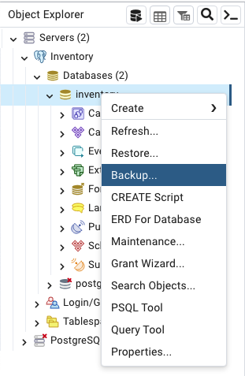
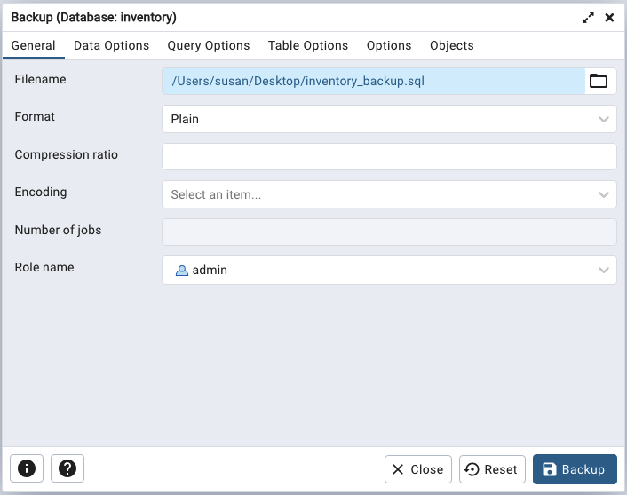

# Using pg_dump for Backups

[pg_dump](https://www.postgresql.org/docs/16/app-pgdump.html) is a Postgres tool that can create a script or archive of the settings and commands required to recreate data, a database, or database objects on another PostgreSQL server. You can use pg_dump to move objects into a Cloud database, or from a Cloud database to another server. pg_dump can also be used as a backup tool.

When using pg_dump with Cloud, you should specify one or more schema names or unique object names in the pg_dump command. The owner of the objects must exist in the database to execute commands to recreate the objects, and must have privileges in the schema in which the objects are being created. You should not backup or attempt to recreate objects in the `spock` schema.

The version of pg_dump and pg_restore that you use must be the same version as the schema or objects that you are recreating. You can invoke pg_dump on the command line or with the pgAdmin graphical client. At the command line, the simplest form of the command is:

`pg_dump -Fp -h domain_name -U user_name -d database_name -n schema_name > path_to_file/target_filename`

Use the `-F` flag to specify a format; `-Fp` generates a plain-text SQL script that can be restored with psql (the default), while `-Ft` produces a tar archive that can be installed with pg_restore.

When prompted, provide the database password. For example, the following command:

`./pg_dump -Fp -h usefully-excited-foxhound-iad.a1.pgedge.io -U admin -d inventory > /Users/susan/Desktop/inventory_backup`

Creates a plain-text file that recreates the `inventory` database; the database resides on a Cloud host with the domain of `usefully-excited-foxhound-iad.pgedge.io`. The commands are written to a plain text file named `inventory_backup`.   For a complete list of pg_dump command line options, see the [documentation at the PostgreSQL website](https://www.postgresql.org/docs/16/app-pgdump.html).

## Using pgAdmin for Backups

The pgAdmin client includes a backup tool that is a front-end for pg_dump; to open the dialog and define a custom or tar formatted backup, right click on a server name in the `Object Explorer` and select `Backup...` from the context menu.



When the `Backup` dialog opens:

* Provide a name for the backup with the file browser in the `Filename` field on the `General` tab.
* If applicable, specify a file format in the `Format` field on the `General` tab.
* Specify the name of a database superuser (or `admin`) in the `Role name` field on the `General` tab.
* Specify your backup preferences on the `Data Options`, `Query Options`, `Table Options`, and `Options` tabs.
* Select the database or database objects for backup on the `Objects` tab.



When the backup completes, you can open the file and review the statements, modify SQL commands, or use the file to recreate objects. For example, the following plain-text dump file of the `fruit` table makes it easy to see how the table is created and populated, how ownership is conveyed, and how key definition is determined. 

Note that at the start of the script, any parameters that are not set to default PostgreSQL values are reset to the values in the dump file when the script is replayed. This can potentially modify the behavior of the database into which the script is played back:

```sql
--
-- PostgreSQL database dump
--
-- Dumped from database version 16.1
-- Dumped by pg_dump version 16.1

SET statement_timeout = 0;
SET lock_timeout = 0;
SET idle_in_transaction_session_timeout = 0;
SET client_encoding = 'UTF8';
SET standard_conforming_strings = on;
SELECT pg_catalog.set_config('search_path', '', false);
SET check_function_bodies = false;
SET xmloption = content;
SET client_min_messages = warning;
SET row_security = off;

--
-- Name: public; Type: SCHEMA; Schema: -; Owner: pg_database_owner
--
CREATE SCHEMA public;
ALTER SCHEMA public OWNER TO pg_database_owner;

--
-- Name: SCHEMA public; Type: COMMENT; Schema: -; Owner: pg_database_owner
--
COMMENT ON SCHEMA public IS 'standard public schema';
SET default_tablespace = '';
SET default_table_access_method = heap;

--
-- Name: fruit; Type: TABLE; Schema: public; Owner: alice
--
CREATE TABLE public.fruit (
    pkey integer NOT NULL,
    type text,
    color text
);

ALTER TABLE public.fruit OWNER TO alice;

--
-- Data for Name: fruit; Type: TABLE DATA; Schema: public; Owner: alice
--
COPY public.fruit (pkey, type, color) FROM stdin;
1	grapefruit	pink
2	apple	green
3	pear	yellow
4	orange	orange
5	apple	red
6	banana	yellow
7	raspberry	red
8	grape	red
9	grape	black
10	grape	green
11	watermelon	green/pink
12	canteloupe	tan/orange
\.

--
-- Name: fruit fruit_pkey; Type: CONSTRAINT; Schema: public; Owner: alice
--
ALTER TABLE ONLY public.fruit
    ADD CONSTRAINT fruit_pkey PRIMARY KEY (pkey);
--
-- PostgreSQL database dump complete
--

```
