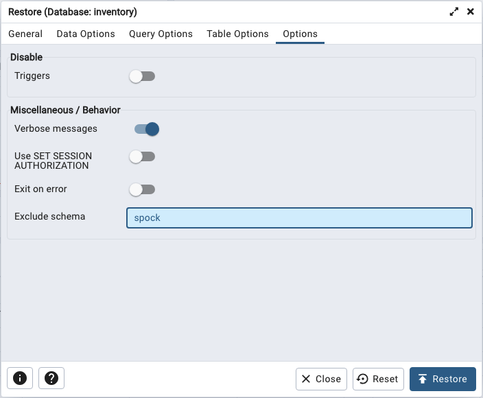

# Restoring a Database from Backup

If your backup was taken with pg_dump in plain-text format, the easiest way to restore into a Cloud database is with the psql command line client. You can use the `PSQL` connection string located in the `Get Started` or `Connect to your database` pane of the Cloud console to connect to psql and playback the script. 

To restore with psql, append the `PSQL` connection string with `path_to_file/filename` and press `Return`. For example, the following command starts psql and plays back a script named `fruit`, creating the new schema objects and data in the `produce` database:

`PGSSLMODE=require PGPASSWORD=49VqNp6tg6g76RBz5L9n39DU psql -h mentally-cute-ladybird-iad.a1.pgedge.io -p 5432 -U admin -d produce < /Users/susan/Desktop/fruit`

As the commands are played back, the command results are echoed onscreen:

```sql
PGSSLMODE=require PGPASSWORD=q2w40BbTL7e2Ug45c437MKaO psql -h brightly-striking-ram-iad.a1.pgedge.io -p 5432 -U admin -d produce < /Users/susan/Desktop/fruit 
SET
SET
SET
SET
SET
 set_config 
------------
(1 row)
SET
SET
SET
SET
ERROR:  schema "public" already exists
ALTER SCHEMA
COMMENT
SET
SET
CREATE TABLE
ALTER TABLE
COPY 12
ALTER TABLE
```

The script contains a command to create the `public` schema; since the schema already exists, that command throws an error when invoked, but the script continues, eventually creating the table named `fruit` owned by `alice`. The newly created table is then displayed in the `Start Replication` pane.


## Using pgAdmin to Restore an Archive

[pgAdmin](https://www.postgresql.org/docs/16/app-pgrestore.html) is a PostgreSQL client that uses an archive created in the pgAdmin client to recreate data, a database, or database objects on a PostgreSQL server or Cloud database. pgAdmin uses [pg_restore](https://www.postgresql.org/docs/16/app-pgrestore.html) to implement the restore.

When using pg_restore with Cloud, the owner of the objects must exist in the target database so pg_restore can execute commands to create the objects. The object owner must also have privileges in the schema in which the objects are being created. You should not attempt to recreate objects in the `spock` schema.

The version of pg_restore that you use must be the same version as the database in which you are creating the schema or objects. pg_dump and pg_restore are part of the `postgresql` installer; visit the [PostgreSQL website](https://www.postgresql.org/download/) to download an installer or for installation instructions for your platform.

To restore an archive on pgAdmin, right-click the name of the database in the `Object Explorer` panel and select `Restore...` from the context menu. 


On the `General` tab:

* Provide the file format (either a `custom` or `tar` archive) in the `Format` field.
* Use the object browser in the `Filename` field to select the archive with which you'll restore.
* `Number of jobs` must be one; parallel processing for pg_restore processes is not supported at this time.
*  Use the drop-down listbox in the `Role name` field to select the owner of the objects in the archive.

If your backup inadvertantly contains schemas that you do not wish to include when restoring, use the `Options` tab to exclude those schemas from the restore process.



For example, you can exclude the `spock` schema by including the name in the `Exclude schema` field.

### Troubleshooting on pgAdmin

pgAdmin will display a `Process Watcher` popup with diagnostic error messages if it encounters an error. A common problem occurs when restoring an object that resides in the `public` schema; the schema already exists, so pgAdmin returns an error. 


You can avoid this problem when creating tables in the `public` schema by first dropping the schema, then recreating it when you restore the .tar file.


