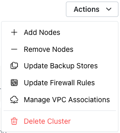
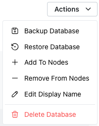

# Using the Actions Menu to Modify a Cluster or Database

The `Actions` menu is a context-sensitive menu that provides a shortcut to frequently-used behaviors related to the object displayed when you open the menu.  Use options accessed via the `Actions` drop-down menu in the upper-right corner of the dialog to manage your cluster or database.

For example, when opened from a cluster node the `Actions` menu might show:

Select from the options listed to:

* [Add a node](../mod_cluster/add.md) to the cluster.
* [Remove a node](../mod_cluster/drop#dropping-a-node-from-a-cluster) from the cluster.
* Update [Backup Stores](../cluster/backup_store.mdx).
* Update [Firewall Rules](../cluster/firewall.mdx).
* Manage [VPC Associations](../cluster/vpc_assoc.mdx)
* [Delete a cluster](https://docs.pgedge.com/cloud/mod_cluster/drop#deleting-a-cluster).

When opened from a database menu, the `Actions` menu may include:

Select from the options listed to:

* [Backup the Database](../backup/backups#taking-a-backup).
* [Restore the Database](../backup/backups#restoring-a-backup) from backup.
* [Add the database](../mod_cluster/add#adding-a-database-to-a-cluster-node) to another node.
* [Remove the database](../mod_cluster/drop#removing-a-database-from-a-node) from a node.
* [Edit the Display Name](../mod_cluster/modify#changing-the-display-name-of-a-database) of the database.
* [Delete the database](../mod_cluster/drop#deleting-a-database).
