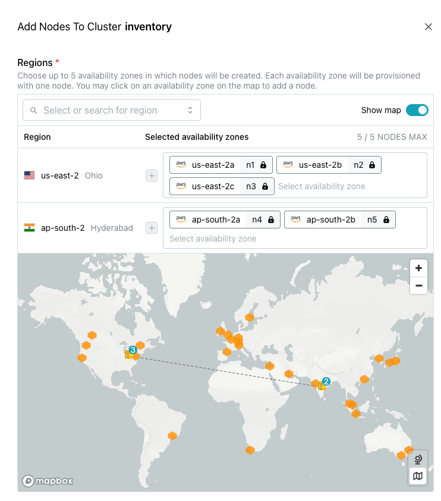
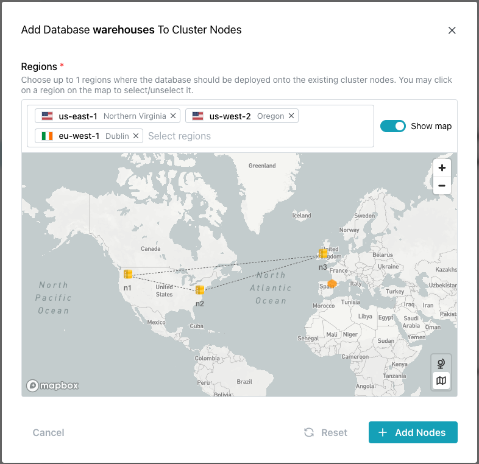

# Adding a Database or Cluster Node

You can use options on the `Actions` drop-down menu (located in the upper-right corner of the Cloud console) to add a database to a node or a node to a cluster. The menu options are context-sensitive, applying to the object currently selected in the navigation panel. To access menu options, select the name of the cluster or database you'd like to modify in the navigation panel, and then open the `Actions` menu.

## Adding a Node to a Cluster

To add a node to an existing cluster, select the cluster name in the navigation panel, open the `Actions` menu, and select `Add Nodes`.

When the `Add Node` dialog opens as shown below, provide details the new node(s): 

* Use indicators on the map or select regions from the drop-down list in the `Select regions` field to choose the region(s) in which the new nodes will reside.
* Accept the `Default` configuration to use server-assigned network addresses or select `Manual` to assign specific addresses for your new node(s).
* Modify the deployment details for the new node if needed. The values shown in the `Network Settings` section and instance details reflect the values used for the other nodes in the cluster.

Select the `Add Nodes` button to deploy your new nodes and add them to your cluster. The cluster will be placed in modification status until the addition is complete; when the update finished, you will be able to access the new node using the SSH configuration defined during the initial cluster creation.

!!! tip

    Existing databases are not added to a new node automatically.

## Adding a Database to a Cluster Node

To add a database to a cluster node, select the database name in the navigation panel, open the `Actions` menu, and select `Add to Nodes`. Note that new cluster node must be [added to the cluster](#adding-a-node-to-a-cluster) before you can add a database to the node. The node to which you are adding the database must be a member of the cluster on which the database was created.

When you add a database to a new node, the database is empty. You will need to restore existing schemas and data to the database, and if AutoDDL is not enabled, start replication on the node. Once replication has been re-established, new transactions can be written to the database. To review recommended workflows to bring the node up to date with a full dataset visit [here](#restoring-data-to-a-database-on-a-new-cluster-node).

The `Add Database... to Cluster Nodes` dialog opens.

On the map, nodes labeled with a node name (like `n1`, `n2`, or `n3`) and connected by a dotted line are currently replicating the selected database between themselves. Nodes that are not attached to other nodes by a dotted line, or are unlabeled are not part of the cluster for the selected database. To select a node(s) for updating, click in the `Select regions` field to access a list of available nodes on which the database does not currently reside, or click a node(s) on the map.

After selecting the node(s), click the `Add Nodes` button to start the modification process. 

When you add a database to a new cluster node, the process places the new node into the `Nearest Node` DNS. If your application uses this connection, you should plan downtime accordingly until data can be aligned and restored on all nodes, or you should set your application to only read data from a pre-existing node during the data restoration process.

## Restoring Data to a Database on a New Cluster Node

Adding a database to a new cluster node does not manage the transfer of existing data to the database. The new node is added to the replication configuration for the database, but you must restore existing data to the new database node through a separate workflow.

We recommended that you stop write transactions to the database while you are restoring data to align the nodes across the cluster. If write transactions are enabled, it is possible for data to not reach other nodes depending on the restoration strategy. This must currently be enforced by your application.

The steps you use to restore data to your new database/node combination will depend on if your nodes are running with AutoDDL enabled.

* If your nodes are running with AutoDDL enabled, you can use the Cloud [Restore Database](https://docs.pgedge.com/cloud/backup/restore) option to restore a data backup from another node. You can perform a restore specifically to just the new node, or restore to all nodes to ensure a complete/refreshed alignment of datasets. Your chosen strategy should take into account your spock subscription and data residency requirements.

If you are using the graphical `Restore Database` interface to restore your database, the existing nodes will restart during the setup process for the new node in order to re-establish replication. This will cause a brief downtime on these nodes.

* If your nodes are not running with AutoDDL enabled, you can restore the data manually with an external tool [like pg_dump](https://www.postgresql.org/docs/current/app-pgdump.html). Then, you'll need to use the Cloud [Start Replication](https://docs.pgedge.com/cloud/database/manage_db#the-start-replication-pane) button to align the new node with the existing database nodes.

!!! note

    If you are using pgBackRest to restore data from another node in your Backup Stores, pgBackRest will re-establish Spock replication sets using the restored data, automatically re-establishing replication as it was at the time of the backup.