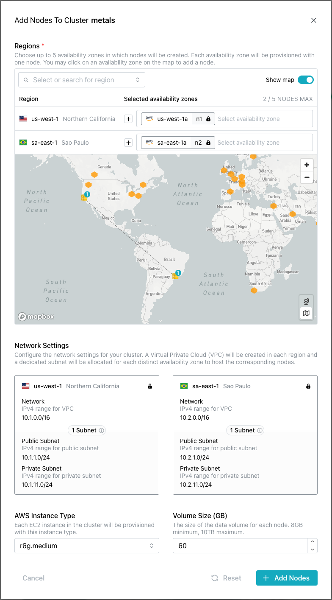
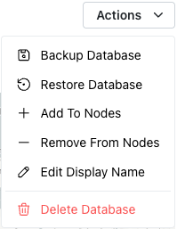
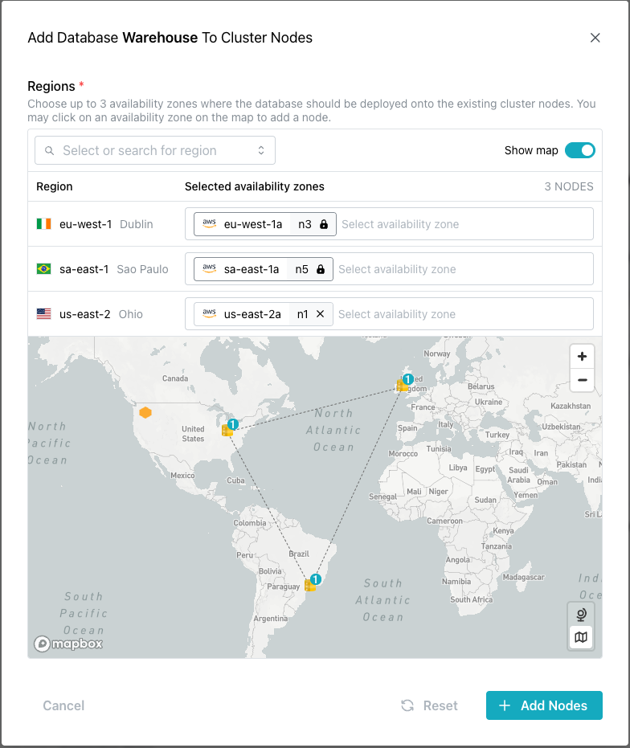

# Adding a Database or Cluster Node

You can use options on the `Actions` drop-down menu (located in the
upper-right corner of the Cloud console) to add a database to a node or a
node to a cluster. The menu options are context-sensitive, applying to the
object currently selected in the navigation panel. To access menu options,
select the name of the cluster or database you'd like to modify in the
navigation panel, and then open the `Actions` menu.

## Adding a Node to a Cluster

To add a node to an existing cluster, select the cluster name in the
navigation panel, open the `Actions` menu, and select `Add Nodes`.

When the `Add Node` dialog opens, provide details the new node(s): 

* Use indicators on the map or select regions from the drop-down list in
  the `Select regions` field to choose the region(s) in which the new
  nodes will reside.
* Accept the `Default` configuration to use server-assigned network
  addresses or select `Manual` to assign specific addresses for your new
  node(s).
* Network addresses for the new node(s) are assigned for consistency with the
  rest of your cluster, and are not modifiable.
* The `Instance Type` field displays the value selected for the other nodes
  in your cluster; use the selector to choose an alternative configuration. 
  If you are adding more than one node in a single update, the same 
  configuration will be applied to both nodes.
* The `Volume Size` field displays the data volume size of the other nodes in
  your cluster; use the selector to choose an alternative size. If you are
  adding more than one node in a single update, the same size will be applied
  to both nodes.

After specifying your preferences, select the `Add Nodes` button to deploy
your new nodes and add them to your cluster. The cluster will be placed in
modification status until the addition is complete; when the update finished,
you will be able to access the new node using the SSH configuration defined
during the initial cluster creation.

!!! tip

    Existing databases are not added to a new node automatically.

## Adding a Database to a Cluster Node

To add a database to a cluster node, select the database name in the
navigation panel, open the `Actions` menu, and select `Add to Nodes`. Note
that node must be 
[an operational member of the cluster](#adding-a-node-to-a-cluster)
before you can add a database to the node. The node to which you are adding
the database must be a member of the cluster on which the database was
created.

When you add a database to a node, Cloud uses 
[Spock's Zodan functionality](https://docs.pgedge.com/spock-v5/v5-0-6/modify/zodan/)
to copy the existing data to the new node. Automatic DDL replication is
enabled as the node joins the cluster.

The `Add Database... to Cluster Nodes` dialog opens.a

On the map, nodes connected by a dotted line are currently replicating
the selected database amongst themselves. Nodes that are not attached to
other nodes by a dotted line are currently not hosting the selected database.
To select a node(s) for updating, click in the `Regions` field to access a
list of available nodes on which the database does not currently reside, or
click a node(s) on the map.

After selecting the node(s), click the `Add Nodes` button to start the
modification process.
