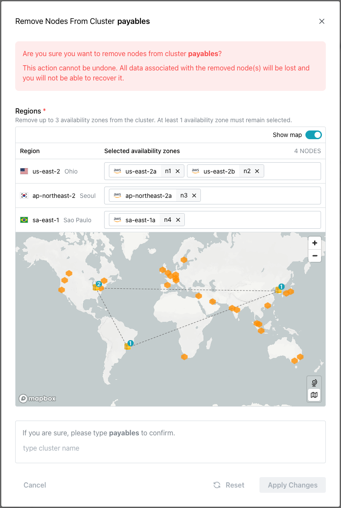
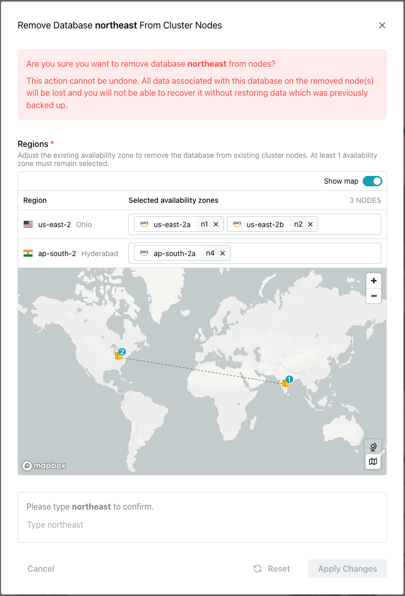
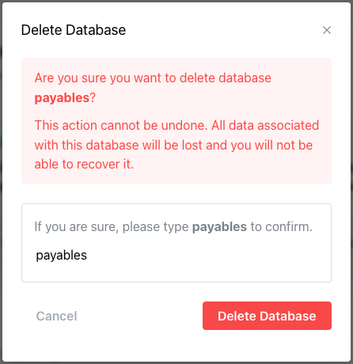
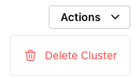
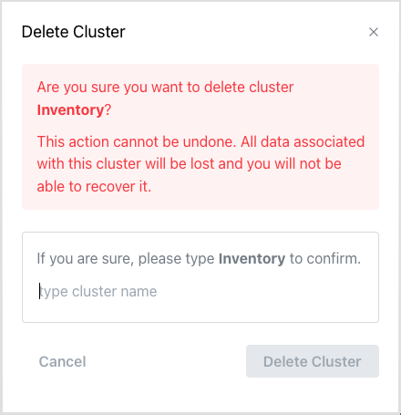
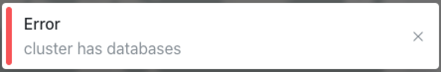

# Removing a Cloud Database, Node, or Cluster

You can use options on the `Actions` drop-down menu (in the upper-right corner of the Cloud console) to drop a database from a specific node or a specific node from a cluster. The menu options are context-sensitive, with the selected actions applying to the object currently highlighted in the navigation panel. To access menu options, highlight the name of the cluster object you'd like to change in the navigation panel, and then open the `Actions` menu.

## Dropping a Node from a Cluster

Before dropping a node from a cluster, you must [delete any database(s)](https://docs.pgedge.com/cloud/mod_cluster/drop#deleting-a-database) from that node. Then, to access the `Remove Nodes` dialog, highlight the name of a cluster in the navigation panel and select `Remove Nodes` from the `Actions` menu.

When the `Remove Nodes` dialog opens, click a node on the map or click the `X` in an availability zone name in the `Regions` field to remove the node from the specified region. Then, to remove the node and reconfigure your cluster, enter the cluster name in the confirmation field, and click the `Apply Changes` button.

Please note: You may only remove a single node at a time.  When you are working with a multi-node cluster with replication enabled, the minimum number of cluster nodes (and respective databases) cannot drop below two.

## Removing a Database from a Node

To drop a database from a cluster node, select the name of the database in the navigation panel, and open the `Actions` menu.

Select the `Remove From Nodes` option from the `Actions` menu to open the `Remove Database` dialog.  When the dialog opens, deselect the node(s) on the map or from the list of availability zones to indicate which nodes you'd like to remove the database from.

After removing the nodes from the `Regions` list, type the database name in the confirmation pane and click the `Apply Changes` button. The database will be removed the node, resulting in the loss of all data on that node. Database backups will remain available for the database, accessible via the API.

The remaining cluster nodes are then reconfigured to replicate the database between the remaining nodes.

## Deleting a Database

To delete a database, highlight the name of the database you wish to delete in the tree control. Open the `Actions` drop-down in the upper-right corner, and select `Delete Database` from the context menu. 

When prompted, enter the database name in the popup window to confirm the deletion, and select the `Delete Database` button.

## Deleting a Cluster

To delete a cluster provisioned by Cloud, select the cluster name in the navigation tree control to open the cluster information page. Select the `Actions` drop-down in the upper-right corner of the page, and choose `Delete Cluster`.

The `Delete Cluster` popup prompts you to confirm that you wish to delete the cluster. To confirm, enter the cluster name and press `Delete Cluster`.

!!! Note

    If your cluster has databases, you must [delete the databases](https://docs.pgedge.com/cloud/mod_cluster/drop#deleting-a-database) before deleting the cluster. A popup alerts you if you attempt to delete a cluster that still hosts databases.

