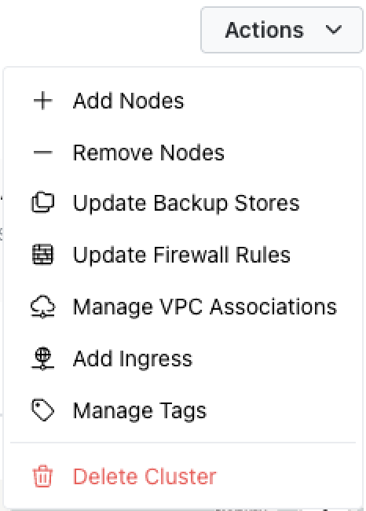
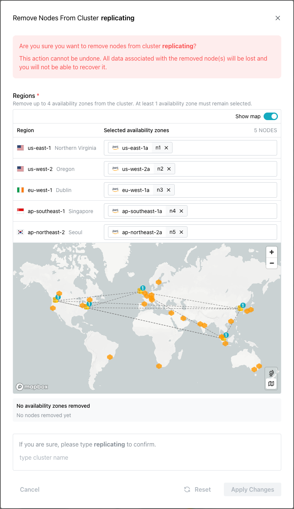
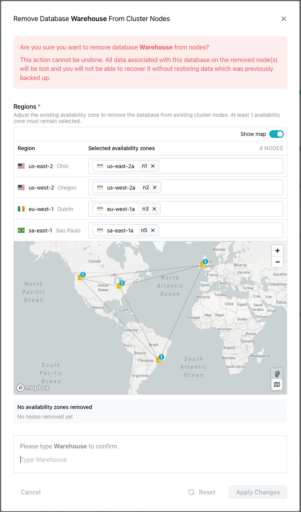
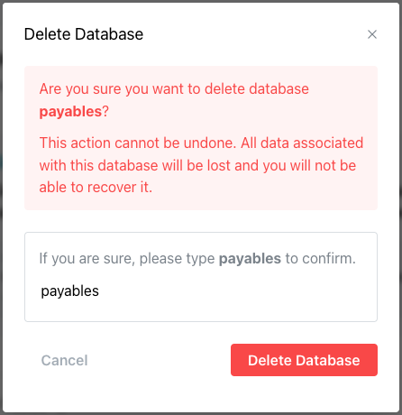
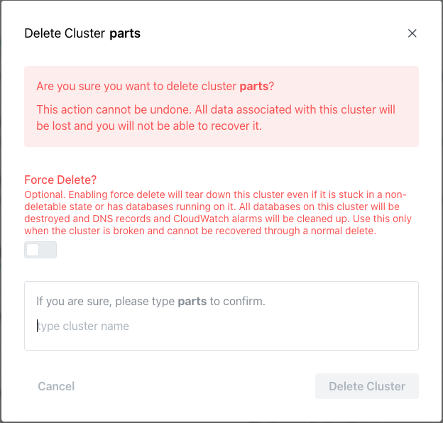
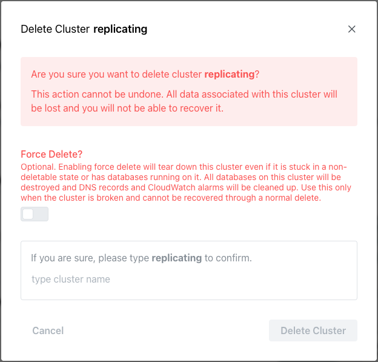
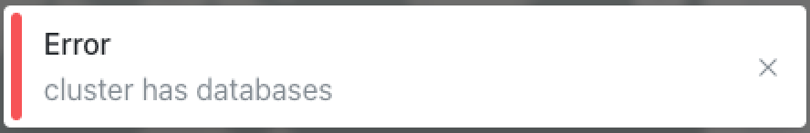

# Removing a Cloud Database, Node, or Cluster

Use the `Actions` drop-down menu in the upper-right corner of the Cloud
console to manage databases, nodes, and clusters. The menu options are
context-sensitive; the selected action applies to the object currently
highlighted in the navigation panel. To access the menu options,
highlight the name of the cluster object in the navigation panel, and
then open the `Actions` menu.

## Dropping a Node from a Cluster

To access the `Remove Nodes` dialog, highlight the name
of a cluster in the navigation panel and select `Remove Nodes` from the
`Actions` menu.

When the `Remove Nodes` dialog opens, click a node on the map or click
the `X` in an availability zone name in the `Regions` field to remove
the node from the specified region. To remove the node and reconfigure
the cluster, enter the cluster name in the confirmation field and click
`Apply Changes`.

You may only remove a single node at a time. When working with a
multi-node cluster with replication enabled, the cluster cannot drop
below two nodes.

## Removing a Database from a Node

To drop a database from a cluster node, select the name of the database
in the navigation panel and open the `Actions` menu.

Select `Remove From Nodes` from the `Actions` menu to open the `Remove
Database` dialog. When the dialog opens, deselect the nodes on the map
or from the list of availability zones to indicate which nodes to remove
the database from.

After removing the nodes from the `Regions` list, type the database name
in the confirmation pane and click `Apply Changes`. The database is
removed from the node, resulting in the loss of all data on that node;
database backups remain available via the API. The remaining cluster
nodes are then reconfigured to replicate the database between them.

## Deleting a Database

To delete a database, highlight the name of the database in the
navigation panel. Open the `Actions` drop-down in the upper-right
corner and select `Delete Database` from the context menu.

When prompted, enter the database name in the confirmation window and
select `Delete Database`.

## Deleting a Cluster

To delete a cluster, select the cluster name in the navigation panel to
open the cluster information page. Select the `Actions` drop-down in
the upper-right corner and choose `Delete Cluster`.

The `Delete Cluster` dialog prompts you to confirm the deletion. Enter
the cluster name and press `Delete Cluster` to confirm.

!!! Note

    If the cluster has databases, you must
    [delete the databases](https://docs.pgedge.com/cloud/mod_cluster/drop#deleting-a-database)
    before deleting the cluster. A popup alerts you if you attempt to
    delete a cluster that still hosts databases.

