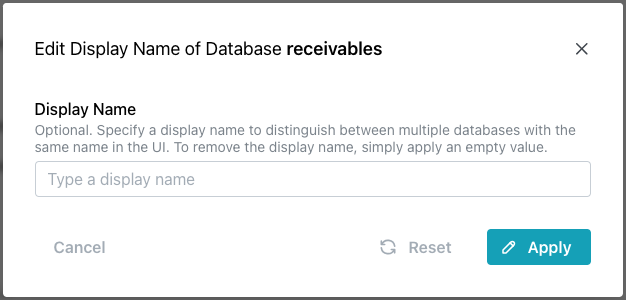

# Modifying a Database, Node, or Cluster

You can use the pgEdge Distributed Postgres (Cloud Edition) console or API to modify your Cloud resources. For more information about using the API, [visit here](https://docs.pgedge.com/cloud/settings#the-api-clients-tab).

## Changing the Display Name of a Database

To change the name of a database that is displayed in the navigation pane, highlight the database name and select `Edit Display Name` from the `Actions` menu.

When the `Change Display Name` popup opens, enter the new database name in the `Display Name` field and select `Apply`.

