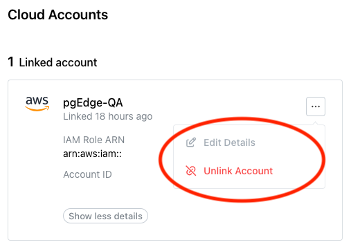

# Managing Cloud Provider Accounts

import { Callout } from 'nextra/components'
 
<Callout type="info">
  Cloud Accounts are available only on Cloud Enterprise Edition.
</Callout>

Before creating a cluster on the pgEdge Distributed Postgres (Cloud Edition) console, you must create an account with a cloud provider and link that account with your Cloud account. Select the `Cloud Accounts` node in the navigation pane to open the `Cloud Accounts` page.

Use options accessed from the `Cloud Accounts` page to manage the accounts used to provision databases with pgEdge Cloud; to get started, select the `+ Link Cloud Account` button to link an account with pgEdge Cloud. 

Then, visit the vendor-specific page for information about linking an account with:

    * [AWS](cloud_accounts/link_to_AWS.md)
    * [Azure](cloud_accounts/link_to_Azure.md)
    * [Google](cloud_accounts/link_to_Google.md)

After linking a provider account, that account is displayed on the `Linked accounts` pane. Use the `Show more details` button to display details about the provider account.

Use the menu icon (...) in the upper-right corner of an account pane to access the account management options and edit account details or [unlink an account](#deleting-an-account-link). 

## Deleting an Account Link

Before deleting an account link, ensure that any resources deployed with Cloud have been backed up to your satisfaction and destroyed. Then, to delete the link to a cloud vendor account, select the menu icon (...) in the top-right corner of the pane of a linked account.

When the menu opens, select `Unlink Account`.

To confirm that you wish to unlink the account, enter the account name in the `Unlink Cloud Account` popup, and press the `Unlink Account` button.
