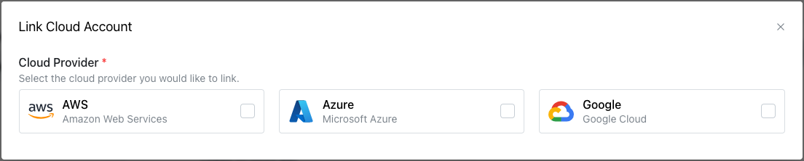

# Linking an AWS Account

To link an AWS provider account with your pgEdge Distributed Postgres (Cloud Edition) account, select the `Cloud Accounts` heading in the left navigation pane and then the `+ Link Cloud Account` button. The `Link Cloud Account` popup opens:

On the `Link Cloud Account` popup, select the `AWS` icon to expand the dialog. 

If you have an `AWS IAM Role` you wish to use, you can use the fields in the top portion of the dialog to create the link:

* Provide a user-friendly name in the `Account Name` field.
* Provide an account description in the `Account Description` field.
* Provide your AWS IAM role identifier in the `AWS IAM Role` field.

When you're finished, press the `Link Account` button to link the account and add it to the `Cloud Accounts` page.

## Creating an AWS IAM Role for use with Cloud

The Cloud console provides an AWS CloudFormation Template to simplify creation of an IAM role. 

**The template settings create a role that allows Cloud to securely provision resources in your Cloud account. Cloud uses IAM cross-account trust policies to assume the role in your account. This is the AWS recommended approach.**

Before using the Cloud wizard to create an IAM role, open a browser tab and log in to your AWS account. Then, return to the Cloud console window and select the `Open the Create Stack Wizard` button. When the AWS `Quick create stack` window opens, the template is displayed, complete with the details you need to create an IAM role for replication management.

The URL of the Cloud `AWS CloudFormation Template` is: `https://pgedge-public-assets.s3.amazonaws.com/product/templates/cloudformation.template`

CloudFormation prompts you to provide a name for the stack in the `Stack name` field; you can accept the default and scroll down.

The `CloudFormation Stack Parameters` are completed as required, allowing Cloud to securely provision resources with your AWS account.

No changes are required in the `CloudFormation Stack Permissions` section.

Review the message in the `Capabilities` section, and check the box next to `I acknowledge that AWS CloudFormation might create IAM resources with custom names`. Then, select `Create stack`.

AWS CloudFormation navigates to a page listing the stack creations that are in progress; when your stack completes, select the `Resources` tab in the right pane.

Select the link in the `Physical ID` column to open a details page in the AWS `Identity and Access Management (IAM)` service console. The ARN is displayed in the page `Summary`.

Copy the role ARN, and return to the Cloud console. Add the role ARN to the `AWS IAM Role` field, specify a name for the account in the `Account Name` field, and a description of the account in the `Account Description` field. Select the `Link Account` button to finish linking your account to the Cloud console. 

With a linked account in place, you're ready to [create an Enterprise Edition cluster](../../cluster/create_cluster.md).

## Creating an AWS Key Pair

To create a new AWS key pair:

1. Sign in to the AWS management console.
2. Navigate to the EC2 service.
3. Select `Key Pairs` from the `Network & Security` menu.
4. Select the `Create key pair` button located in the upper-right corner of the `Key Pairs` window to specify the key pair details.

On the AWS `Create key pair` window, provide a name for the key pair in the `Name` field; the other fields can be left to their defaults. Select `Create key pair` to create the key pair and return to the main `Key pairs` window.

You can now use the AWS key pair when defining a cluster that is provisioned in the AWS cloud.

## Enabling a Region in the AWS Console

While you can access all regions in the Cloud console, not all regions may be enabled for use in your AWS account. To enable a region, log in to the AWS management console. Use the arrow to the right of your user name (in the upper-right corner) to access the account information menu.

Select the `Account` menu option to navigate to the `Account` information page; scroll down to the `AWS Regions` table. 

To enable a region for use with Cloud, check the box to the left of the region name, and select the `Enable` button. A popup will open, asking you to confirm that you wish to enable the region(s); select the `Enable regions` button to continue. Use the `refresh` button in the upper-right corner to update table to check the `Status` column. 