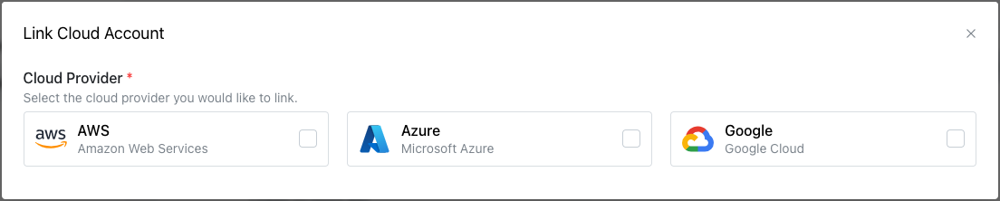
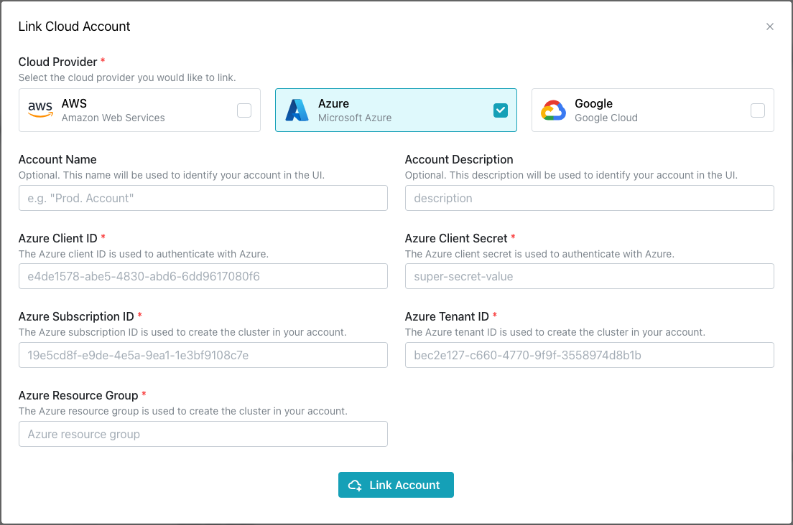

# Linking an Azure Account

pgEdge Distributed Postgres (Cloud Edition) uses an `App Registration` to provision clusters in a specific `Resource Group` within your Azure subscription. You can create an `App Registration` and an associated `Client Secret` in the Azure console under `Microsoft Entra ID` --> `App Registrations`.

You can use a new or existing `Resource Group`. The following roles must be assigned to the `App Registration` on the `Resource Group` prior to creating a cluster:

* `Contributor`
* `Key Vault Administrator`
* `Key Vault Data Access Administrator`

To assign a role, navigate to: `Resource Groups` --> `<Resource Group Name>` --> `IAM` --> `Add role assignment`.

The following resource providers must be registered on the Azure Subscription to enable API access. 

* `Microsoft.Compute`
* `Microsoft.Network`
* `Microsoft.ManagedIdentity`
* `Microsoft.KeyVault`

To register a resource provider, navigate to: `All services` --> `Subscriptions` --> `<Subscription Name>` -> `Resource Providers`.

Depending on your Cloud node locations and Azure Instance Type selection, you may need to request Quota Increases under `All services` --> `Quotas` --> `Compute` to ensure that virtual machines can be successfully created in each location. In addition, you must accept the image terms for the virtual machine image used by Cloud via the Azure CLI:

`az vm image terms accept --urn erockyenterprisesoftwarefoundationinc1653071250513:rockylinux-9:rockylinux-9:9.1.20230215`

To link an Azure account with your Cloud account, select the `Cloud Accounts` heading in the left navigation pane and then the `+ Link Cloud Account` button. 

On the `Link Cloud Account` dialog, select the `Azure` icon to expand the dialog. 

Use the fields in the dialog to create a link to your Azure account:

* Provide a user-friendly name in the `Account Name` field.
* Provide an account description in the `Account Description` field.
* Provide your Client ID in the `Azure Client ID` field.
* Provide your Client Secret in the `Azure Client Secret` field.
* Provide your Subscription ID in the `Azure Subscription ID` field. To find your subscription ID in the Azure console, go to `All services` --> `Subscriptions` --> `Subscription ID`.
* Provide your Tenant ID in the `Azure Tenant ID` field. To find your tenant ID in the Azure console, go to `Microsoft Entra ID` --> `Properties` --> `Directory ID`.
* Provide your Resource Group in the `Azure Resource Group` field.

After providing connection information, select `Link Account` to create a link to your Azure account.