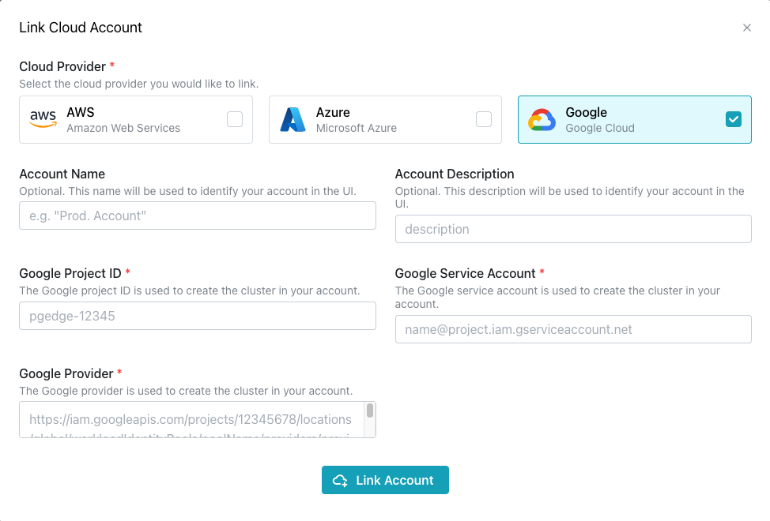
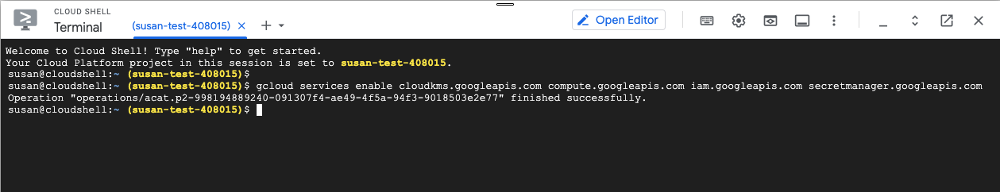
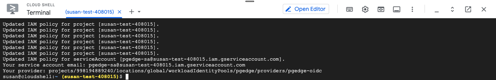

# Linking a Google Account

pgEdge Distributed Postgres (Cloud Edition) can use a Google Cloud project with OpenID Connect (OIDC) to provision clusters. You can use an existing Google project, or use the [templated commands](#creating-google-resources) provided to create a project with the required permissions to provision Cloud clusters. Before linking your project, you must enable the following APIs for use with your project:

* `cloudkms.googleapis.com`
* `compute.googleapis.com`
* `iam.googleapis.com`
* `secretmanager.googleapis.com`
* `cloudresourcemanager.googleapis.com`
* `storage.googleapis.com`

Your Google provider project must have a service account with the following assigned roles:

* `Compute Admin`
* `Secret Manager Admin`
* `Cloud KMS Admin`
* `Security Admin`
* `Service Account Admin`
* `Service Account User`
* `Storage Admin`

To link a Google Cloud project with your Cloud account, select the `Cloud Accounts` heading in the navigation pane and then the `+ Link Cloud Account` button. 



To link a Google Cloud project:

* Check the box in the `Google` account pane.
* Provide a user-friendly name in the `Account Name` field.
* Add a description of the account in the `Account Description` field.

Three pieces of Google-specific information are required to create a link to a Google account; you must provide:

* The Google `Project ID`. To locate the project ID, log in to the Google console, and use the resource selector drop-down (located in the upper-left corner of the console) to select your project's parent resource. When the `Select a resource` popup opens, use the tabs across the top to locate your project name in the list. 

* The Google `Service Account`. The service account is used for machine-to-machine communication. It is referred to by its email address. To locate the service account email in the Google console, select your project from the resource selector, navigate to `IAM & Admin`, then select `Service Accounts` from the navigation panel. Choose your service account from the list of service accounts displayed.

* The Google `Provider`. The Workload Identity provider is used to create an OIDC connection between Cloud and your Google Cloud project. The provider is associated with a Workload Identity pool. To locate the provider name, open the `Workload Identity Federation` window and select the name of your pool. The providers are listed on the right; choose the provider and click the edit button. The full provider name is the `default audience` value.


## Creating Google Resources

You can use the Google Cloud Shell editor to create the resources needed to provision clusters with Cloud. After authenticating with the account in which you wish to create resources, open the Cloud Shell Terminal, and enter the following command to enable access to the APIs:

```
gcloud services enable cloudkms.googleapis.com \
compute.googleapis.com \
iam.googleapis.com \
secretmanager.googleapis.com \
cloudresourcemanager.googleapis.com \
storage.googleapis.com
```



Then, use the following command to create the required resources. Note that the first line in the command creates an environment variable that refers to your Cloud `Tenant ID`. To locate the value you will substitute for your `YOUR-TENANT-ID`, open the `Settings` page in the Cloud console, and open the `Team` tab. The `Tenant ID` is displayed on the first line of the `Team` pane.

After substituting *YOUR-TENANT-ID* into the first line, invoke the command:

```
export TENANT_ID=YOUR-TENANT-ID &&
gcloud iam workload-identity-pools create pgedge --location="global" \
--display-name="pgEdge Workload Identity" \
--description="Workload Identity pool for pgEdge" \
--format=none && \
pool=$(gcloud iam workload-identity-pools describe pgedge \
--location="global" --format="value(name)") && \
gcloud iam workload-identity-pools providers create-oidc pgedge-oidc \
--location="global" --workload-identity-pool="pgedge" \
--display-name="pgEdge OIDC provider" \
--description="OIDC provider connection to pgEdge" \
--attribute-mapping="google.subject=assertion.sub,attribute.pgedge_tenant_id=assertion.pgedge_tenant_id" \
--issuer-uri="https://auth.pgedge.com/" \
--allowed-audiences=https://iam.googleapis.com \
--format=none && \
provider=$(gcloud iam workload-identity-pools providers describe pgedge-oidc \
--workload-identity-pool="pgedge" --location="global" --format="value(name)") && \
service_account=$(gcloud iam service-accounts create pgedge-sa \
--display-name "pgEdge service account" \
--description "Service account used by pgEdge to create clusters" \
--format="value(email)") && project_name=$(gcloud config get-value project) && \
gcloud projects add-iam-policy-binding ${project_name} \
--member serviceAccount:${service_account} \
--role roles/iam.securityAdmin \
--format none --condition None && \
gcloud projects add-iam-policy-binding ${project_name} \
--member serviceAccount:${service_account} \
--role roles/compute.admin \
--format none --condition None && \
gcloud projects add-iam-policy-binding ${project_name} \
--member serviceAccount:${service_account} \
--role roles/cloudkms.admin \
--format none --condition None && \
gcloud projects add-iam-policy-binding ${project_name} \
--member serviceAccount:${service_account} \
--role roles/secretmanager.admin \
--format none --condition None && \
gcloud projects add-iam-policy-binding ${project_name} \
--member serviceAccount:${service_account} \
--role roles/iam.serviceAccountAdmin \
--format none --condition None && \
gcloud projects add-iam-policy-binding ${project_name} \
--member serviceAccount:${service_account} \
--role roles/iam.serviceAccountUser \
--format none --condition None && \
gcloud projects add-iam-policy-binding ${project_name} \
--member serviceAccount:${service_account} \
--role roles/storage.admin \
--format none --condition None && \
gcloud iam service-accounts add-iam-policy-binding ${service_account} \
--member principalSet://iam.googleapis.com/${pool}/attribute.pgedge_tenant_id/$TENANT_ID \
--role roles/iam.workloadIdentityUser \
--format none --condition None && \
echo "Your service account email: ${service_account}" && \
echo "Your provider: https://iam.googleapis.com/${provider}"
```



When the command completes, Google Cloud Shell Terminal displays the information needed to link your account. In our example:

* The project name is in square brackets: `susan-test-408015`
* The service account email follows: `pgedge-sa@susan-test-408015.iam.gserviceaccount.com`
* The provider is the last information listed: ` https://iam.googleapis.com/projects/998194889240/locations/global/workloadIdentityPools/pgedge/providers/pgedge-oidc`