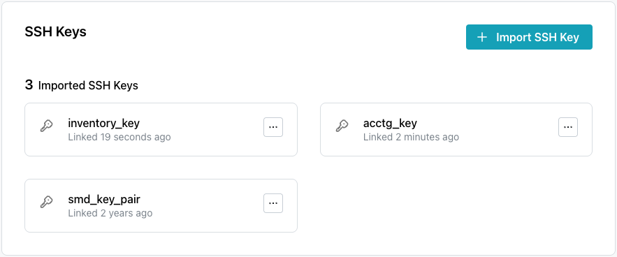
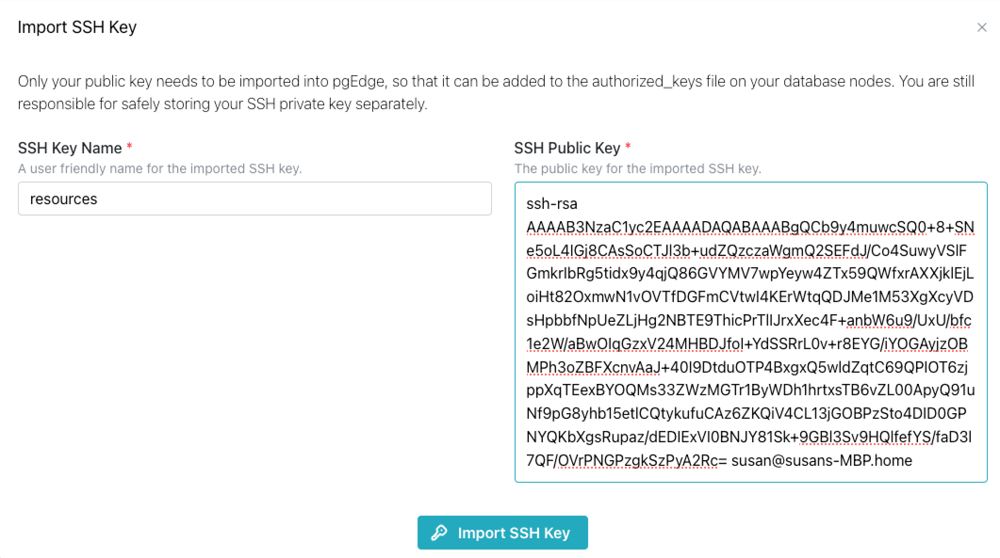

## Managing SSH Keys

import { Callout } from 'nextra/components'
 
<Callout type="info">
  SSH key management is available only on Cloud Enterprise Edition.
</Callout>

pgEdge Distributed Postgres (Cloud Edition) supports [SSH authentication](https://en.wikipedia.org/wiki/Secure_Shell) for connections to provisioned clusters. When you configure a cluster in the pgEdge console, you have the option of specifying a previously imported SSH public key. To authenticate with your cluster with SSH, you must provide the private key that corresponds to the public key specified during cluster deployment.

The `SSH Keys` dialog displays the SSH public keys that have been imported to your pgEdge Cloud account. 

### Importing an SSH Key

To import an SSH Key, select the `SSH Keys` node in the navigation pane; when the `SSH Keys` dialog opens, select the `Import SSH Key` button. 

Provide information about your key:

* Provide a user-friendly name for the key in the `SSH Key Name` field.
* Provide the public half of your key pair (`key_pair_name.pub`) in the `SSH Public Key` field.

If you do not have an SSH key pair, you can use the Linux [ssh-keygen](https://en.wikipedia.org/wiki/Ssh-keygen) program to generate a key. Be sure that you store the private half of your key in a safe place, away from the public key.

### Deleting an SSH Key

To delete a previously uploaded key, open the context menu in the key pane, and select `Delete Key`. A popup opens, asking you to confirm that you wish to delete the key; enter the key name in the field on the popup, and press `Delete SSH Key` to remove the key.