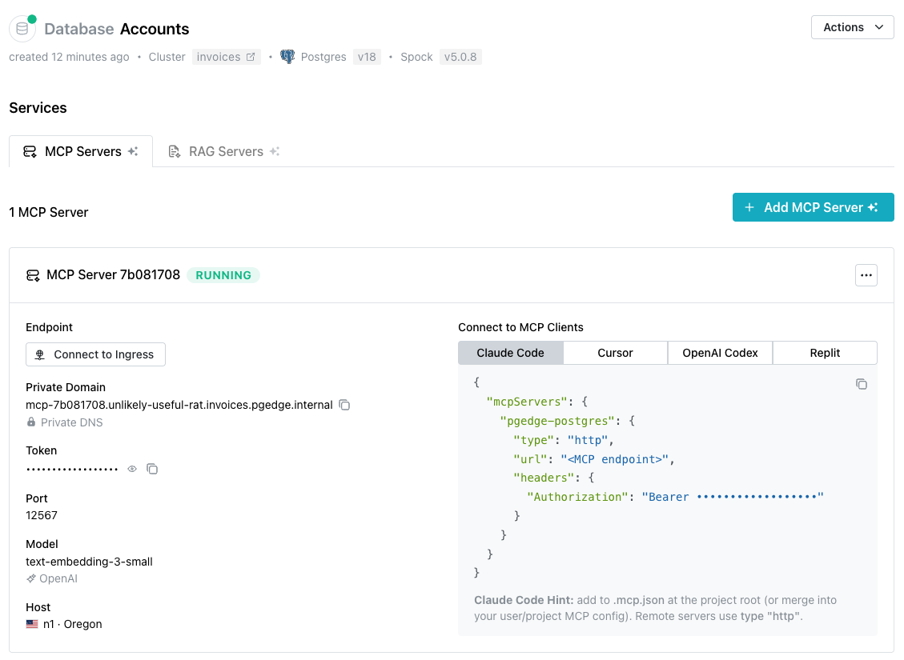
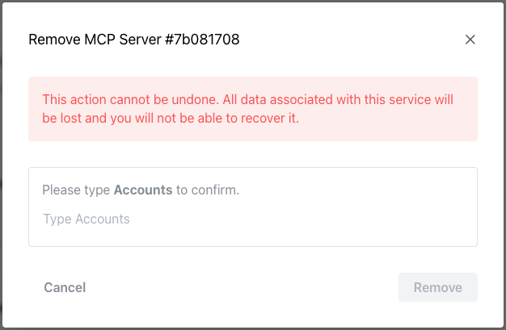
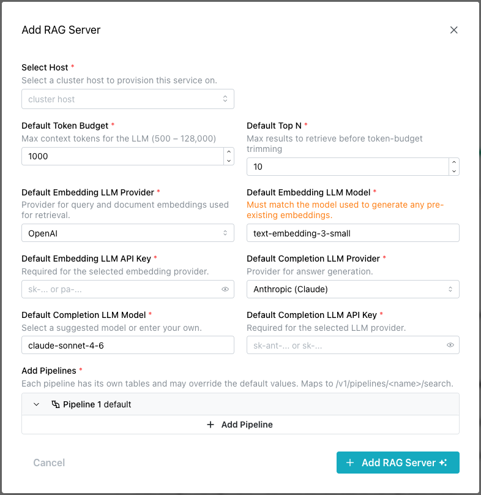
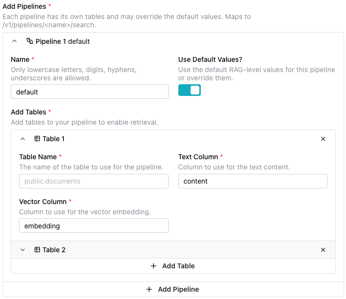
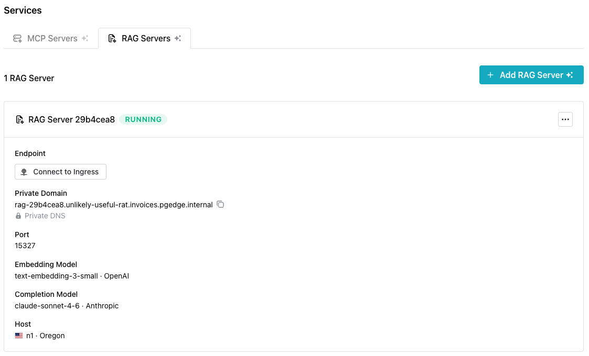
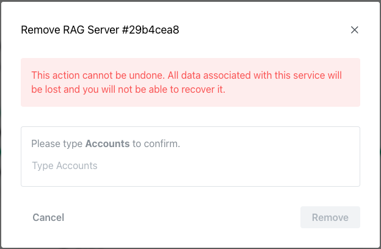

# Creating and Managing AI Toolkit Services

pgEdge Cloud databases can be deployed with an installed and configured MCP
server, ready for connections. After deployment, use the `Services` dialog to
open the `Add MCP Server` popup to add AI functionality to an existing cluster
or to manage defined functionality.


!!! note

    If your Cloud cluster resides on a private network, you can expose a port
    for connections by [creating a public ingress](../cloud/cluster/ingress.md).
    An ingress into a private network is used only for services (like AI 
    tools), and does not accept Postgres database connections.
    

## Adding an MCP Server

Select the `+ Add MCP Server` button to access the `Add MCP Server` popup to
define an MCP server and optionally enable an LLM.


Use the fields on the `Add MCP Server` popup to describe the server and,
optionally, the LLM:

- Use the `Select Host` field to select the cluster host on which this MCP
  server will be provisioned and run.

- Use the `Target Nodes` field to optionally select the database nodes this
  MCP server connects to, in priority order. Defaults to all nodes.

- Use the `Allow Writes?` toggle to optionally grant the MCP service
  read-write access (INSERT / UPDATE / DELETE) via the
  [`query_database`](https://docs.pgedge.com/pgedge-postgres-mcp-server/v1-0-0/developers/mcp-protocol/#tools)
  tool. Note that allowing read-write access could potentially expose data to
  unexpected or unwanted modifications.

- Use the `LLM Enabled?` toggle to optionally enable an LLM to generate
  embeddings for the database. When the toggle is `on`, Cloud activates the
  `generate_embedding` tool on the MCP server and requests LLM provider
  credentials. To enable an LLM, provide the following information:

    - Use the `Embedding Provider` field to select the provider used by the
      `generate_embedding` tool on the MCP server.

    - Use the `Embedding Model` field to specify the model identifier used by
      the `generate_embedding` tool (e.g. `text-embedding-3-small`,
      `voyage-3`).

    - Use the `Embedding API Key` field to enter the API key for the selected
      embedding provider. This key is stored encrypted server-side.

When you've defined the MCP server (and optionally LLM functionality), select
the `+ Add MCP Server` button to update the database. The `Services` dialog
displays the MCP server deployment details when the deployment is complete.



To delete an MCP Server, use the menu in the upper-right corner of the MCP
Servers details panel; select `Delete Service` to access a confirmation popup
that prompts you to enter the database name as confirmation that you wish to
delete the service.




### Connecting a Client to the MCP Server

The steps for connecting a client to the MCP server vary by client and
platform. The Services dialog displays connection details for several popular
clients under the `Connect to MCP Clients` label:


Select a tab to view and copy connection details for the selected client.
Choose from:

- [Claude Code](https://code.claude.com/docs/en/overview)
- [Cursor](https://cursor.com/en-US/docs)
- [OpenAI Codex](https://openai.com/codex/)
- [Replit](https://docs.replit.com/getting-started/intro-replit)


## Adding a RAG Server

Select the `Add RAG Server` button to access the `Add RAG Server` popup to
define a RAG server and optionally enable an associated LLM.



Use the fields on the `Add RAG Server` popup to describe the server:

- Use the `Select Host` field to select the cluster host on which this RAG
  server service will be provisioned and run.

- Use the `Default Token Budget` field to set the maximum number of context
  tokens (500–128,000) the LLM can process per request.

- Use the `Default Top N` field to set the number of results retrieved from
  the vector store before they are trimmed to fit within the token budget.

- Use the `Default Embedding LLM Provider` field to select the provider whose
  model will generate vector embeddings for queries and documents during
  retrieval.

- Use the `Default Embedding LLM Model` field to specify the embedding model
  to use. This must match the model used to generate any pre-existing
  embeddings in the dataset.

- Use the `Default Embedding LLM API Key` field to enter the API key for
  authenticating with the selected embedding provider.

- Use the `Default Completion LLM Provider` field to select the provider whose
  model will be used for answer generation after relevant documents are
  retrieved.

- Use the `Default Completion LLM Model` field to specify the model used for
  answer generation. Select a suggested model or enter a custom one.

- Use the `Default Completion LLM API Key` field to enter the API key for
  authenticating with the selected completion provider.

Expand the `Add Pipelines` field to define one or more named pipelines. Each
pipeline specifies one or more
[tables](https://docs.pgedge.com/pgedge-rag-server/v1-0-0/configuration/#table-properties)
and their associated columns and vector columns.

!!! hint

    For more information about using pipelines, see the
    [pgEdge RAG Server documentation](https://docs.pgedge.com/pgedge-rag-server/v1-0-0/configuration/#specifying-properties-in-the-pipeline-section).



Use the:

- `+ Add Table` button to access fields to define additional tables. Then:

    - Use the `Table Name` field to specify the fully qualified name of the
      table to use for the pipeline (like `public.documents`).

    - Use the `Text Column` field to specify the column that contains the text
      content to be indexed and searched (like `content`).

    - Use the `Vector Column` field to specify the column that stores the
      vector embedding used for similarity search (like `embedding`).

- `+ Add Pipeline` button to define additional pipelines and associated tables.

When you're finished defining the RAG server, select the `+ Add RAG Server`
button. The `Services` dialog displays the RAG server deployment details when
the deployment is complete.



To delete a RAG Server, use the menu in the upper-right corner of the RAG
Servers details panel; select `Delete Service` to access a confirmation popup
that prompts you to enter the database name as confirmation that you wish to
delete the service.




### Using the RAG Server

After adding a RAG Server to your cloud deployment, you can use the
[pgEdge Docloader](https://docs.pgedge.com/pgedge-docloader/v1-0-0/)
to load your documents into your database. The Docloader converts HTML,
Markdown, and reStructuredText into a `documents` table:

```bash
pgedge-docloader --config docloader.yml
```

Once data is loaded, you can query your pipeline via the REST API. For
example:

```bash
curl -X POST https://<your-rag-server-url>/v1/pipelines/my-docs/search \
  -H "Content-Type: application/json" \
  -d '{"query": "How do I configure replication?"}'
```

The RAG server retrieves the most relevant document chunks using hybrid
search (vector similarity + BM25 keyword matching), then passes them to
the LLM to generate a grounded answer.

!!! note

    The full API docs and an interactive demo are available at
    [docs.pgedge.com/pgedge-rag-server](https://docs.pgedge.com/pgedge-rag-server).