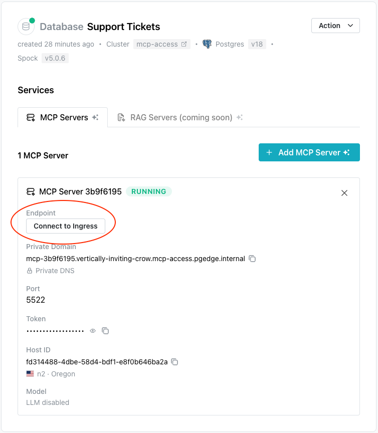
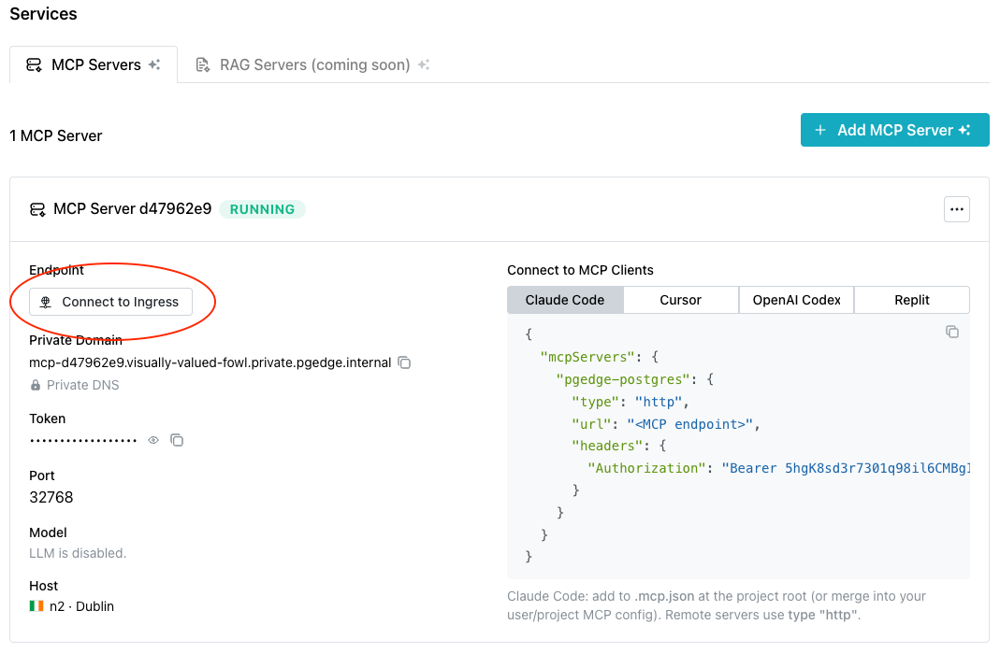

# Creating and Managing AI Toolkit Services

pgEdge Cloud databases can be deployed with an installed and configured
MCP server, ready for connections. After deployment, use the `Services`
page to open the `Add MCP Server` popup to add AI functionality to an
existing cluster or to manage defined functionality.


Select the `Add MCP Server` button to access the `Add MCP Server` popup
and define an MCP server, and optionally enable an associated LLM.


Use the fields on the `Add MCP Server` popup to describe the server
and, optionally, the LLM:

- Click the `Select Host` field to select the node that the MCP server
  will be provisioned on. You can deploy the MCP server on each node of
  your cluster, but each MCP server deployment must be individually defined.

- Use the `API Token` field to provide the string used to authenticate
  with your MCP server; this is a user-created value.

- Slide the `LLM Enabled?` toggle switch to enable the LLM detail fields.

- Use the `LLM Provider` drop-down to select your AI provider. pgEdge
  Cloud currently supports the following AI providers:

    - Anthropic AI (Claude)
    - OpenAI (ChatGPT)
    - Ollama

- Enter the model name of the LLM provider. This field is not validated,
  but must match the name of an available model. For example, the
  following models are supported:

    - claude-sonnet-4-6
    - gpt-4o
    - llama3.1


## Connecting a Client to the MCP Server

The steps you use to connect a client to the MCP server vary by client
and platform. The example below uses the pgEdge Postgres MCP Server and
connects to the Claude Desktop application on a Mac. Consult your
client's documentation for detailed instructions.


After installing the Claude Desktop client, open the Claude Settings
dialog (`Claude` --> `Settings`). Select `Developer` to configure a
local MCP server:


Select the `Edit Config` button to open a file browser window, then
open the `claude_desktop_config.json` configuration file.


When the configuration file opens, add your connection details to the
`mcpServers` section:

```json
{
  "preferences": {
    "coworkWebSearchEnabled": true,
    "ccdScheduledTasksEnabled": true,
    "sidebarMode": "chat",
    "coworkScheduledTasksEnabled": true
  },
  "mcpServers": {
    "pgedge-appdb": {
      "command": "/Users/sdouglas/.nvm/versions/node/v20.19.4/bin/npx",
      "args": [
        "mcp-remote",
        "connection_string_to_mcp_server",
        "--transport",
        "sse",
        "--allow-http",
        "--header",
        "Authorization: authentication_string"
      ]
    }
  }
}
```

Replace the following placeholders with your actual values:

- Replace `connection_string_to_mcp_server` with your database
  connection string. To connect to a private cluster, create a
  [public ingress](#creating-a-public-ingress) for the connection.
- Replace `authentication_string` with the authentication string
  provided in the API token field.


!!! note

    After updating the configuration file with details about your MCP
    server, restart the Claude client for the changes to take effect.

After restarting the Claude client, you can query your database from
the Claude client.


## Creating a Public Ingress

If your cluster was created as a private cluster (without a public-facing
IP address), you need to create a public ingress for connections to the
MCP server.

To access a list of available ingresses or to create a public ingress,
navigate to the `Services` page via the link under the database name in
the navigation panel.



Select the `Connect to Ingress` button. If no healthy ingresses exist
for the current cluster, the `Connect to Ingress` popup opens; use the
`Go to Cluster Settings` button to edit the cluster and create an
ingress.



When the cluster dialog opens, scroll to the `Network Ingresses` section
and select the `+ Add Ingress` button. Use the following fields to
configure the ingress:

- Provide a name for the ingress in the `Name` field.
- Use the `Region` drop-down to select the region the ingress will use
  for connections. If you have multiple nodes in the selected region,
  connections will be managed with a connection pooler and load
  balancer.

After providing ingress details, select the `+ Create Ingress` button
to create the ingress and add it to the list of ingresses.