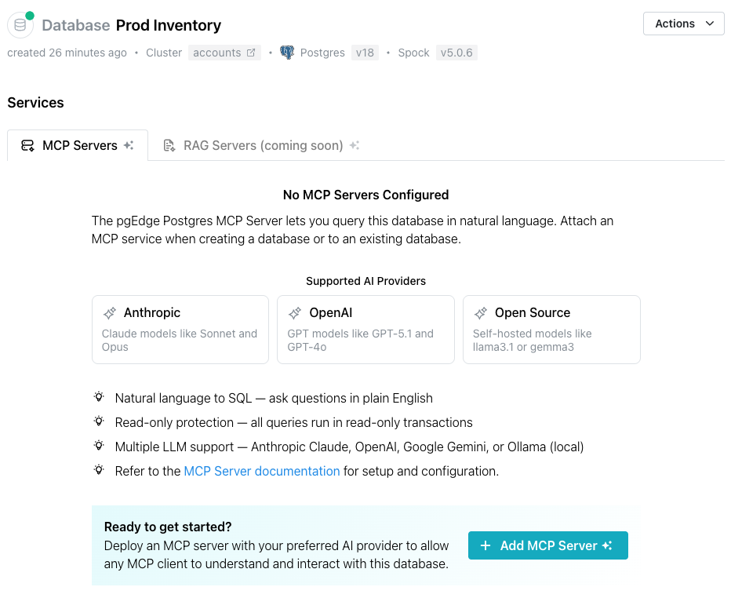
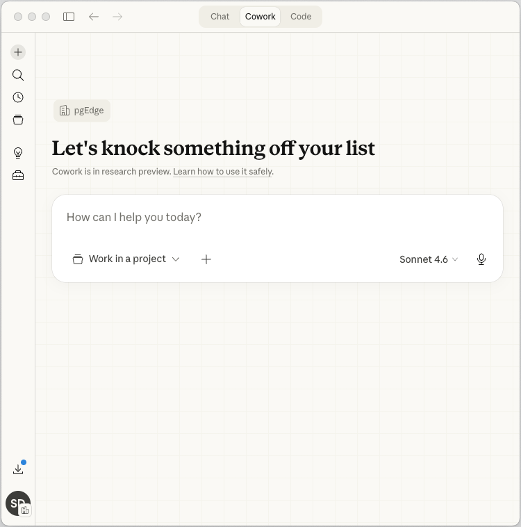
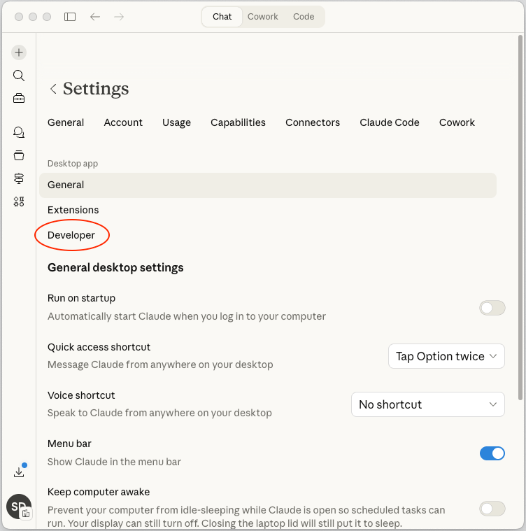
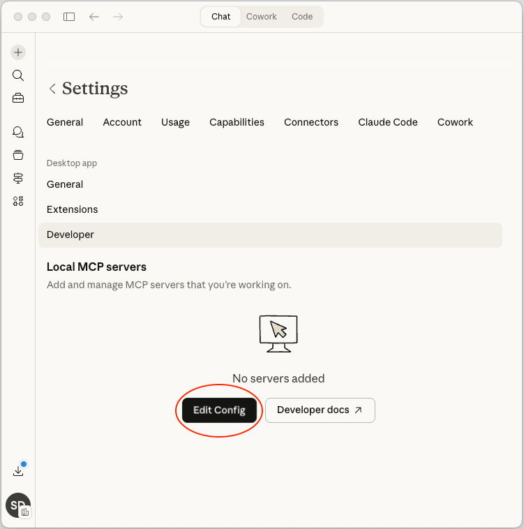

# Creating and Managing AI Toolkit Services

pgEdge Cloud databases can be deployed with an installed and configured MCP server, ready for connections; after deployment, you can use the `Services` page to open the `Add MCP Server` popup to add AI functionality to an existing cluster or to manage the defined functionality.



Select the Add MCP Server button to access the Add MCP Server popup and define an MCP server, and optionally enable an associated LLM.


Use fields on the `Add MCP Server` popup to describe the server and optionally, the LLM:

* Click the `Select Host` field to select the node that the MCP server will be provisioned on; you can deploy the MCP server on each node of your cluster, but each MCP server deployment must be individually defined.

* Use the `API Token` field to provide the string used to authenticate with your MCP server; this is a user-created value.

* Slide the `LLM Enabled?` toggle switch to enable the LLM detail fields.

* Use the LLM Provider drop-down to select your AI provider; currently, Cloud supports the following AI providers:

    * Anthropic AI (Claude)
    * OpenAI (ChatGPT)
    * Ollama

* Enter the model name of the LLM provider; this field is not validated, but must match the name of an available model.  For example, the following models are supported:

    * claude-sonnet-4-6
    * gpt-4o
    * llama3.1
  


## Connecting a Client to the MCP Server

The steps that you use to connect a client to the MCP server will vary by client and platform.  In the example that follows, we're using a Claude MCP Server and connecting to the Claude Desktop application on a Mac.  Consult the documentation for your client for detailed instructions.



After installing the Claude Desktop client, open the Claude Settings dialog (`Claude` --> `Settings`).  Select `Developer` to configure a Local MCP server:



Select the `Edit Config` button to browse to your claude_desktop_config.json configuration file.



When the configuration file opens, add your connection details to the `mcpServers` section:

```json
{
  "preferences": {
    "coworkWebSearchEnabled": true,
    "ccdScheduledTasksEnabled": true,
    "sidebarMode": "chat",
    "coworkScheduledTasksEnabled": true
  },
  "mcpServers": {
    "pgedge-appdb": {
      "command": "/Users/sdouglas/.nvm/versions/node/v20.19.4/bin/npx",
      "args": [
        "mcp-remote",
        "mcp-71e6367b.horribly-awake-jackal.accounts.pgedge.internal",
        "--transport",
        "sse",
        "--allow-http",
        "--header",
        "Authorization: claude_code_key_susan_ook sk-ant-api3-Zq"
      ]
    }
  }
}
```

!!! note

After updating the configuration file with details about your MCP server, you need to restart the Claude client for the changes to take effect.


## Accessing a Service from a Private Cluster

If your cluster was created as a private cluster (without a public-facing IP address), you'll need to create a public ingress to use for connections to the MCP server.  You can add an ingress:

* when initially defining a database.
* when defining a service.

