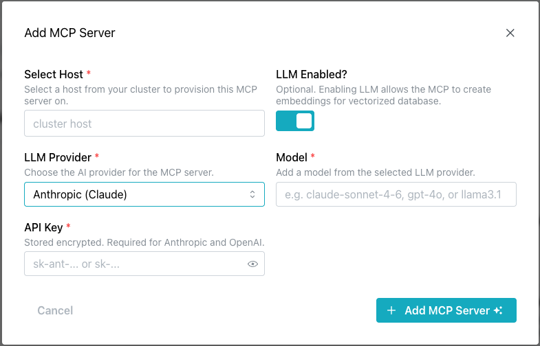
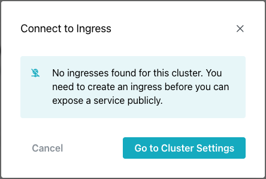
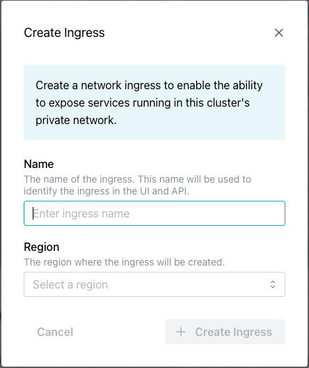
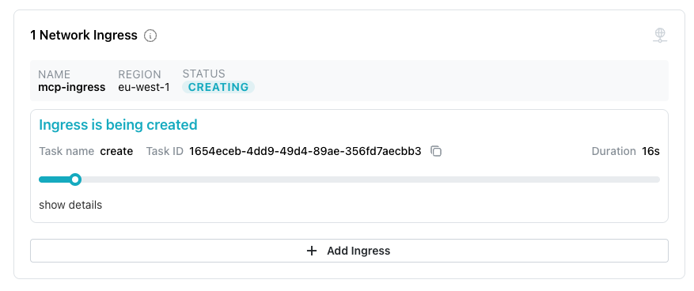
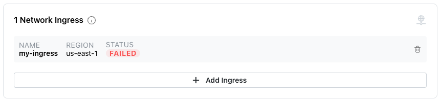
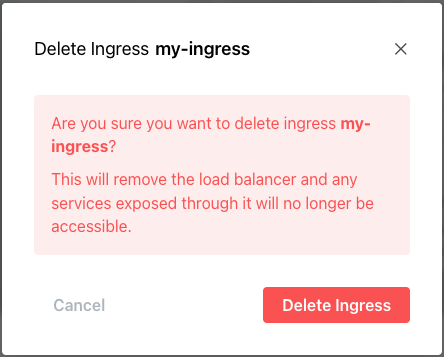

# Creating and Managing AI Toolkit Services

pgEdge Cloud databases can be deployed with an installed and configured
MCP server, ready for connections. After deployment, use the `Services`
dialog to open the `Add MCP Server` popup to add AI functionality to an
existing cluster or to manage defined functionality.

Select the `Add MCP Server` button to access the `Add MCP Server` popup
and define an MCP server, and optionally enable an associated LLM.

Use the fields on the `Add MCP Server` popup to describe the server
and, optionally, the LLM:

- Click the `Select Host` field to select the node that the MCP server
  will be provisioned on. You can deploy the MCP server on each node of
  your cluster, but each MCP server deployment must be individually defined.

- Slide the `LLM Enabled?` toggle switch to enable the LLM detail fields.

- Use the `LLM Provider` drop-down to select your AI provider. pgEdge
  Cloud currently supports the following AI providers:

    - Anthropic AI (Claude)
    - OpenAI (ChatGPT)
    - Ollama

- Use the Model field to provide the model name for the LLM provider. This
  field is not validated, but must match the name of an available model. For
  example:

    - claude-sonnet-4-6
    - gpt-4o
    - llama3.1

- If prompted, use the `API Token` field to provide the string used to
  authenticate with your MCP server; this is a user-created value required by
  Anthropic and OpenAI.

When you've defined the MCP server (with optional LLM functionality), select
the `+ Add MCP Server` button to update your database.

When the deployment is complete, details about the MCP server deployment are
displayed in the Services dialog.

### Connecting a Client to the MCP Server

The steps you use to connect a client to the MCP server vary by client
and platform. The Services dialog displays connection details for several
popular clients under the `Connect to MCP Clients` label:

Select a tab to view and copy connection details for the client you wish to
use.  Choose from:

* [Claude Code](https://code.claude.com/docs/en/overview)
* [Cursor](https://cursor.com/en-US/docs)
* [OpenAI Codex](https://openai.com/codex/)
* [Replit](https://docs.replit.com/getting-started/intro-replit)

## Creating a Public Ingress

If your cluster was created as a private cluster (without a public-facing
IP address), you will need to use a public ingress for connections to the
MCP server. Select the `Connect to Ingress` button to review available
ingresses or to create a new ingress: 

If no healthy ingresses exist
for the current cluster, the `Connect to Ingress` popup opens; use the
`Go to Cluster Settings` button to edit the cluster and create an
ingress.

To navigate to the cluster's dialog and create an ingress, select the
`Go to Cluster Settings` button. Once on the cluster dialog, scroll down to
the page end, and select `+ Add Ingress`:

The `Create Ingress` popup opens: 

Use the following fields to configure the ingress:

- Provide a name for the ingress in the `Name` field.
- Use the `Region` drop-down to select the region the ingress will use
  for connections. If you have multiple nodes in the selected region,
  connections will be managed with a connection pooler and load
  balancer.

After providing ingress details, select the `+ Create Ingress` button
to create the ingress and add it to the list of ingresses.

Once created, the ingress will be added to the list of available ingresses: 

To delete an ingress, select the delete icon on the ingress information pane.

When prompted, confirm the deletion.

A popup confirms that the ingress is being deleted.