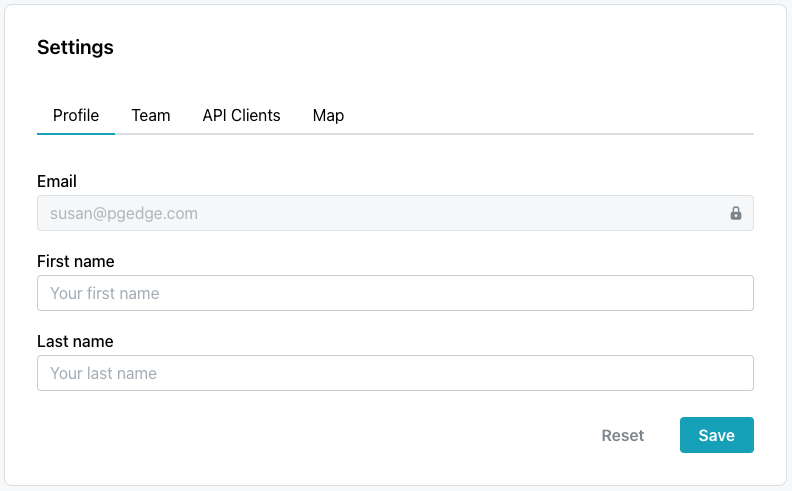
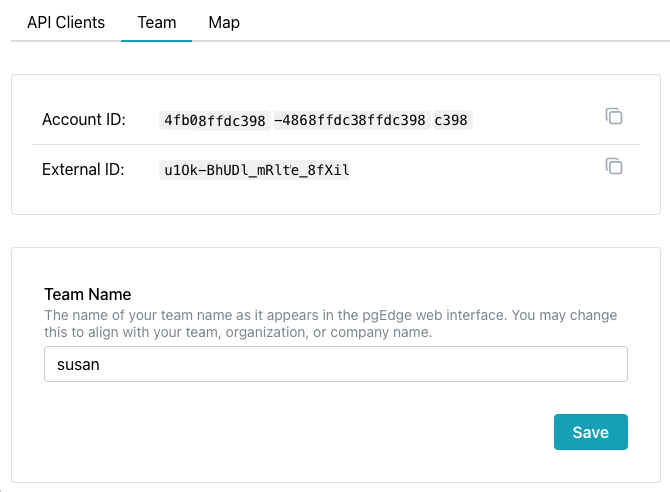

# Using the Settings Dialog

In the lower-left corner of the pgEdge Distributed Postgres (Cloud Edition) console you'll find a link to the `Settings` dialog; you can use the `Settings` dialog to [modify your profile](#the-profile-tab), create an [API client](#the-api-clients-tab), [obtain or set account information](#the-team-tab), or review your cluster nodes on a map.

## The Profile Tab

Use fields on the `Profile` tab to modify the names associated with your account; you can also find a link to the `Profile` tab in the user information drop-down menu (located in the upper-right corner of the screen):

* Provide your first name in the `First name` field.
* Provide your last name in the `Last name` field.

import { Callout } from 'nextra/components'
 
<Callout type="info" emoji="ℹ️">
Note that the email associated with the account cannot be modified.
</Callout>

When you've finished, select `Save` to update your account with the name changes; use the `Reset` icon to return the fields to their previous values.

## The API Clients Tab

Select the `API Clients` tab to view, manage, or create an API client. 

You can use options accessed on the API Clients tab, to define and delete API clients.  To create an client, select the `Create API Client` icon. When the `Create API Client` popup opens:

* Provide a user-friendly name for the API client in the `API Client Name` field.
* Provide a brief description of the API client in the `Description` field.

Then, to create the API client, click the `Create` button.

When you create an API client, you will be provided an `Auth ID` and `Auth Secret` that you can use when connecting to Cloud with the API, and the new client will be added to the `API Clients` list. 
 
<Callout type="warning">
  Be sure to copy your `Auth Secret` when it is displayed on the `Client created` popup and store it in a safe place; the `Auth Secret` cannot be retrieved once the popup is closed.
</Callout>

To delete one or more API client(s), check the box to the left of the client name and select the `Delete selected client` button, or choose the `Delete` option from the context menu located to the right of the API client identifiers in the `API Clients` table. When prompted, click the `Confirm` button to delete the selected client(s).

**API Documentation**

Use the `pgEdge Cloud API` link below the table to access the Cloud API documentation. 

## The Team Tab

The Team tab displays information about your account:

* Provide the `Account ID` when contacting pgEdge support (if needed for troubleshooting).
* The `External ID` is used in the AWS IAM trust policy, when granting Cloud access to an AWS account for cluster provisioning.
* Update the `Team Name` to match your team, division, or company name. This name appears in invitation emails when you invite other people to join your account.

