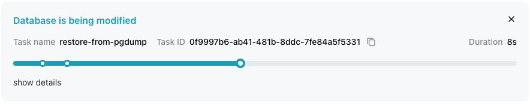
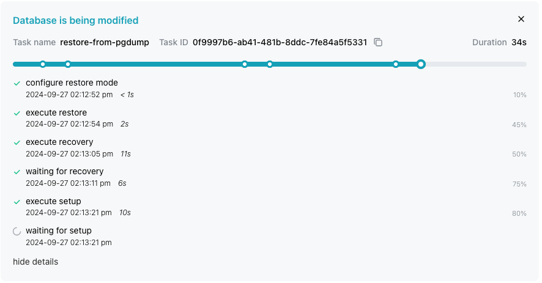
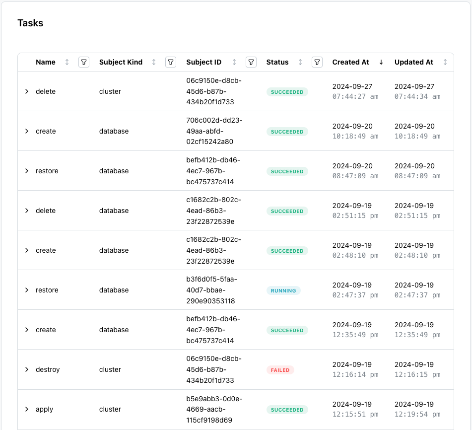
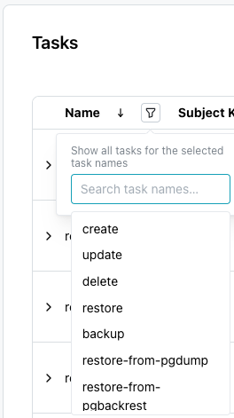

# Reviewing Tasks

When you start a database or cluster task (like modifying a configuration or restoring a backup) with the Cloud console, the task is displayed in the table on the `Tasks` page and a task project bar is displayed on the main console dialog for the related object.

The task progress bar provides information about the task in progress, including the task identifier and duration.  Select the `show details` link to display additional information about the task in progress:

Each point on the task bar corresponds to an event detail. To close the task bar, select the `X` in the upper-right corner of the task progress bar.

The `Tasks` page organizes Cloud console activity into an easy to understand table that you can organize or sort with [filters](#filtering-the-tasks-table).  

Columns on the `Tasks` dialog display:

* **Task Name** The type of task for the table entry; values are `create`, `update`, `delete`, `restore`, `backup`, `restore-from-pgdump`, `restore-from-pgbackrest`.
* **Subject Kind** The target of the task; values are `database` or `cluster`.
* **Subject ID** The unique identifier of the task.
* **Status** The state of the task; values are `running`, `succeeded`, `queued`, or `failed`
* **Created At** The timestamp at which the task started.
* **Updated At** The timestamp at which the task was updated.

Use the page selector in the lower-right corner of the page to navigate through the pages in the table.

## Filtering and Sorting the Tasks Table

A drop-down filter icon located next to the column name lists the values for that column that you can sort the table by: 

Select from the options displayed on the filter drop-down to re-arrange the table, moving the content that includes the selected value to the top.  Use the arrow between the column name and the filter drop-down to reverse the display order of the tables based on that column.