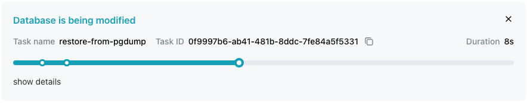
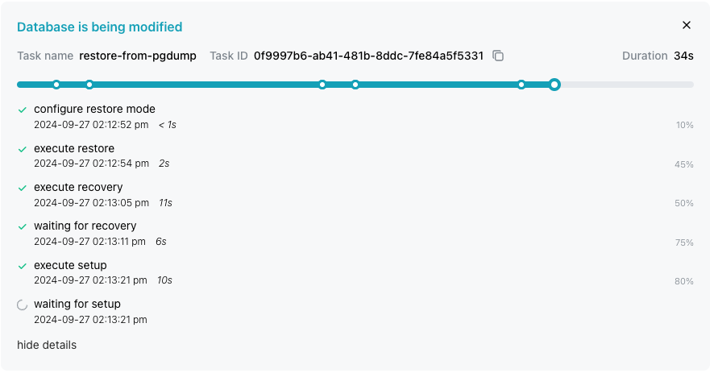
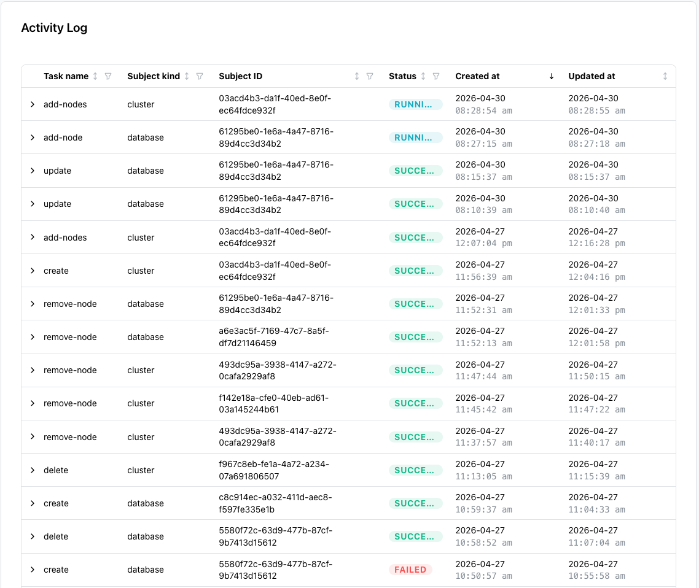
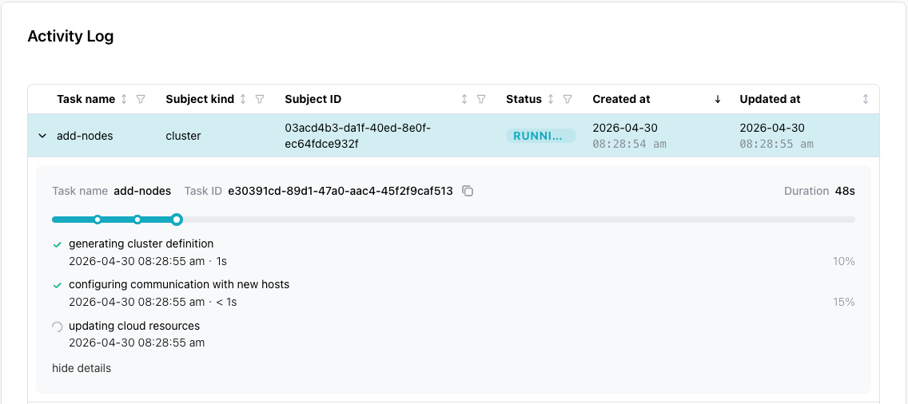
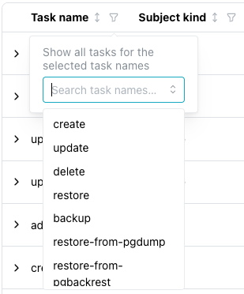

# Reviewing the Activity Log

When you start a database or cluster task with the Cloud console, the console
adds the task to the table on the `Activity Log` page. The Activity Log page 
organizes Cloud console activity into a table that you can sort and filter.

The console also displays a task progress bar on the main console dialog for
the related database or cluster.

The progress bar provides information about the task in progress,
including the identifier and duration. Select the `show details` link to
display additional information about the task in progress.

Each point on the task bar corresponds to an event detail. To close the task
bar, select the `X` in the upper-right corner of the task progress bar.

The Activity Log page displays the following columns:

- Task name identifies the type of task for the table entry; values are
  `create`, `update`, `delete`, `restore`, `backup`,
  `restore-from-pgdump`, or `restore-from-pgbackrest`.
- Subject kind identifies the target of the task; values are `database`
  or `cluster`.
- Subject ID is the unique identifier of the task.
- Status indicates the state of the task; values are `running`,
  `succeeded`, `queued`, or `failed`.
- Created At is the timestamp at which the task started.
- Updated At is the timestamp at which the console last updated the task.

Use the arrow to the left of a `Task name` to expand the task information and
view details about the selected task.

## Filtering and Sorting the Activity Log

The Activity Log table supports filtering and sorting by column value. A
drop-down filter icon located next to each column name lists the available
values for that column.

Select a value from the filter drop-down to re-arrange the table and move
matching content to the top. Select the arrow between the column name and the
filter drop-down to reverse the display order based on that column.
